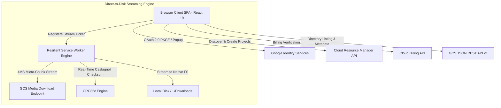

# Files of Ba Sing Se

| This is a weekend project, Gemini continues below...

> **High-Performance, Zero-Backend Media Portal & Google Cloud Storage Explorer**

[](https://creativecommons.org/licenses/by-sa/4.0/)
[](https://www.typescriptlang.org/)
[](https://react.dev/)
[](https://vitejs.dev/)
[](https://tailwindcss.com/)
[](https://vitest.dev/)

**Files of Ba Sing Se** is a client-side Single Page Application (SPA) designed for film, VFX, and post-production engineering teams to browse, inspect, and stream multi-gigabyte media files (10GB–50GB+) directly from Google Cloud Storage (GCS) to local disk—with zero backend hosting liability, constant low memory footprint (<15MB RAM), and real-time cryptographic integrity verification.

---

## Key Features

- **Zero-Backend Host-Liability Model**: Pure client-side browser application connecting directly to the Google Cloud Storage JSON REST API v1. All egress and retrieval charges are attributed directly to the client's GCP project (`?userProject=...`), eliminating intermediary server hosting costs and proxy liabilities.
- **Direct-to-Disk Micro-Chunk Streaming**:
  - Leverages the **Chromium File System Access API** and **Resilient Service Worker Stream Interception** (`public/sw.js` compiled from TypeScript `src/sw/sw.ts`).
  - Streams massive files in 4MB micro-chunks with JavaScript heap consumption strictly bounded under **15 MB RAM** (tested up to 50GB+).
- **Cryptographic CRC32c Integrity Parity**: Computes rolling Castagnoli CRC32c (`0x1EDC6F41`) checksums in real-time as binary chunks stream through, verifying bit-exact parity against GCS `x-goog-hash` headers upon completion.
- **Cost Governance & Billing Mode Architecture**:
  - **Requester-Pays Mode (Implemented)**: Automated live estimation of Archive retrieval ($0.05/GB), Coldline ($0.02/GB), and internet egress ($0.12/GB) fees before downloading, backed by high-cost confirmation safety gates (> $5.00 USD / > 25 GB).
  - **Owner-Pays / Dual Mode (Spec'd & Designed; Implementation Planned)**: Fully architected and specified design for automated preflight detection of owner-sponsored buckets ($0.00 client egress cost), dynamic status badges, and project-optional onboarding fast track (Module 13 & Engine 11).
- **Volatile Token Isolation & Storage Boundary Governance**:
  - OAuth 2.0 access bearer tokens reside exclusively in volatile runtime memory (`useRuntimeStore`) and are never written to `localStorage` or disk.
  - Active `StorageBoundaryAuditor` continuously monitors and prevents accidental leaks of private credentials.
  - Instant memory purge and stream abort upon sign-out.
- **High-Density Virtualized Asset Grid**: Windowed DOM virtualization capable of smoothly rendering buckets and directories with **10,000+ files at 60 FPS**, featuring multi-column sorting, real-time debounced fuzzy search, and file category filter chips.
- **Automated CLI Command Generator**: 1-click generator for `gcloud storage`, `gsutil`, and `curl` commands tailored for terminal and automated batch workflows.
- **Accessible Design System**: WCAG AAA/AA compliant Dark/Light theme engine with zero Flash of Unstyled Text (FOUT) and full ARIA keyboard navigation.

---

## Architecture Overview



---

## Getting Started

### Prerequisites

- **Node.js**: `v20.0.0` or higher
- **npm**: `v10.0.0` or higher
- **Google Cloud Platform Account**: For configuring Google OAuth 2.0 credentials and accessing target GCS buckets.

### 1. Clone & Install Dependencies

```bash
git clone https://github.com/NovaLogicDev/FilesOfBaSingSe.git
cd FilesOfBaSingSe
npm install
```

### 2. Configure Environment Variables

Copy `.env.example` to `.env`:

```bash
cp .env.example .env
```

Edit `.env` and provide your Google OAuth 2.0 Client ID:

```ini
# Google OAuth 2.0 Web Client ID
VITE_GOOGLE_CLIENT_ID=your-client-id.apps.googleusercontent.com

# Optional Defaults
VITE_DEFAULT_BUCKET=
VITE_DEFAULT_PROJECT_ID=
VITE_ENABLE_LIVE_GCS=true
```

#### Setting up Google Cloud OAuth 2.0
1. Navigate to **Google Cloud Console > APIs & Services > Credentials**.
2. Click **Create Credentials > OAuth Client ID**.
3. Select **Web application**.
4. Add **Authorized JavaScript origins**:
   - `http://localhost:5173` (for local development)
   - `http://127.0.0.1:5173`
   - Your production hosting domain (e.g. `https://your-app.web.app`)
5. Copy the generated **Client ID** into your `.env` file.

### 3. Start Development Server

```bash
npm run dev
```

The application will be accessible at `http://localhost:5173`.

---

## Available Scripts

| Command | Description |
| :--- | :--- |
| `npm run dev` | Compiles the Service Worker and starts the Vite development server. |
| `npm run build` | Compiles the Service Worker, runs TypeScript typecheck, and bundles the production app. |
| `npm run build:sw` | Bundles `src/sw/sw.ts` to `public/sw.js` using esbuild. |
| `npm test` | Runs the full Vitest automated test suite (unit, integration, and E2E tests). |
| `npm run test:watch` | Runs Vitest in interactive watch mode. |
| `npm run typecheck` | Executes `tsc -b --noEmit` to verify static TypeScript typings across all configs. |
| `npm run preview` | Previews the production build locally. |
| `npm run deploy` | Builds the application and deploys to Firebase Hosting. |

---

## Project Structure

```
FilesOfBaSingSe/
├── docs/
│   └── requirements/         # Comprehensive specifications, user stories, and engine designs
├── public/
│   ├── favicon.svg           # Application favicon
│   ├── privacy.html          # Static standalone Privacy Policy
│   └── sw.js                 # Compiled Service Worker bundle (generated from src/sw/)
├── src/
│   ├── components/           # React UI components (Auth, Explorer, Cost, Downloader, Inspector, CLI)
│   ├── engines/              # Core business engines (Stream, CRC32c, Cost, History, Session, Theme)
│   ├── hooks/                # Custom React hooks (useNetworkStatus, useVirtualizer)
│   ├── services/             # API services (GCS REST, GIS Auth, GCP Project, SW Service, Observability)
│   ├── store/                # Zustand stores (runtime in-memory store, persistent store, toast store)
│   ├── sw/                   # Service Worker TypeScript source files and types
│   ├── types/                # TypeScript interfaces and type definitions
│   ├── App.tsx               # Main application entry point
│   ├── index.css             # Tailwind CSS styles and custom utility classes
│   └── main.tsx              # React DOM hydration root
├── tests/
│   ├── e2e/                  # End-to-end integration and virtualization benchmark tests
│   ├── fixtures/             # Test datasets and media fixtures
│   ├── helpers/              # Test rendering utilities and mocks
│   ├── integration/          # Multi-component integration test suites
│   └── unit/                 # Unit tests for components, services, and engines
├── firebase.json             # Firebase Hosting configuration with security headers & CSP
├── gcs-cors.json             # Sample GCS CORS configuration for target buckets
├── package.json              # Project manifest and scripts
├── tsconfig.json             # Root TypeScript project references configuration
└── vite.config.ts            # Vite configuration with chunk splitting & Tailwind integration
```

---

## GCS Bucket CORS Configuration

To allow direct browser streaming from target Google Cloud Storage buckets, configure the bucket's CORS policy using the provided `gcs-cors.json`:

```bash
gcloud storage buckets update gs://YOUR_BUCKET_NAME --cors-file=gcs-cors.json
```

---

## Quality & Testing

The repository maintains an automated test suite with **100% pass rate across 65 test suites (648 tests)** covering:
- **Token Isolation & Storage Boundary Governance**: Asserts zero disk writes for bearer tokens.
- **Hardware-Accurate Castagnoli CRC32c Engine**: Verifies compliance against RFC 3720 test vectors.
- **Service Worker Lifecycle & Keep-Alive Resilience**: Tests background heartbeat maintenance during transfers.
- **DOM Virtualization Benchmarks**: Ensures 60 FPS rendering under 10,000+ asset directories.
- **Adversarial Hardening**: Stress tests network abort latency (<200ms), malformed metadata, and API error recoveries.

Run the test suite:
```bash
npm test
```

---

## License

This project is licensed under the **Creative Commons Attribution-ShareAlike 4.0 International (CC-BY-SA-4.0)** license. See the [LICENSE](LICENSE) file for details.
