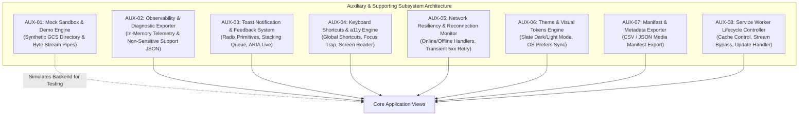
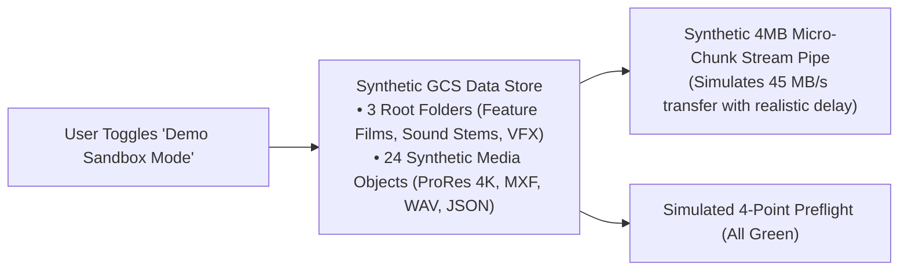
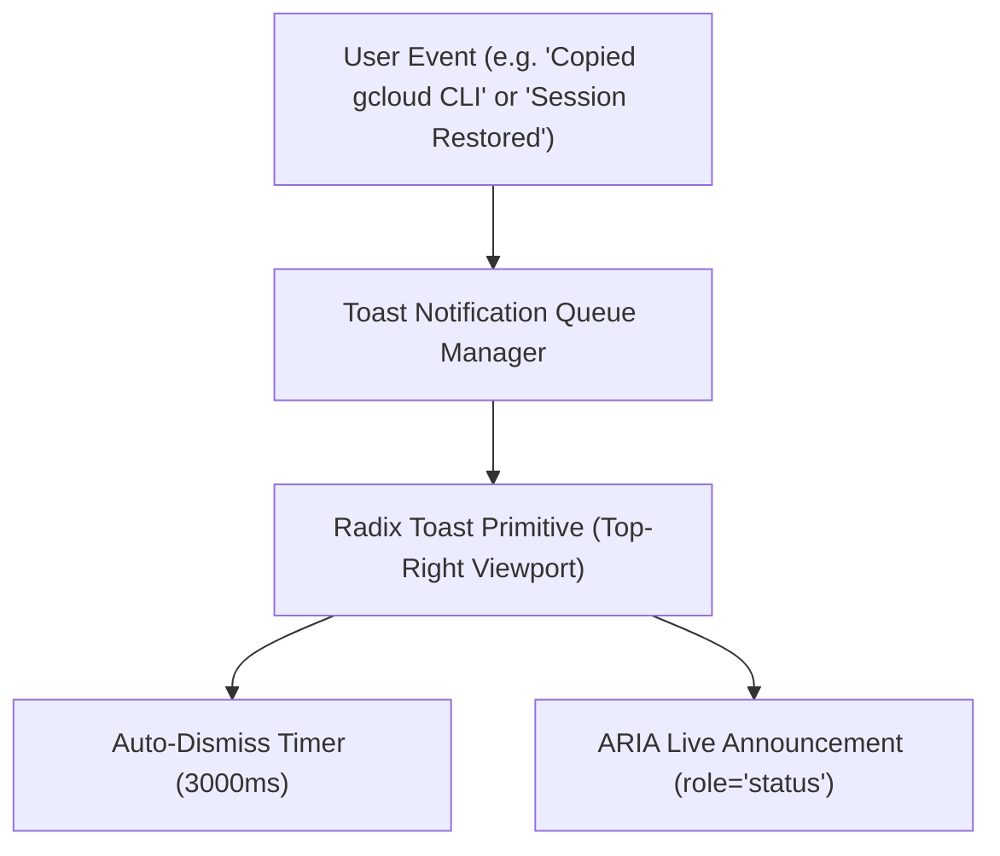
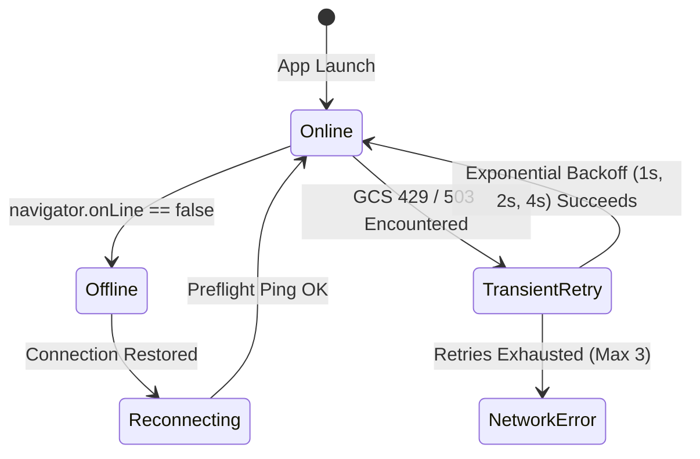

# Auxiliary & Supporting Components Design & Requirements Specification
## Project: Files of Ba Sing Se — GCS Requester-Pays Media Distribution Portal

---

### Executive Overview & Subsystem Architecture

To support the primary operational engines and deliver an enterprise-grade, resilient, accessible, and easily testable user experience, **Files of Ba Sing Se** incorporates eight **Auxiliary and Supporting Subsystems**.



---

## 1. AUX-01: Mock Sandbox & Demo Engine

### 1.1 Purpose & Scope
Provides a zero-configuration "Demo / Sandbox Mode" allowing stakeholders, developers, and potential clients to experience the full application workflow (authentication simulation, directory navigation, real-time cost estimation, direct-to-disk streaming, and CLI generation) without needing active Google Cloud credentials or a live billing project.

### 1.2 Architectural State & Synthetic Data



### 1.3 Functional Requirements
- **FR-AUX-1.1**: Header toggle button allowing instant switching between "Live GCS Mode" and "Demo Sandbox Mode".
- **FR-AUX-1.2**: Synthetic GCS Bucket hierarchies demonstrating both billing paradigms:
  - **Requester-Pays Demo Bucket (`gs://demo-avatar-master-archives-2026`)**:
    - `gs://demo-avatar-master-archives-2026/feature_films/reel_04/reel04_cam_A_raw.mxf` (18.40 GB `ARCHIVE`)
    - `gs://demo-avatar-master-archives-2026/feature_films/reel_04/reel04_cam_B_raw.mxf` (16.20 GB `ARCHIVE`)
    - `gs://demo-avatar-master-archives-2026/feature_films/reel_04/reel04_prores_proxy.mov` (8.00 GB `STANDARD`)
    - `gs://demo-avatar-master-archives-2026/feature_films/reel_04/reel04_sound_mix.wav` (1.20 GB `ARCHIVE`)
    - `gs://demo-avatar-master-archives-2026/feature_films/reel_04/metadata_manifest.json` (4.20 KB `STANDARD`)
  - **Owner-Pays Demo Bucket (`gs://demo-open-cinematic-assets`)**:
    - `gs://demo-open-cinematic-assets/sample_reels/open_nature_4k.mov` (12.50 GB `STANDARD`)
    - `gs://demo-open-cinematic-assets/sample_reels/open_audio_master.wav` (2.10 GB `STANDARD`)
- **FR-AUX-1.3**: Synthetic Streaming Pipeline: Simulates 4MB chunk emission at ~45 MB/s with authentic byte throughput, live ETA countdown, memory monitoring, and valid pre-computed CRC32c hashes (`0xAF82F6C0`).
- **FR-AUX-1.4**: Synthetic Preflight check returning all 4 green checkmarks with a simulated `demo-billing-project-2026` for Requester-Pays or $0.00 notice for Owner-Pays.

---

## 2. AUX-02: Client-Side Observability, Telemetry & Diagnostic Exporter

### 2.1 Purpose & Scope
Captures structured client-side runtime logs, network latency metrics, memory heap telemetry, and error classifications. Allows users encountering issues to export a **sanitized diagnostic report (JSON/Markdown)** for technical support, with zero credential leakage.

### 2.2 Data Contract & Sanitization Rules

```typescript
export interface DiagnosticReport {
  timestamp: string;
  appVersion: string;
  userAgent: string;
  browserEngine: 'Chromium' | 'WebKit' | 'Gecko' | 'Unknown';
  fileSystemAccessApiSupported: boolean;
  serviceWorkerActive: boolean;
  activeBucket: string;
  activeBucketBillingMode: 'requester-pays' | 'owner-pays';
  activeProjectIdMasked: string; // e.g. "clie***-2026"
  hasCompletedOnboarding: boolean;
  heapMemoryMB: number;
  recentLogs: Array<{
    level: 'info' | 'warn' | 'error';
    category: 'AUTH' | 'GCS' | 'STREAM' | 'PREFLIGHT' | 'SESSION';
    message: string;
    timestamp: string;
  }>;
}
```

### 2.3 Functional Requirements
- **FR-AUX-2.1**: In-memory ring buffer capturing the last 100 non-sensitive log events (capped at 500KB RAM), including session boot recovery milestones (`SESSION_RESTORE_INIT`, `SESSION_RESTORE_SUCCESS`, `SESSION_RESTORE_INTERACTIVE_REQUIRED`).
- **FR-AUX-2.2**: 1-Click "Export Diagnostic Report" action in the Help / Error modal, generating a downloadable `basingse-diagnostics-{timestamp}.json` file.
- **FR-AUX-2.3**: Credential Redaction Filter: Automatically strips OAuth tokens, bearer strings, full emails, and private project numbers before outputting reports.

---

## 3. AUX-03: Toast Notification & User Feedback System

### 3.1 Purpose & Scope
Delivers non-intrusive, accessible notifications for user actions (e.g. copying CLI scripts, copying CRC32c hashes, preflight successes, stream completion, network status updates, session restoration feedback).

### 3.2 Notification Queue Architecture



### 3.3 Functional Requirements
- **FR-AUX-3.1**: Stackable toast notifications with four visual variants:
  - `Success` (Emerald border + checkmark icon) — e.g. "Welcome back, Taylor! Resumed session for gs://media-vault" or "Download Complete! Saved to disk [⚡ Reveal in Dolphin]"
  - `Info` (Cyan border + info icon)
  - `Warning` (Amber border + alert triangle)
  - `Error` (Rose border + alert circle)
- **FR-AUX-3.2**: Configurable auto-dismiss durations (default: 3000ms for confirmations, persistent for actionable errors).
- **FR-AUX-3.3**: ARIA `role="status"` and `aria-live="polite"` integration for screen reader accessibility.

---

## 4. AUX-04: Keyboard Shortcuts & Accessibility (a11y) Subsystem

### 4.1 Purpose & Scope
Ensures full keyboard operability and screen reader compliance across all interactive surfaces, adhering to **WCAG 2.1 AA** accessibility standards.

### 4.2 Keyboard Navigation Matrix

| Shortcut | Context | Action & Target |
| :--- | :--- | :--- |
| **`/`** or **`Ctrl+K` / `Cmd+K`** | Global | Focuses the search and filter input in the Asset Explorer. |
| **`Ctrl+G` / `Cmd+G`** | Global | Opens the unified GCP Configuration Center modal (*Module 9*). |
| **`Alt+Left` / `Cmd+[`** | Global | Traverses back in directory browser history via Browser History API (*Module 11*). |
| **`Alt+Right` / `Cmd+]`** | Global | Traverses forward in directory browser history via Browser History API (*Module 11*). |
| **`Esc`** | Modal / Drawer / Mini-Widget | Dismisses active modal, closes inspector drawer, or restores focus to grid. |
| **`Ctrl+A` / `Cmd+A`** | Asset Table View | Toggles "Select All" / "Deselect All" for visible directory items. |
| **`Up` / `Down` Arrow** | Asset Table Rows | Moves row-level focus sequentially through the virtualized grid. |
| **`Space`** | Focused Table Row | Toggles the selection checkbox of the currently focused row. |
| **`Enter`** | Focused Table Row | If folder $\rightarrow$ opens directory; If file $\rightarrow$ opens Asset Inspector Drawer. |
| **`Tab` / `Shift+Tab`** | Breadcrumbs Bar | Moves focus sequentially across clickable breadcrumb path segments. |
| **`Ctrl+D` / `Cmd+D`** | Active Selection | Triggers download of currently selected files. |
| **`Ctrl+R` / `Cmd+R`** | Focused Download Card | Copies OS File Manager reveal command for the completed download (*Module 12*). |

### 4.3 Functional Requirements
- **FR-AUX-4.1**: Focus Trap in all modals (`OnboardingWizard`, `CliModal`, `HighCostConfirmationModal`).
- **FR-AUX-4.2**: Visual 2px Cyan focus ring (`focus-visible:ring-2 focus-visible:ring-cyan-400`) on all interactive buttons, inputs, checkboxes, and tabs.
- **FR-AUX-4.3**: Skip Navigation Link (`Skip to main content`) as the first focusable element for screen reader users.
- **FR-AUX-4.4**: History Traversal Announcements: Screen reader live region (`aria-live="polite"`) announces restored path when traversing history.
- **FR-AUX-4.5**: Post-Download File Reveal Shortcuts: `Cmd+R` / `Ctrl+R` shortcut on completed download widgets immediately copies the OS file reveal command to clipboard with an audible/visual toast.

---

## 5. AUX-05: Network Resiliency & Reconnection Monitor

### 5.1 Purpose & Scope
Monitors browser connectivity status, handles intermittent Wi-Fi drops, and provides automatic retry mechanisms for transient GCS API errors (HTTP 429 rate limits, HTTP 503 service unavailable).

### 5.2 Resiliency State Machine



### 5.3 Functional Requirements
- **FR-AUX-5.1**: Real-time `navigator.onLine` and `window.addEventListener('online'/'offline')` event monitoring.
- **FR-AUX-5.2**: Top banner alert: *"Network connection lost. Active downloads paused. Reconnecting..."* with automatic resumption handshake upon reconnect.
- **FR-AUX-5.3**: Exponential backoff retry logic for GCS metadata calls: 3 attempts with jittered delays ($1\text{s} \rightarrow 2\text{s} \rightarrow 4\text{s}$).

---

## 6. AUX-06: Theme & Design System Engine

### 6.1 Purpose & Scope
Provides seamless dark/light theme switching with instant DOM synchronization and zero Flash of Unstyled Theme (FOUT). Tailored for color-critical video editorial environments (dark mode standard).

### 6.2 Design Tokens & Theme Synchronization

```typescript
export type ThemeMode = 'dark' | 'light' | 'system';

export class ThemeEngine {
  public static applyTheme(mode: ThemeMode): void {
    const root = document.documentElement;
    const isDark =
      mode === 'dark' ||
      (mode === 'system' && window.matchMedia('(prefers-color-scheme: dark)').matches);

    if (isDark) {
      root.classList.add('dark');
    } else {
      root.classList.remove('dark');
    }
  }
}
```

### 6.3 Functional Requirements
- **FR-AUX-6.1**: Support for `dark` (default), `light`, and `system` (matches OS preference).
- **FR-AUX-6.2**: Theme persistence in `localStorage` (`basingse-media-client-prefs`).
- **FR-AUX-6.3**: High-contrast mode support for WCAG 2.1 AAA accessibility environments.

---

## 7. AUX-07: Manifest & Metadata Exporter

### 7.1 Purpose & Scope
Empowers video editors, VFX leads, and production coordinators to export structured file manifests of selected assets or entire bucket directories in **CSV** or **JSON** format for integration into production tracking software (ShotGrid, Frame.io, Notion, Excel).

### 7.2 Manifest Formats & Attributes

#### CSV Export Format:
```csv
Object Path,File Name,Storage Class,Size Bytes,Size Formatted,CRC32c Hex,Created UTC,Estimated Cost USD
feature_films/reel_04/reel04_cam_A_raw.mxf,reel04_cam_A_raw.mxf,ARCHIVE,18400000000,18.40 GB,0xAF82F6C0,2026-07-14T10:22:15Z,$3.13
feature_films/reel_04/reel04_cam_B_raw.mxf,reel04_cam_B_raw.mxf,ARCHIVE,16200000000,16.20 GB,0xBF91A2D1,2026-07-14T10:45:00Z,$2.75
feature_films/reel_04/reel04_prores_proxy.mov,reel04_prores_proxy.mov,STANDARD,8000000000,8.00 GB,0xCD88E3F4,2026-07-14T11:30:00Z,$0.96
```

### 7.3 Functional Requirements
- **FR-AUX-7.1**: `[Export Manifest (CSV)]` and `[Export Manifest (JSON)]` action buttons in the explorer header.
- **FR-AUX-7.2**: Generates and downloads a client-side Blob (`data:text/csv;charset=utf-8,...`) without server interaction.
- **FR-AUX-7.3**: Includes all cryptographic checksums, exact byte sizes, storage tiers, and calculated retrieval/egress estimates in the exported manifest.

---

## 8. AUX-08: Service Worker Stream Controller & Edge Cache Lifecycle Manager

### 8.1 Purpose & Scope
Manages the registration, updates, stream interception, and keep-alive lifecycle of the client-side Service Worker (`public/sw.js`). Powers the primary Tier 1 streaming engine across Chrome, Edge, Safari, Brave, and Arc, computing on-the-fly Castagnoli CRC32c hashes, maintaining worker thread liveness, and routing streams into native browser download shelves (`chrome://downloads`).

### 8.2 Service Worker Routing Protocol

```mermaid
flowchart TD
    Request["Incoming Browser Fetch Request"] --> RouteCheck{"Is Route a GCS Stream Request?\n(e.g. /sw-pipe/:streamId/:filename)"}
    
    RouteCheck -->|Yes| StreamPipe["Service Worker Stream Pipe\n1. Look up Ephemeral Ticket in SW State\n2. Attach Authorization: Bearer <TOKEN> & ?userProject=<PROJECT>\n3. Pipe upstream ReadableStream through TransformStream (CRC32c & Progress)\n4. Return Response with Content-Disposition: attachment"]
    
    RouteCheck -->|No| CacheCheck{"Is Static Asset (JS/CSS/Font)?"}
    
    CacheCheck -->|Yes| HashedCache["Cache-First Policy (Content-Hashed Assets)"]
    CacheCheck -->|No (index.html)| NetworkFirst["Network-First / No-Cache Policy (Always Latest HTML)"]
```

### 8.3 Functional Requirements
- **FR-AUX-8.1**: Automatic registration of `sw.js` on boot with `scope: '/'` and active claim on navigation.
- **FR-AUX-8.2**: High-Throughput Stream Interception: Intercepts synthetic `/sw-pipe/:streamId/:filename` endpoints, consumes registered ephemeral tickets (60s claim TTL), attaches client credentials to upstream GCS fetches, and returns standard attachment responses to the browser's download manager.
- **FR-AUX-8.3**: Keep-Alive Heartbeat Responder: Listens for `SW_KEEP_ALIVE_PING` every 10 seconds from the main thread, responds with `SW_KEEP_ALIVE_PONG`, and resets internal idle termination timers.
- **FR-AUX-8.4**: Pass-Through `TransformStream`: Computes running Castagnoli CRC32c hashes (`0x1EDC6F41`) in real time, dispatches `SW_STREAM_PROGRESS` messages to the main thread, and finalizes cryptographic digests upon stream closure (`SW_STREAM_COMPLETE`).
- **FR-AUX-8.5**: New Version Prompt: Detects Service Worker updates and displays a gentle toast: *"A new version of Files of Ba Sing Se is available. [Refresh to Update]"*.

---

### Verification Matrix for Auxiliary Components

- **AUX-01 (Demo Engine)**: Verify all 24 mock items load, demo streaming pipes at ~45 MB/s, and preflight passes without GCP credentials.
- **AUX-02 (Observability)**: Verify diagnostic report JSON contains masked project ID and zero tokens.
- **AUX-03 (Toast)**: Verify toasts auto-dismiss after 3000ms and announce via ARIA live regions.
- **AUX-04 (Keyboard a11y)**: Verify full `/`, `Esc`, `Space`, and `Enter` keyboard operation across the app.
- **AUX-05 (Resiliency)**: Simulate offline event via devtools and verify warning banner and auto-retry.
- **AUX-06 (Theme)**: Verify zero FOUT on dark/light mode toggle.
- **AUX-07 (Manifest Exporter)**: Verify exported `.csv` and `.json` files contain valid checksums and cost estimates.
- **AUX-08 (Service Worker)**: Verify SW registration, keep-alive heartbeat loop, pass-through CRC32c calculation, and native browser download shelf tracking.
