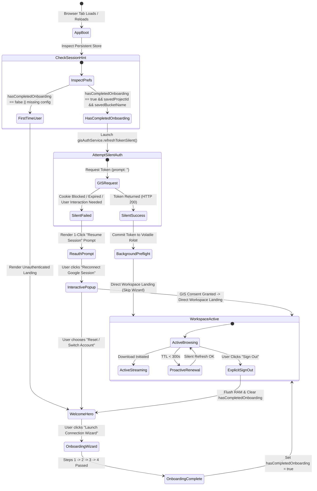
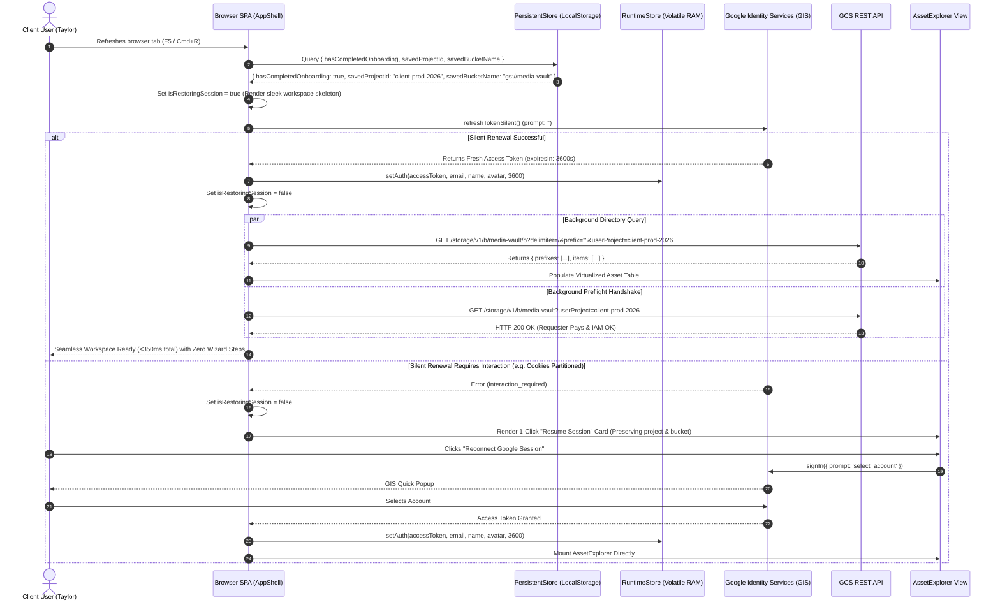
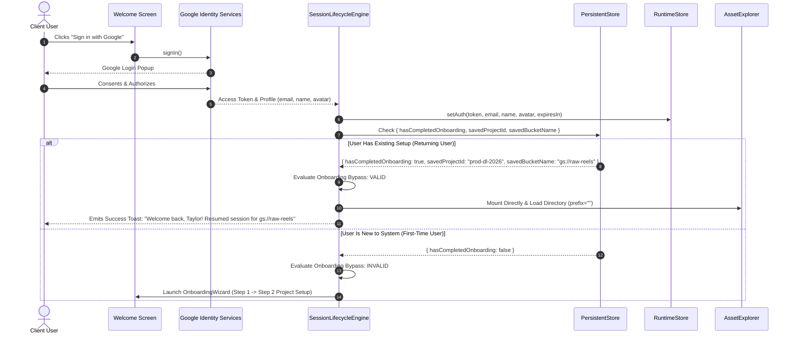

# Module 10: Session Continuity, Silent Token Restoration & Onboarding Bypass Specification
## Module ID: `MOD-10-SESSION-LIFECYCLE`

---

### 1. Executive Summary & Problem Statement

In web-based client applications interacting with Google Cloud Storage (GCS) and Google Identity Services (GIS), session persistence and user flow continuity present a critical UX challenge under zero-trust, client-side security constraints.

#### The Problem:
1. **Volatile Memory Drop on Reload**: In compliance with strict credential security guidelines (NFR-1.1, Module 8), OAuth 2.0 access tokens are held exclusively in volatile in-memory runtime storage (`Zustand` store) and **must never be written to `localStorage`, `sessionStorage`, or cookies**. Consequently, when a client user reloads or refreshes their browser tab, the in-memory access token is lost. Previously, this caused the application to drop the user back to the cold "Connect to Google Cloud Storage" welcome screen, forcing them to restart their entire workflow.
2. **Forced Multi-Step Onboarding**: When returning users sign in with their Google account, they were previously forced through all four linear steps of the Onboarding Wizard (Identity $\rightarrow$ Project Selection $\rightarrow$ Bucket Input $\rightarrow$ 4-Point Preflight), even if they had already completed onboarding, had active GCP billing, and possessed valid saved preferences (`savedProjectId` and `savedBucketName`).

```mermaid
flowchart TD
    subgraph ProblemStatement ["Previous Broken Flow (Friction & State Loss)"]
        Reload1["User Reloads Page / Re-authenticates"] --> Wipe["Volatile RAM Wiped\n(Token = null)"]
        Wipe --> Landing["Cold Initial Welcome Screen Rendered"]
        Landing --> ForcedWizard["Forced 4-Step Onboarding Wizard\n(Step 1 -> 2 -> 3 -> 4)"]
        ForcedWizard --> Frustration["User Frustration & Wasted Time"]
    end

    subgraph SolutionStatement ["New Seamless Session Lifecycle (MOD-10)"]
        Reload2["User Reloads Page"] --> DetectHint["Detect Non-Sensitive Session Hint\n(hasCompletedOnboarding: true)"]
        DetectHint --> SilentAuth["Silent GIS Token Re-Acquisition\n(prompt: '', background iframe/client)"]
        
        SilentAuth -->|Success| BgPreflight["Background 4-Point Preflight Handshake"]
        BgPreflight --> DirectWorkspace["Direct Workspace Landing (AssetExplorer)\n(Zero Wizard Steps / Zero State Loss)"]
        
        SilentAuth -->|Interactive Required / Expired| ReauthCard["In-Workspace 1-Click 'Resume Session' Card\n(Preserves Project, Bucket, and Path Context)"]
        ReauthCard -->|1-Click GIS Popup| DirectWorkspace
    end
```



---

### 2. Functional & Non-Functional Requirements

#### Functional Requirements (FR)

- **FR-10.1 (Non-Sensitive Session Hint Persistence)**:
  - The application shall record a non-sensitive session metadata object in `localStorage` under `basingse-media-client-prefs` upon successful completion of initial onboarding or explicit authentication.
  - Session hint attributes shall strictly include:
    - `hasCompletedOnboarding: boolean`
    - `lastAuthUserEmail: string` (e.g. `"taylor@freelance-edit.com"`)
    - `lastAuthTimestamp: number` (Epoch milliseconds)
    - `sessionContinuityEnabled: boolean` (default: `true`)
  - **Zero Credentials Clause**: Under no circumstances shall OAuth tokens, refresh tokens, client secrets, or private keys be written into this session hint.

- **FR-10.2 (Boot-Time Silent Session Restoration)**:
  - Upon web application boot (`AppShell` mount), if `hasCompletedOnboarding === true` and valid `savedBucketName` is present (with `savedProjectId` verified for Requester-Pays buckets, or optional for Owner-Pays buckets), the application shall automatically execute a silent background token re-acquisition handshake via `gisAuthService.refreshTokenSilent()`.
  - While silent restoration is in progress:
    - The UI shall render a subtle, non-blocking restoration indicator ("Restoring Google Cloud session...") or maintain the workspace skeleton without flashing the initial landing hero.
    - If silent re-acquisition succeeds ($\le 400\text{ ms}$): Ingest token into volatile RAM (`useRuntimeStore.getState().setAuth()`), update token expiration countdown, and trigger background preflight verification.

- **FR-10.3 (Returning User Onboarding Bypass & Direct Workspace Landing)**:
  - When an authenticated session is restored (either silently on reload or via interactive sign-in), the system shall evaluate whether the user has completed onboarding and possesses a valid bucket (and project if in Requester-Pays mode).
  - If valid configuration exists:
    - The application shall **bypass the 4-step Onboarding Wizard entirely**.
    - The application shall immediately mount the `AssetExplorerShell` and initiate directory metadata querying for the active `savedBucketName` using the active `savedProjectId` (omitted if Owner-Pays).
    - An automated 4-point preflight check shall run asynchronously in the background. If preflight passes, a non-intrusive success indicator is emitted. If preflight fails (e.g. IAM permission revoked), an actionable warning banner is surfaced without tearing down the workspace.

- **FR-10.4 (Interactive 1-Click Re-Authentication Fallback)**:
  - If silent token re-acquisition fails (due to third-party cookie restrictions, expired Google session, or browser privacy partitions), the application shall **not** reset the user's configured project or bucket.
  - Instead, the workspace shall render an elegant **Session Re-Authentication Card** (or Header Reconnect Prompt):
    - Displays user identity hint: *"Welcome back, Taylor (taylor@freelance-edit.com)"*.
    - Context summary: *"Active Project: `client-media-prod-2026` | Bucket: `gs://media-vault`"*.
    - Primary Action: `[ ⚡ Reconnect Google Session (1-Click) ]`.
    - Secondary Action: `[ Switch Account / Reconfigure ]`.
  - Clicking "Reconnect Google Session" launches the standard GIS popup. Upon authorization, the user is immediately returned to their exact directory path without stepping through the onboarding wizard.

- **FR-10.5 (Session Expiration Lifecycle & Background Proactive Renewal)**:
  - The application shall monitor remaining token TTL in volatile memory.
  - At **5 minutes prior to token expiration** ($T - 300\text{s}$), the background timer shall automatically invoke `gisAuthService.refreshTokenSilent()`.
  - If proactive renewal succeeds, token TTL is seamlessly extended in RAM with zero user interruption.
  - If proactive renewal fails (e.g. network disconnect), an in-workspace ambient banner appears: *"Your Google Cloud authorization will expire in X minutes. [Click to Renew Session]"*.

- **FR-10.6 (Explicit Sign-Out & Session Hint Cleardown)**:
  - When the user explicitly clicks "Sign Out" or "Disconnect Session":
    - Volatile RAM credentials (`oauthToken`, active stream `AbortController`s) are immediately wiped.
    - Active network and disk streams are aborted within $< 200\text{ ms}$.
    - The persistent session hint `hasCompletedOnboarding` is set to `false`, and `lastAuthUserEmail` is cleared.
    - The application cleanly returns to the unauthenticated Welcome view.

#### Non-Functional Requirements (NFR)

- **NFR-10.1 (Zero Token Persistence Guarantee)**:
  - Automated security scanners and `StorageBoundaryAuditor` must continuously assert that no keys matching `token`, `bearer`, `secret`, `oauth`, or `jwt` exist in `localStorage` or `sessionStorage`.
- **NFR-10.2 (Session Restoration Latency SLA)**:
  - Silent token re-acquisition and directory state rehydration on reload must resolve in **$< 400\text{ ms}$** on standard broadband connections.
- **NFR-10.3 (Accessibility & Visual Transitions)**:
  - Session restoration state transitions must comply with **WCAG 2.1 AA**, featuring accessible `aria-live="polite"` status announcements and zero layout shifts (Cumulative Layout Shift $\text{CLS} < 0.05$).

---

### 3. Subsystem Protocol & State Machine



---

### 4. Sequence Diagrams

#### 4.1 Sequence A: Page Reload with Silent Background Restoration (The "Zero-Click" Reload Flow)



#### 4.2 Sequence B: Returning User Interactive Sign-In with Onboarding Bypass



---

### 5. TypeScript Interfaces & Data Contracts

```typescript
/**
 * Non-sensitive session metadata stored in persistent storage.
 * STRICTLY PROHIBITED: No access tokens, refresh tokens, or secret keys.
 */
export interface SessionHint {
  hasCompletedOnboarding: boolean;
  lastAuthUserEmail: string | null;
  lastAuthUserName: string | null;
  lastAuthTimestamp: number | null;
  sessionContinuityEnabled: boolean;
}

/**
 * Volatile runtime session restoration state.
 */
export interface SessionRestorationState {
  isRestoringSession: boolean;
  restorationStatus: 'idle' | 'restoring' | 'restored' | 'interactive_required' | 'failed';
  restorationError: string | null;
}

/**
 * Engine contract governing session lifecycle, silent recovery, and onboarding bypass.
 */
export class SessionLifecycleEngine {
  /**
   * Evaluates whether the user qualifies for immediate onboarding bypass.
   */
  public static shouldBypassOnboarding(
    hasCompletedOnboarding: boolean,
    savedProjectId: string,
    savedBucketName: string
  ): boolean {
    const hasValidProject = Boolean(savedProjectId && savedProjectId.trim().length >= 6);
    const hasValidBucket = Boolean(savedBucketName && savedBucketName.trim().length >= 3);
    return hasCompletedOnboarding && hasValidProject && hasValidBucket;
  }

  /**
   * Executes boot-time session restoration lifecycle.
   */
  public static async restoreSessionOnBoot(options: {
    hasCompletedOnboarding: boolean;
    savedProjectId: string;
    savedBucketName: string;
    onStatusChange: (status: SessionRestorationState) => void;
  }): Promise<{ restored: boolean; requireInteractive: boolean }> {
    const { hasCompletedOnboarding, savedProjectId, savedBucketName, onStatusChange } = options;

    if (!this.shouldBypassOnboarding(hasCompletedOnboarding, savedProjectId, savedBucketName)) {
      onStatusChange({
        isRestoringSession: false,
        restorationStatus: 'idle',
        restorationError: null
      });
      return { restored: false, requireInteractive: false };
    }

    onStatusChange({
      isRestoringSession: true,
      restorationStatus: 'restoring',
      restorationError: null
    });

    try {
      // Attempt silent GIS refresh
      const session = await (window as any).gisAuthService?.refreshTokenSilent?.();
      if (session?.accessToken) {
        onStatusChange({
          isRestoringSession: false,
          restorationStatus: 'restored',
          restorationError: null
        });
        return { restored: true, requireInteractive: false };
      }
      throw new Error('Silent renewal returned empty token.');
    } catch (err: any) {
      onStatusChange({
        isRestoringSession: false,
        restorationStatus: 'interactive_required',
        restorationError: err?.message || 'Silent session renewal required interactive prompt.'
      });
      return { restored: false, requireInteractive: true };
    }
  }

  /**
   * Commits session completion upon successful onboarding finish.
   */
  public static markOnboardingComplete(
    userEmail: string,
    userName: string,
    projectId: string,
    bucketName: string
  ): void {
    // Record non-sensitive persistent hints
    const persistentStore = (window as any).usePersistentStore?.getState?.();
    if (persistentStore) {
      persistentStore.setHasCompletedOnboarding?.(true);
      persistentStore.setLastAuthUserEmail?.(userEmail);
      persistentStore.setLastAuthUserName?.(userName);
      persistentStore.setSavedProjectId?.(projectId);
      persistentStore.setSavedBucketName?.(bucketName);
      persistentStore.addRecentBucket?.(bucketName);
    }
  }

  /**
   * Completely purges all session state and hints upon sign-out.
   */
  public static purgeSession(): void {
    const runtimeStore = (window as any).useRuntimeStore?.getState?.();
    const persistentStore = (window as any).usePersistentStore?.getState?.();

    if (runtimeStore) {
      runtimeStore.clearAuth?.();
    }
    if (persistentStore) {
      persistentStore.setHasCompletedOnboarding?.(false);
      persistentStore.setLastAuthUserEmail?.(null);
      persistentStore.setLastAuthUserName?.(null);
    }
  }
}
```

---

### 6. UI Components & Visual Layout

#### 6.1 Re-Authentication & Session Reconnect Card Wireframe
```
+----------------------------------------------------------------------------------------------------+
|  [Logo] Files of Ba Sing Se                                                 [Settings] [Help]      |
+----------------------------------------------------------------------------------------------------+
|                                                                                                    |
|  +----------------------------------------------------------------------------------------------+  |
|  | [Key] RESUME GOOGLE CLOUD SESSION                                                            |  |
|  |                                                                                              |  |
|  | Welcome back, Taylor (taylor@freelance-edit.com)!                                            |  |
|  | Your workspace is configured and ready. Please re-authenticate your Google session to       |  |
|  | resume browsing and streaming.                                                               |  |
|  |                                                                                              |  |
|  | ACTIVE CONFIGURATION:                                                                        |  |
|  | • Billed Project: client-prod-media-2026                                                      |  |
|  | • Target Bucket:  gs://media-vault                                                           |  |
|  |                                                                                              |  |
|  | [ ⚡ Reconnect Google Session (1-Click) ]             [ Switch Account / Reconfigure ]        |  |
|  +----------------------------------------------------------------------------------------------+  |
|                                                                                                    |
+----------------------------------------------------------------------------------------------------+
```

---

### 7. Error Handling, Edge Cases & Browser Matrix

| Edge Case / Scenario | Root Cause | Handling & Recovery Protocol |
| :--- | :--- | :--- |
| **Third-Party Cookies Blocked (Safari/Firefox/Brave)** | Silent iframe token request fails due to partitioned storage or cookie restrictions | Catch silent refresh error $\rightarrow$ transition gracefully to `interactive_required` $\rightarrow$ render 1-Click "Resume Session" card. Do not show error toasts. |
| **Google Password Changed / Token Revoked** | User revoked application permission in Google Security settings | Catch `401 Unauthorized` / `invalid_grant` $\rightarrow$ clear session hint $\rightarrow$ launch full Google sign-in consent. |
| **Project Permissions Revoked by Host Admin** | Client user was removed from bucket's `roles/storage.objectViewer` | Direct workspace mount loads directory $\rightarrow$ encounters `HTTP 403 Forbidden` $\rightarrow$ renders actionable permission diagnosis card with 1-click admin request template. |
| **Saved Project Deleted in Google Cloud** | User deleted their billing project in GCP Console | Preflight check detects `HTTP 404 Project Not Found` $\rightarrow$ surfaces Project Switcher Popover automatically. |
| **Multi-Tab Session Sync** | User opens media portal in multiple tabs simultaneously | In-memory tokens exist per tab; non-sensitive preferences sync via `window.addEventListener('storage')`. |

---

### 8. Verification & Test Matrix

- **Unit Tests**:
  - `test_should_bypass_onboarding_evaluation`: Asserts true when `hasCompletedOnboarding && savedProjectId && savedBucketName`, false otherwise.
  - `test_zero_token_in_session_hints`: Asserts `SessionHint` serialization does not contain credentials.
  - `test_session_purge`: Asserts `purgeSession()` clears both volatile tokens and persistent `hasCompletedOnboarding`.
- **Integration Tests**:
  - Mock page reload with valid session hint $\rightarrow$ verify `refreshTokenSilent()` called and `AssetExplorerShell` mounts in $< 400\text{ ms}$.
  - Mock page reload with failed silent refresh $\rightarrow$ verify 1-Click "Resume Session" card renders with pre-populated project and bucket badges.
  - Mock sign-in for returning user $\rightarrow$ verify 4-step wizard is completely bypassed.
