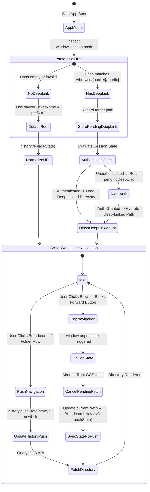
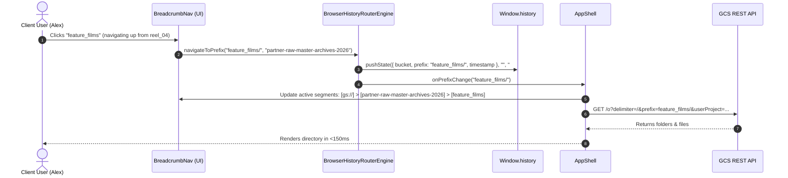
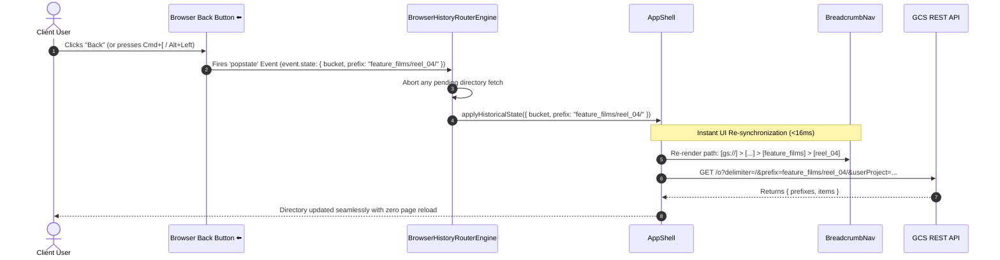

# Module 11: Browser History API, URL Synchronization & Deep-Linking Design & Requirements Specification
## Module ID: `MOD-11-BROWSER-HISTORY-ROUTING`

---

### 1. Executive Summary & Problem Statement

In media production environments, client users (video editors, VFX supervisors, colorists, and post-production leads) navigate deep, nested directory hierarchies within Google Cloud Storage buckets (e.g., `gs://partner-raw-master-archives-2026/feature_films/reel_04/camera_raw/scene_12A/`). 

#### The Problem:
1. **Broken Browser History Traversal**: In a standard client-side SPA state model, clicking through breadcrumb segments or folder rows updates only local React component state (`useState` / Zustand). When a user naturally presses their browser's **Back** or **Forward** buttons (or uses keyboard shortcuts `Alt+Left`, `Alt+Right`, `Cmd+[`, `Cmd+]`, or mouse navigation buttons), the browser navigates entirely away from the application page or reloads the unauthenticated root, causing immediate context loss and workflow disruption.
2. **Lack of Bookmarkable & Shareable Deep Links**: Without URL synchronization, users cannot copy a URL from the address bar to share a specific reel folder with a colleague, bookmark a daily review folder, or refresh their browser tab without being reset to the root directory (`prefix=""`).
3. **Rapid Navigation Race Conditions**: When users click Back/Forward repeatedly in rapid succession, out-of-order GCS API fetch responses can cause directory rendering jitter or stale folder listings if in-flight requests are not properly tracked and cancelled.

```mermaid
flowchart TD
    subgraph ProblemStatement ["Previous Broken Navigation Flow"]
        FolderClick["User Clicks 'scene_12A/'"] --> StateUpdate["React State: currentPrefix = '.../scene_12A/'"]
        StateUpdate --> NoURL["Browser URL Remains Static (No History Stack Entry)"]
        NoURL --> UserBack["User Clicks Browser Back Button ⬅️"]
        UserBack --> BrokenNav["Browser Leaves App / Navigates to Prior Web Page\n(Session Context Lost)"]
    end

    subgraph SolutionStatement ["New History-Synchronized Flow (MOD-11)"]
        NavAction["User Navigates (Folder Click / Breadcrumb Click)"] --> PushHistory["history.pushState({ bucket, prefix, timestamp }, '', '#/browse/...')"]
        PushHistory --> URLSync["Address Bar Synchronizes (Bookmarkable Deep-Link)"]
        URLSync --> PopListener["Browser Back/Forward ⬅️ ➡️ Fires 'popstate' Event"]
        PopListener --> Engine["BrowserHistoryRouterEngine Intercepts popstate"]
        Engine --> AbortInFlight["Abort In-Flight GCS Requests via AbortController"]
        Engine --> UpdatePrefix["Update currentPrefix & BreadcrumbNav in <16ms"]
        UpdatePrefix --> LoadDirectory["Query GCS for Historical Prefix"]
    end
```



---

### 2. Functional & Non-Functional Requirements

#### Functional Requirements (FR)

- **FR-11.1 (Canonical URL Hash Routing & Serialization)**:
  - The application shall maintain a bidirectional synchronization between the active bucket, directory prefix, and the browser's URL hash.
  - **Canonical URL Hash Schema**:
    ```
    #/browse/{bucketName}/{encodedPrefix}
    ```
    - Example Root: `#/browse/partner-raw-master-archives-2026/`
    - Example Nested: `#/browse/partner-raw-master-archives-2026/feature_films/reel_04/`
  - **Query-Param Fallback Schema** (supported as alias on input):
    ```
    #/browse?bucket={bucketName}&prefix={encodedPrefix}
    ```
  - All directory prefix segments shall undergo safe URI encoding (`encodeURIComponent`) to correctly preserve spaces, slashes, unicode, and special characters.

- **FR-11.2 (History Stack Push on Forward Navigation)**:
  - When the user navigates into a folder row or clicks a breadcrumb segment, the system shall invoke `window.history.pushState(state, '', url)`.
  - The history state object shall strictly adhere to:
    ```typescript
    interface NavigationHistoryState {
      bucket: string;
      prefix: string;
      timestamp: number;
      source: 'user_interaction' | 'deep_link' | 'bucket_switch';
    }
    ```
  - Access tokens, passwords, and sensitive keys **MUST NEVER** be placed in `history.state` or URL parameters.

- **FR-11.3 (Browser Back & Forward Button Handling via `popstate`)**:
  - The application shall register a global `window.addEventListener('popstate', handlePopState)` listener on `AppShell` mount.
  - When a `popstate` event fires (via browser UI Back/Forward, mouse buttons 4/5, or keyboard history shortcuts):
    1. Parse the target state from `event.state` (or parse `window.location.hash` if state is null).
    2. Extract `targetBucket` and `targetPrefix`.
    3. If `targetBucket` differs from the current active bucket: verify access/preflight and switch active bucket in state.
    4. Update `currentPrefix` state **WITHOUT** calling `history.pushState` (preventing infinite history loop).
    5. Update the `BreadcrumbNav` component immediately to reflect the restored path.
    6. Initiate directory querying for `targetPrefix`.

- **FR-11.4 (Deep-Link Boot-Time Hydration & Bookmark Support)**:
  - Upon initial application load, if `window.location.hash` contains a valid `#/browse/{bucket}/{prefix}` route:
    - Extract initial bucket and prefix.
    - If user has completed onboarding or qualifies for silent session restoration (*Module 10*), the application shall directly hydrate the workspace with the deep-linked `bucket` and `prefix`.
    - If user requires authentication, the deep-linked path shall be preserved in runtime memory as `pendingDeepLink` and navigated to immediately upon login consent completion.

- **FR-11.5 (History Normalization via `replaceState`)**:
  - During boot-time initialization, silent session recovery, or when normalizing malformed URL hashes, the application shall use `window.history.replaceState()` to update the URL without creating extraneous duplicate entries on the browser history stack.

- **FR-11.6 (In-Flight Request Cancellation & Rapid Traversal Guardrail)**:
  - When rapid successive `popstate` events occur (e.g. user clicking Back 5 times quickly), any pending in-flight GCS directory fetch request shall be immediately aborted via `AbortController.abort()` to prevent stale responses from overwriting the latest historical view.

- **FR-11.7 (Non-Disruption of Active Streams & Floating Widgets)**:
  - Navigating through browser history or clicking breadcrumbs shall **NEVER** interrupt or abort background file downloads managed by `DownloadManagerShell`. Active stream handles remain anchored in `useRuntimeStore`.

#### Non-Functional Requirements (NFR)

- **NFR-11.1 (Routing Latency SLA)**:
  - Breadcrumb and directory state update upon `popstate` event **MUST resolve in $< 16\text{ ms}$ (within a single animation frame)** to maintain 60 FPS UI responsiveness.
- **NFR-11.2 (Zero Token Exposure in URL / History)**:
  - URL hash, query parameters, and `history.state` must pass security validation confirming $0\%$ presence of OAuth access tokens, refresh tokens, client secrets, or private keys.
- **NFR-11.3 (Accessibility & Screen Reader Announcements)**:
  - Upon history traversal or breadcrumb click, the restored directory path shall be announced to assistive technologies via an accessible `aria-live="polite"` landmark: *"Navigated to folder: feature_films/reel_04/"*.
- **NFR-11.4 (Static Edge Hosting Compatibility)**:
  - Hash-based routing (`#/browse/...`) ensures 100% compatibility with static edge hosts (Firebase Hosting, Cloudflare Pages, S3, local `file://`) without requiring server-side URL rewrite rules.

---

### 3. Subsystem Protocol & State Machine



---

### 4. Sequence Diagrams

#### 4.1 Sequence A: User Clicks Breadcrumb / Folder $\rightarrow$ History Pushed & Synchronized



#### 4.2 Sequence B: User Clicks Browser Back / Forward Button $\rightarrow$ `popstate` Intercepted



---

### 5. TypeScript Interfaces & Data Contracts

```typescript
/**
 * Structured state object stored inside window.history.state.
 * Strictly non-sensitive. Zero tokens or secret credentials.
 */
export interface NavigationHistoryState {
  bucket: string;
  prefix: string;
  timestamp: number;
  source: 'user_interaction' | 'deep_link' | 'popstate' | 'bucket_switch';
}

/**
 * Parsed route information extracted from window.location.hash.
 */
export interface ParsedRoute {
  view: 'browse' | 'onboarding' | 'config' | 'root';
  bucket: string;
  prefix: string;
  isValid: boolean;
}

/**
 * Options for navigation execution.
 */
export interface NavigateOptions {
  replace?: boolean;
  source?: NavigationHistoryState['source'];
}

/**
 * Primary Engine governing Browser History API and URL Synchronization.
 */
export class BrowserHistoryRouterEngine {
  private static ROUTE_PREFIX = '#/browse';

  /**
   * Serializes bucket and prefix into canonical URL hash string.
   */
  public static serializeHash(bucketName: string, prefix: string): string {
    const cleanBucket = bucketName.replace(/^gs:\/\//i, '').replace(/\/+$/, '').trim();
    const cleanPrefix = prefix.replace(/^\/+/, ''); // Preserve trailing slash for directory semantics

    if (!cleanBucket) {
      return '';
    }

    if (!cleanPrefix) {
      return `${this.ROUTE_PREFIX}/${encodeURIComponent(cleanBucket)}/`;
    }

    // Split prefix segments to encode each path component safely
    const encodedSegments = cleanPrefix
      .split('/')
      .map((segment) => encodeURIComponent(segment))
      .join('/');

    return `${this.ROUTE_PREFIX}/${encodeURIComponent(cleanBucket)}/${encodedSegments}`;
  }

  /**
   * Parses current window.location.hash into structured route.
   */
  public static parseHash(hashString: string = window.location.hash): ParsedRoute {
    if (!hashString || !hashString.startsWith('#')) {
      return { view: 'root', bucket: '', prefix: '', isValid: false };
    }

    // Support Query Param style: #/browse?bucket=abc&prefix=xyz
    if (hashString.startsWith('#/browse?') || hashString.startsWith('#?')) {
      const queryPart = hashString.split('?')[1] || '';
      const params = new URLSearchParams(queryPart);
      const bucket = (params.get('bucket') || '').replace(/^gs:\/\//i, '').trim();
      const prefix = params.get('prefix') || '';
      return {
        view: 'browse',
        bucket,
        prefix,
        isValid: Boolean(bucket)
      };
    }

    // Standard Path style: #/browse/{bucket}/{prefix...}
    const cleanHash = hashString.replace(/^#\/?/, '');
    const parts = cleanHash.split('/');

    if (parts[0] !== 'browse') {
      return { view: 'root', bucket: '', prefix: '', isValid: false };
    }

    if (parts.length < 2 || !parts[1]) {
      return { view: 'browse', bucket: '', prefix: '', isValid: false };
    }

    const bucket = decodeURIComponent(parts[1]).replace(/^gs:\/\//i, '').trim();
    const rawPrefixParts = parts.slice(2);
    
    // Decode segments and reconstruct prefix with trailing slash if present
    const decodedPrefix = rawPrefixParts
      .map((seg) => decodeURIComponent(seg))
      .filter((seg, idx) => seg.length > 0 || idx === rawPrefixParts.length - 1)
      .join('/');

    const prefix = decodedPrefix ? (decodedPrefix.endsWith('/') ? decodedPrefix : `${decodedPrefix}/`) : '';

    return {
      view: 'browse',
      bucket,
      prefix,
      isValid: Boolean(bucket && bucket.length >= 3)
    };
  }

  /**
   * Pushes a new navigation state to browser history and updates URL.
   */
  public static pushNavigation(
    bucketName: string,
    prefix: string,
    options: NavigateOptions = {}
  ): void {
    const cleanBucket = bucketName.replace(/^gs:\/\//i, '').replace(/\/+$/, '').trim();
    const targetHash = this.serializeHash(cleanBucket, prefix);

    if (!targetHash) return;

    const state: NavigationHistoryState = {
      bucket: cleanBucket,
      prefix,
      timestamp: Date.now(),
      source: options.source || 'user_interaction'
    };

    if (options.replace || window.location.hash === targetHash) {
      window.history.replaceState(state, '', targetHash);
    } else {
      window.history.pushState(state, '', targetHash);
    }
  }

  /**
   * Replaces current history entry without pushing a new stack item.
   */
  public static replaceNavigation(bucketName: string, prefix: string): void {
    this.pushNavigation(bucketName, prefix, { replace: true, source: 'deep_link' });
  }
}
```

---

### 6. UI Components & Architectural Enhancements

1. **`BreadcrumbNav.tsx`**:
   - Each breadcrumb button triggers `onNavigatePrefix(pathUpToSegment)`.
   - Accessible ARIA attributes: `aria-label="Navigate up to folder {segment}"`, `aria-current={isLast ? 'location' : undefined}`.
   - Smooth hover states with visual keyboard focus ring (`focus-visible:ring-2 focus-visible:ring-cyan-400`).
2. **`AppShell.tsx`**:
   - Registers `popstate` event listener with `useEffect`.
   - Manages `activeAbortController` to abort in-flight queries during fast history traversal.
   - Synchronizes persistent store `savedBucketName` if historical state references an alternate recent bucket.

---

### 7. Error Handling, Edge Cases & Browser Matrix

| Edge Case / Scenario | Root Cause | Handling & Recovery Protocol |
| :--- | :--- | :--- |
| **Rapid Back/Forward Clicking** | User clicks Back button 5+ times in 1 second | Cancel pending directory fetch via `AbortController.abort()`. Process latest `popstate` state cleanly without UI jitter. |
| **Deep Link to Inaccessible Bucket** | User opens shared URL for bucket where they lack IAM permissions | Hydrate route $\rightarrow$ GCS returns `HTTP 403 Forbidden` $\rightarrow$ surface actionable permission diagnosis card with 1-click bucket switch. |
| **Deep Link with Missing Trailing Slash** | User navigates to `#/browse/bucket/folder1` | Automatically normalize to `folder1/` via `history.replaceState()` to ensure correct delimiter slicing. |
| **Popstate to Historical Bucket Not in Preferences** | User navigated across multiple buckets in same tab | Background preflight runs on target bucket; if valid, updates `savedBucketName` and renders directory. |
| **Active Stream During History Navigation** | User downloads 20GB file and presses Back button | Streaming pipeline continues uninterrupted in background; `DownloadManager` floating widget remains active. |
| **Malformed Unicode in URL Hash** | Invalid URI sequence in hash (e.g. `%E0%A4%A`) | Catch `URIError` $\rightarrow$ sanitize string $\rightarrow$ fallback to root directory (`prefix=""`) with warning toast. |

---

### 8. Verification & Test Matrix

- **Unit Tests**:
  - `test_serialize_hash_root`: Confirms `serializeHash("my-bucket", "")` yields `"#/browse/my-bucket/"`.
  - `test_serialize_hash_nested`: Confirms `serializeHash("my-bucket", "folder/subfolder/")` yields `"#/browse/my-bucket/folder/subfolder/"`.
  - `test_serialize_hash_special_chars`: Confirms spaces and special characters are URI encoded (`"reel 04/scene#1"` $\rightarrow$ `"reel%2004/scene%231/"`).
  - `test_parse_hash_valid`: Validates extraction of bucket and nested prefix from hash.
  - `test_parse_hash_malformed`: Validates graceful fallback on invalid hex sequences.
- **Integration Tests**:
  - `test_history_push_on_folder_click`: Clicking folder row invokes `history.pushState` with matching URL hash and state object.
  - `test_popstate_triggers_prefix_reload`: Dispatching synthetic `popstate` event updates `currentPrefix` and invokes directory listing without calling `pushState`.
  - `test_deep_link_boot_hydration`: Mounting `AppShell` with preset `window.location.hash` triggers directory query for deep-linked path upon auth.
  - `test_zero_token_in_history_state`: Asserts that `window.history.state` contains zero credential tokens.

---

### 9. Cross-Module Integration Matrix

- **[Module 2: GCS Explorer & Virtualized Grid](module_2_gcs_explorer_design_and_requirements.md)** (`MOD-02-GCS-EXPLORER`): `BreadcrumbBar` and folder rows delegate all navigation transitions to `BrowserHistoryRouterEngine`.
- **[Module 10: Session Continuity & Onboarding Bypass](module_10_session_lifecycle_and_restoration_design_and_requirements.md)** (`MOD-10-SESSION-LIFECYCLE`): Coordinates boot-time deep-link hydration with silent GIS token restoration.
- **[Module 8: State Management & Persistence](module_8_state_persistence_design_and_requirements.md)** (`MOD-08-STATE-PERSISTENCE`): Asserts zero token leakage in `window.history.state`.
- **[Module 9: Workspace Navigation & GCP Config Center](module_9_workspace_and_gcp_config_center_design_and_requirements.md)** (`MOD-09-WORKSPACE-GCP-CONFIG-CENTER`): Bucket switcher synchronizes target URL hash upon bucket transitions.
