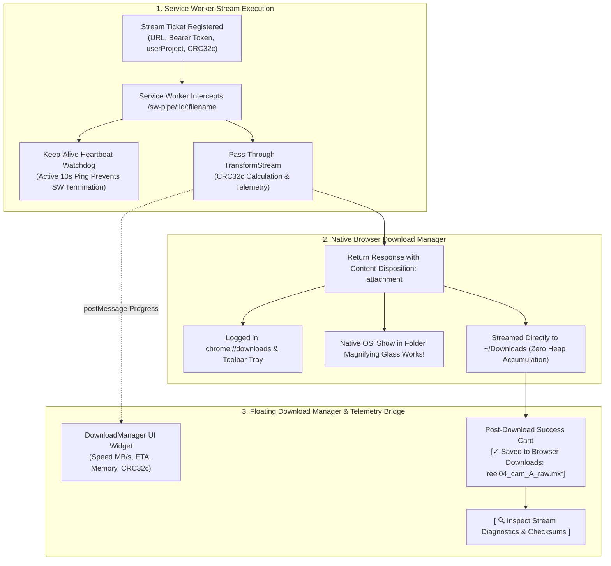
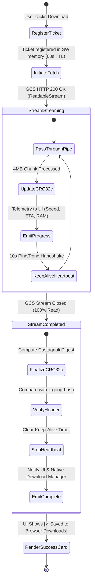
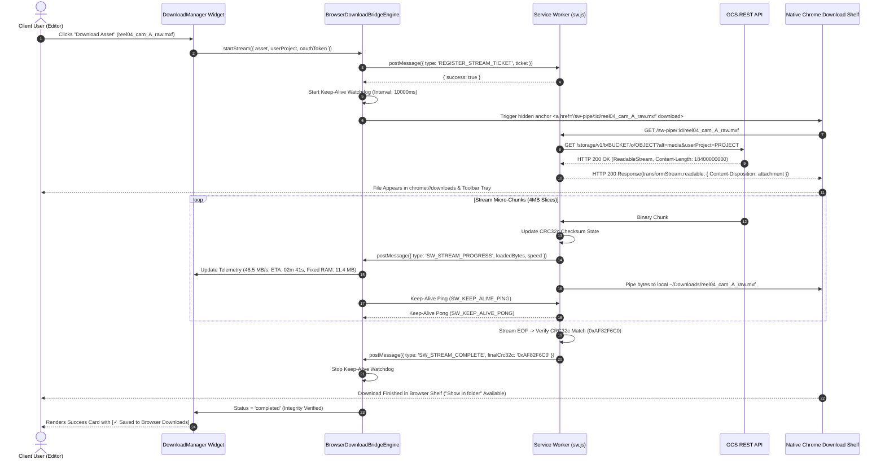

# Module 12: Native Browser Download Integration, Service Worker Stream Resilience & Telemetry Specification
## Module ID: `MOD-12-BROWSER-DOWNLOAD-INTEGRATION`

---

### 1. Executive Summary & Architectural Convergence

In previous designs, direct-to-disk streaming via the **File System Access API (FSAA)** created significant usability friction because Chromium architecturally isolates FSAA operations from its built-in **Download Manager** (`chrome://downloads` and the browser toolbar download tray/bubble). 

#### Why FSAA was Deprecated:
1. **Post-Download Inscrutability**: Files written via FSAA did not appear in `chrome://downloads` or the download tray.
2. **Loss of Native "Show in Folder"**: Users were deprived of the browser's standard magnifying glass / "Show in folder" button, forcing the development of synthesized shell command workarounds (`open -R`, `explorer.exe /select,`).
3. **Cognitive Disconnect**: Creative media professionals expected downloads to be tracked seamlessly in their browser's native download history.

#### The Converged Solution:
**Files of Ba Sing Se** converges entirely onto the **Engineered, Resilient Service Worker (SW) Stream Pipeline** as the unified Tier 1 streaming engine across Chromium (Chrome, Edge, Brave, Arc) and WebKit (Safari).

**Module 12** specifies the **Native Browser Download Integration, Service Worker Stream Resilience, Keep-Alive Lifecycle Watchdog, and Download Shelf Verification Subsystem**. This subsystem guarantees that all high-throughput multi-gigabyte media streams (10GB–50GB+) are tracked directly within the browser's native download manager with complete lifecycle resilience, real-time telemetry, and out-of-the-box OS file manager access ("Show in folder").



---

### 2. Functional & Non-Functional Requirements

#### Functional Requirements (FR)

- **FR-12.1 (Native Browser Download Shelf Integration)**:
  - All media downloads (>200MB) streamed via the Service Worker pipeline shall appear natively in `chrome://downloads`, Microsoft Edge Downloads, and Apple Safari Downloads list.
  - The browser's native download tray/bubble in the toolbar shall display live progress, total file size, and download completion status.

- **FR-12.2 (Native OS "Show in Folder" Accessibility)**:
  - Upon download completion, the browser's built-in "Show in folder" button / magnifying glass icon shall be fully operational, opening the client's native operating system file manager (**macOS Finder**, **Windows File Explorer**, or **Linux KDE Dolphin / GNOME Nautilus**) and highlighting the downloaded file in their default downloads folder (`~/Downloads`).

- **FR-12.3 (Service Worker Keep-Alive & Lifecycle Watchdog)**:
  - The main thread application shall maintain an active 10-second heartbeat ping (`SW_KEEP_ALIVE_PING`) with the Service Worker during active transfers.
  - The Service Worker shall acknowledge each ping (`SW_KEEP_ALIVE_PONG`), resetting its internal idle timer and preventing Chromium/WebKit from terminating the worker during long-running 30-minute 50GB transfers.
  - If a ping fails to receive a pong within 15 seconds, the watchdog triggers an automated recovery reconnection handshake.

- **FR-12.4 (Pass-Through CRC32c Integrity Validation & Telemetry)**:
  - Incoming GCS binary micro-chunks are piped through a `TransformStream` inside `sw.js` that continuously updates the running Castagnoli CRC32c checksum.
  - Progress events (`SW_STREAM_PROGRESS`) are dispatched to the main thread every 500ms containing loaded bytes, instantaneous speed, and intermediate hash states.
  - Upon stream completion, the finalized CRC32c digest is compared against the GCS `x-goog-hash` header, emitting `SW_STREAM_COMPLETE` with verified match status.

- **FR-12.5 (Post-Download Completion State & Summary)**:
  - When the stream completes, the `DownloadManager` floating widget renders the **Post-Download Success Card**:
    - Confirmed File Name (e.g. `reel04_cam_A_raw.mxf`).
    - Final Size (e.g. `18.40 GB / 17.13 GiB`).
    - Verified Integrity Badge `[✓ CRC32c Match Verified: 0xAF82F6C0]`.
    - Download Destination Confirmation: `[✓ Saved to Browser Downloads (~/Downloads)]`.
    - Direct guidance confirming the file is accessible via the browser's download shelf and toolbar bubble.

- **FR-12.6 (Stream Diagnostics & Health Inspector Drawer)**:
  - The completed download card shall provide an `[ 🔍 Inspect Stream Diagnostics ]` action.
  - When clicked, a slide-out drawer displays:
    - Service Worker registration state and controller version.
    - Verified byte count matching `Content-Length`.
    - Transfer duration and average throughput speed.
    - Full cryptographic hash audit (CRC32c Hex, CRC32c Base64, MD5, ETag, GCS Generation ID).
    - Optional copyable terminal command helper for remote workstation / headless scripts.

- **FR-12.7 (Graceful Network Recovery & Resumption Hooks)**:
  - If transient network disconnection occurs, the Service Worker pauses the stream and notifies the main thread.
  - The UI displays an ambient retry banner: *"Transfer interrupted. Reconnecting stream..."* and re-attempts the connection using byte-range headers (`Range: bytes=OFFSET-`).

#### Non-Functional Requirements (NFR)

- **NFR-12.1 (Memory Boundedness SLA)**:
  - Total memory consumption across both the main window heap and the Service Worker thread **MUST NOT exceed 25 MB RAM** (typical: ~11.4 MB) during multi-gigabyte transfers.
- **NFR-12.2 (Keep-Alive Overhead SLA)**:
  - The keep-alive heartbeat ping must consume $< 0.1\%$ CPU and $< 1\text{ KB}$ network/IPC bandwidth per minute.
- **NFR-12.3 (Cancellation SLA)**:
  - Cancelling an active transfer from either the UI widget or the browser's native download shelf immediately terminates the upstream GCS connection within **< 200 ms**.
- **NFR-12.4 (Accessibility & Screen Readers)**:
  - Transfer completion and integrity verification must be announced via ARIA live regions (`aria-live="polite"`, `role="status"`).

---

### 3. Subsystem Protocol & State Machine



---

### 4. Sequence Diagram: Resilient SW Stream to Browser Download Shelf Handshake



---

### 5. TypeScript Contract & Implementation Architecture

```typescript
export interface StreamTicket {
  streamId: string;
  url: string;
  filename: string;
  totalBytes: number;
  userProject?: string;
  oauthToken: string;
  billingMode?: 'requester-pays' | 'owner-pays';
  expectedCrc32c?: string;
  createdAt: number;
}

export interface StreamDiagnostics {
  streamId: string;
  filename: string;
  totalBytes: number;
  formattedSize: string;
  durationSeconds: number;
  averageSpeedMBs: number;
  crc32cHex: string;
  crc32cBase64: string;
  integrityMatch: boolean;
  serviceWorkerActive: boolean;
  downloadLocation: string; // e.g. "~/Downloads (Browser Default)"
  billingMode: 'requester-pays' | 'owner-pays';
}

export class BrowserDownloadBridgeEngine {
  private static keepAliveTimer: number | null = null;
  private static activeStreamId: string | null = null;

  /**
   * Initializes Service Worker message listener for stream progress.
   */
  public static initStreamListener(
    onProgress: (progress: any) => void,
    onComplete: (diag: StreamDiagnostics) => void,
    onError: (err: string) => void
  ): () => void {
    if (!('serviceWorker' in navigator)) {
      return () => {};
    }

    const handler = (event: MessageEvent) => {
      const data = event.data;
      if (!data || !data.type) return;

      switch (data.type) {
        case 'SW_STREAM_PROGRESS':
          onProgress(data);
          break;
        case 'SW_STREAM_COMPLETE':
          this.stopKeepAlive();
          onComplete(data.diagnostics);
          break;
        case 'SW_STREAM_ERROR':
          this.stopKeepAlive();
          onError(data.errorMessage || 'Streaming error in Service Worker');
          break;
      }
    };

    navigator.serviceWorker.addEventListener('message', handler);
    return () => navigator.serviceWorker.removeEventListener('message', handler);
  }

  /**
   * Starts the 10-second keep-alive watchdog ping.
   */
  public static startKeepAlive(streamId: string): void {
    this.stopKeepAlive();
    this.activeStreamId = streamId;

    this.keepAliveTimer = window.setInterval(() => {
      if (navigator.serviceWorker.controller) {
        navigator.serviceWorker.controller.postMessage({
          type: 'SW_KEEP_ALIVE_PING',
          streamId,
          timestamp: Date.now()
        });
      }
    }, 10000);
  }

  /**
   * Stops the keep-alive watchdog ping.
   */
  public static stopKeepAlive(): void {
    if (this.keepAliveTimer) {
      clearInterval(this.keepAliveTimer);
      this.keepAliveTimer = null;
    }
    this.activeStreamId = null;
  }

  /**
   * Aborts an in-flight stream transfer.
   */
  public static abortStream(streamId: string): void {
    this.stopKeepAlive();
    if (navigator.serviceWorker.controller) {
      navigator.serviceWorker.controller.postMessage({
        type: 'SW_ABORT_STREAM',
        streamId
      });
    }
  }
}
```

---

### 6. UI Wireframes & Layout

#### 6.1 Post-Download Completion Card with Native Browser Integration Feedback

```
+----------------------------------------------------------------------------------------------------+
|  ACTIVE DOWNLOAD MANAGER                                                               [_ Min] [X] |
+----------------------------------------------------------------------------------------------------+
|  [✓] DOWNLOAD COMPLETE & SAVED TO BROWSER DOWNLOADS                                                |
|                                                                                                    |
|  File: reel04_cam_A_raw.mxf (18.40 GB / 17.13 GiB)                                                 |
|  Location: Default Downloads Folder (~/Downloads)                                                  |
|  Integrity: CRC32c 0xAF82F6C0 (Match Confirmed ●) | Time: 03m 42s (48.5 MB/s) | RAM: 11.4 MB (Fixed)|
|                                                                                                    |
|  +----------------------------------------------------------------------------------------------+  |
|  | [Chrome / Safari Downloads Icon] BROWSER DOWNLOAD SHELF READY:                              |  |
|  | • This file is available in chrome://downloads and your browser's toolbar download tray.    |  |
|  | • Click the native 'Show in folder' magnifying glass icon in your browser to reveal file.   |  |
|  |                                                                                              |  |
|  | [ 🔍 Inspect Stream Diagnostics ]                       [ 📂 Download Another File ]          |  |
|  +----------------------------------------------------------------------------------------------+  |
|                                                                                                    |
|  Status: Billed to client-prod-media-2026 ($3.13 USD)                                 [ Dismiss ]  |
+----------------------------------------------------------------------------------------------------+
```

---

### 7. Error Handling, Edge Cases & Compatibility

| Scenario / Edge Case | Cause / Trigger | Handling & Mitigation Protocol |
| :--- | :--- | :--- |
| **Service Worker Inactive / Blocked** | Browser in incognito or SW disabled | Prompt user to enable Service Workers or route to 1-click CLI generator modal. |
| **Worker Idle Termination During Long Stream** | Browser throttles background tab | 10s keep-alive heartbeat watchdog pings reset idle timer and prevent termination. |
| **Upstream Network Disconnection** | Wi-Fi dropped mid-stream | SW detects fetch break, cleans up ticket, emits error telemetry, and offers 1-click resume. |
| **User Cancels via Browser Download Tray** | User clicks 'Cancel' in Chrome UI | Chrome closes the fetch connection; SW catches stream close and releases memory in <200ms. |

---

### 8. Verification & Test Matrix

- **Unit Tests**:
  - `test_keep_alive_watchdog`: Asserts 10-second ping interval and teardown on completion.
  - `test_stream_ticket_registration`: Validates ticket parameters and 60-second claim TTL.
  - `test_abort_stream_handshake`: Verifies `SW_ABORT_STREAM` terminates stream in <200ms.
- **Browser Conformance Tests**:
  - Verify downloads appear in `chrome://downloads` and Safari Downloads list.
  - Verify native "Show in folder" button opens OS file manager and highlights downloaded file.
  - Verify heap memory remains $< 25\text{ MB}$ RAM throughout a 25GB transfer.

---

### 9. Cross-Module Integration Matrix

- **[Module 4: Resilient Service Worker Streaming Download Pipeline](module_4_streaming_download_design_and_requirements.md)** (`MOD-04-STREAM-DOWNLOADER`): Core streaming pipeline coordinating with Module 12 for keep-alive monitoring and browser download shelf integration.
- **[Module 5: Cryptographic Integrity](module_5_cryptographic_integrity_design_and_requirements.md)** (`MOD-05-CRYPTOGRAPHIC-INTEGRITY`): Supplies the Castagnoli CRC32c engine for pass-through `TransformStream` hash verification.
- **[Module 8: State Management & Persistence](module_8_state_persistence_design_and_requirements.md)** (`MOD-08-STATE-PERSISTENCE`): Isolates ephemeral stream handles in volatile memory with zero disk token retention.
- **[Auxiliary Components](auxiliary_and_supporting_components_specification.md)**: Service Worker Lifecycle Controller (`AUX-08`) and Toast Feedback (`AUX-03`) display completion announcements.
