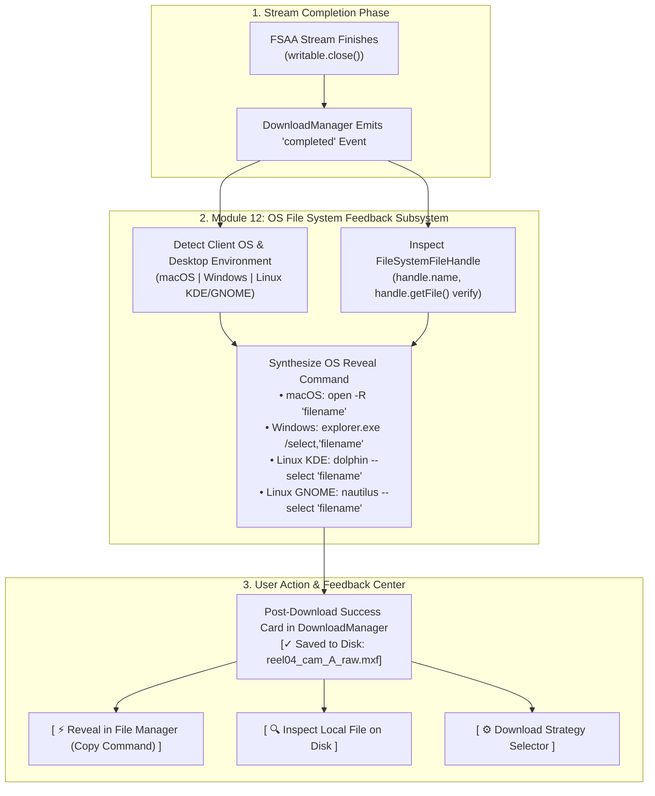
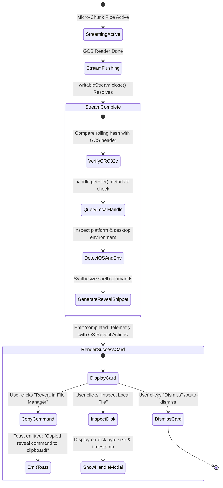
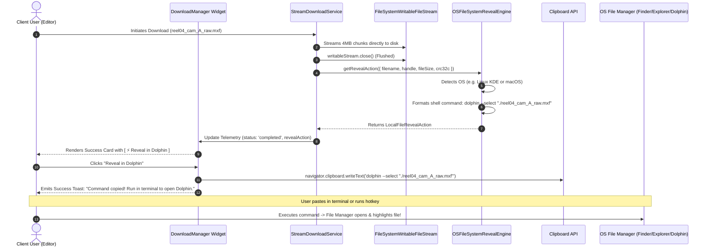

# Module 12: OS File System Feedback & File Manager Reveal Integration Specification
## Module ID: `MOD-12-OS-FILESYSTEM-FEEDBACK`

---

### 1. Executive Summary & Problem Statement

In Chromium-based browsers (Google Chrome, Microsoft Edge, Brave, Arc, Opera), when high-performance media files (10GB–50GB+) are streamed directly to local storage via the **File System Access API (FSAA)** (`window.showSaveFilePicker()` and `FileSystemWritableFileStream`), Chrome bypasses its internal **Download Manager** (`chrome://downloads` and the browser toolbar download tray/bubble).

#### The Problem:
1. **Missing Browser Download List Entry**: Because Chromium architecturally classifies File System Access API operations as direct local disk I/O (similar to an IDE saving a file) rather than an incoming network attachment, the downloaded asset does not appear in Chrome's download history shelf.
2. **Loss of the "Show in Folder" Action**: In standard browser downloads, users rely on the native "Show in folder" / magnifying glass button in Chrome's download tray to jump straight to the downloaded file in their operating system's file manager (macOS Finder, Windows Explorer, or Linux Dolphin/Nautilus). With direct FSAA streaming, users are left without automated navigation to the file they just saved.
3. **Need for Platform-Aware OS File System Feedback**: Creative media professionals (video editors, VFX compositors, sound designers) operate across diverse desktop operating systems (macOS, Windows 11, Linux KDE/GNOME) and need immediate, unambiguous feedback showing:
   - Verification that the file is safely flushed to disk.
   - The file handle name and disk path context.
   - 1-click commands or links to open and highlight the file directly in their native OS file manager (**macOS Finder**, **Windows Explorer**, **KDE Dolphin**, **GNOME Nautilus**, or **Generic XDG**).
   - An optional dual-mode strategy toggle allowing users to choose between FSAA direct disk streaming and standard browser download manager routing.



---

### 2. Functional & Non-Functional Requirements

#### Functional Requirements (FR)

- **FR-12.1 (Post-Download Disk Handle Confirmation & Filename Tracking)**:
  - Upon successful stream completion (`writableStream.close()`), the application shall retain the `FileSystemFileHandle` reference in runtime state.
  - The `DownloadManager` widget and completion toast notifications shall prominently display:
    - Saved File Name (e.g. `reel04_cam_A_raw.mxf`).
    - Storage Confirmation Badge: `[✓ Saved to Disk: Confirmed]`.
    - Total Flushed Bytes & CRC32c Integrity Match.

- **FR-12.2 (Platform-Aware OS File Manager Reveal Command Generator)**:
  - The system shall inspect `navigator.userAgent`, `navigator.userAgentData`, and platform heuristics to determine the client operating system and desktop environment (`macOS`, `Windows`, `Linux-KDE`, `Linux-GNOME`, `Linux-Generic`).
  - The system shall generate context-exact, shell-escaped OS file reveal commands:
    - **macOS (Finder)**:
      ```bash
      open -R "./reel04_cam_A_raw.mxf"
      ```
    - **Windows (File Explorer)**:
      ```powershell
      explorer.exe /select,"reel04_cam_A_raw.mxf"
      ```
    - **Linux (KDE Dolphin)**:
      ```bash
      dolphin --select "./reel04_cam_A_raw.mxf"
      ```
    - **Linux (GNOME Nautilus)**:
      ```bash
      nautilus --select "./reel04_cam_A_raw.mxf"
      ```
    - **Linux (Generic XDG Desktop Fallback)**:
      ```bash
      xdg-open .
      ```

- **FR-12.3 (1-Click Clipboard Copy with Actionable Feedback)**:
  - The completed download widget and inspection drawer shall feature a prominent primary action: `[ ⚡ Reveal in Finder / Explorer / Dolphin ]`.
  - Clicking this button shall copy the formatted reveal command to the system clipboard, display a confirmation toast with instructions, and render a quick terminal snippet helper modal.

- **FR-12.4 (Formatted Local Path & `file://` Scheme Display)**:
  - The UI shall format and display the local filename with an OS-appropriate icon (Apple Finder icon on macOS, Windows Folder icon on Windows, Dolphin/Nautilus icon on Linux).
  - Provides a formatted `file://` URI string preview (e.g. `file://./reel04_cam_A_raw.mxf`) for easy drag-and-drop or terminal reference.

- **FR-12.5 (In-Browser Direct Disk Handle Re-Verification)**:
  - The completion card shall provide an `[ Inspect Local File on Disk ]` diagnostic button.
  - When clicked, the application queries `handle.getFile()` using the active `FileSystemFileHandle` to re-verify that the file exists on the client's filesystem, reporting:
    - Verified File Size on Disk (matching downloaded byte count).
    - Last Modified Timestamp on Local Disk.
    - Local MIME Content-Type.

- **FR-12.6 (Dual Download Strategy Preference Selector)**:
  - The application shall provide a user-configurable **Download Strategy Preference** in the Header, Settings Drawer, and Download Manager:
    1. **Direct to Disk (FSAA Stream + OS Reveal)** *(Default on Chromium)*: Prompts OS folder picker, streams 4MB chunks directly to disk with constant <15MB RAM, verifies CRC32c parity, and provides OS reveal feedback.
    2. **Browser Download Manager (Service Worker Stream)**: Streams via Service Worker interceptor, appearing directly in Chrome's download bubble and `chrome://downloads` with native browser "Show in folder" button.
    3. **In-Memory Blob (Small Files <200MB)**: Instant direct download via `<a download>`.
  - The user's preferred strategy shall be saved in `localStorage` under `basingse-media-client-prefs`.

- **FR-12.7 (Floating Download Manager Post-Completion Card)**:
  - When a download reaches 100% and finishes disk flushing, the `DownloadManager` widget expands or updates to show the **Post-Download Success Card**:
    - File Name, Size, and Formatted Duration.
    - Green Integrity Badge `[✓ CRC32c Match Verified: 0xAF82F6C0]`.
    - 1-Click `[ Reveal in File Manager ]` action.
    - Copyable reveal command pill box.
    - `[ Dismiss ]` button.

- **FR-12.8 (Optional Directory Handle Retention for Absolute Path Resolution)**:
  - For advanced power users, the app shall support an optional "Select Destination Directory" mode (`window.showDirectoryPicker()`), allowing the app to retain directory handles and construct full relative paths for batch downloads.

#### Non-Functional Requirements (NFR)

- **NFR-12.1 (Zero Native Host Security Boundary)**:
  - All OS file reveal integrations must operate strictly within standard web security boundaries (clipboard command generation, `file://` formatting, and browser-standard APIs) without requiring external unsafe browser flags, untrusted NPAPI plugins, or host-installed daemon requirements.
- **NFR-12.2 (Command Generation Latency SLA)**:
  - OS detection and shell command string synthesis must execute in **$< 5\text{ ms}$** upon stream completion.
- **NFR-12.3 (Accessibility & Keyboard Operability)**:
  - The Post-Download Reveal Card must adhere to **WCAG 2.1 AA** with full keyboard focus navigation (`Tab`, `Space`, `Enter` to copy command, `Esc` to dismiss).
- **NFR-12.4 (Cross-Platform Shell Escaping)**:
  - All filenames containing spaces, single quotes, double quotes, dollar signs, and unicode characters must be strictly escaped for POSIX shells (`bash`, `zsh`) and Windows PowerShell.

---

### 3. Subsystem Protocol & State Machine



---

### 4. Sequence Diagram: Post-Download OS Reveal Handshake



---

### 5. TypeScript Contract & Implementation Architecture

```typescript
export type SupportedOS = 'macos' | 'windows' | 'linux' | 'unknown';
export type FileManagerTarget = 'finder' | 'explorer' | 'dolphin' | 'nautilus' | 'xdg' | 'generic';

export interface OSFileSystemMetadata {
  os: SupportedOS;
  desktopEnvironment: 'kde' | 'gnome' | 'xfce' | 'generic' | 'windows' | 'macos';
  fileManager: FileManagerTarget;
  fileManagerLabel: string; // e.g. "macOS Finder", "Windows Explorer", "KDE Dolphin"
  iconName: string;
}

export interface LocalFileRevealAction {
  filename: string;
  suggestedDirectory?: string;
  osMetadata: OSFileSystemMetadata;
  command: string;
  powershellCommand?: string;
  fileUri: string;
  copyFeedbackText: string;
}

export interface LocalHandleInspectionResult {
  filename: string;
  sizeBytes: number;
  formattedSize: string;
  lastModified: number;
  lastModifiedDate: string;
  mimeType: string;
  isHandleValid: boolean;
}

export class OSFileSystemRevealEngine {
  /**
   * Detects client operating system and desktop environment.
   */
  public static detectOS(): OSFileSystemMetadata {
    if (typeof navigator === 'undefined') {
      return {
        os: 'unknown',
        desktopEnvironment: 'generic',
        fileManager: 'generic',
        fileManagerLabel: 'File Manager',
        iconName: 'folder',
      };
    }

    const ua = navigator.userAgent || '';
    const platform = (navigator as any).userAgentData?.platform || navigator.platform || '';

    // 1. macOS (Apple Finder)
    if (/Macintosh|MacIntel|MacPPC|Mac68K|Darwin/i.test(platform) || /Mac OS X/i.test(ua)) {
      return {
        os: 'macos',
        desktopEnvironment: 'macos',
        fileManager: 'finder',
        fileManagerLabel: 'Finder',
        iconName: 'apple',
      };
    }

    // 2. Windows (File Explorer)
    if (/Win32|Win64|Windows|WinCE/i.test(platform) || /Windows NT/i.test(ua)) {
      return {
        os: 'windows',
        desktopEnvironment: 'windows',
        fileManager: 'explorer',
        fileManagerLabel: 'File Explorer',
        iconName: 'monitor',
      };
    }

    // 3. Linux (Dolphin / Nautilus / XDG)
    if (/Linux/i.test(platform) || /Linux|X11/i.test(ua)) {
      // Check for KDE or GNOME hints in userAgent if present
      const isKDE = /KDE/i.test(ua);
      const isGNOME = /GNOME/i.test(ua);

      if (isKDE) {
        return {
          os: 'linux',
          desktopEnvironment: 'kde',
          fileManager: 'dolphin',
          fileManagerLabel: 'Dolphin',
          iconName: 'folder-open',
        };
      }

      if (isGNOME) {
        return {
          os: 'linux',
          desktopEnvironment: 'gnome',
          fileManager: 'nautilus',
          fileManagerLabel: 'Files (Nautilus)',
          iconName: 'folder-open',
        };
      }

      return {
        os: 'linux',
        desktopEnvironment: 'generic',
        fileManager: 'dolphin', // Default preferred for media/KDE or xdg fallback
        fileManagerLabel: 'File Manager (Dolphin / Files)',
        iconName: 'folder-open',
      };
    }

    return {
      os: 'unknown',
      desktopEnvironment: 'generic',
      fileManager: 'generic',
      fileManagerLabel: 'File Manager',
      iconName: 'folder',
    };
  }

  /**
   * Safely escapes filenames for POSIX shells (bash, zsh).
   */
  public static escapePosix(filename: string): string {
    return filename.replace(/'/g, "'\\''");
  }

  /**
   * Safely escapes filenames for Windows PowerShell / CMD.
   */
  public static escapeWindows(filename: string): string {
    return filename.replace(/"/g, '`"');
  }

  /**
   * Synthesizes OS-specific reveal commands and file URI metadata.
   */
  public static generateRevealAction(
    filename: string,
    suggestedDirectory: string = './',
  ): LocalFileRevealAction {
    const osMeta = this.detectOS();
    const cleanFilename = filename.trim();
    let command = '';
    let powershellCommand: string | undefined = undefined;

    switch (osMeta.fileManager) {
      case 'finder':
        command = `open -R "./${this.escapePosix(cleanFilename)}"`;
        break;
      case 'explorer':
        command = `explorer.exe /select,"${this.escapeWindows(cleanFilename)}"`;
        powershellCommand = `Invoke-Item (Get-Item "${this.escapeWindows(cleanFilename)}")`;
        break;
      case 'dolphin':
        command = `dolphin --select "./${this.escapePosix(cleanFilename)}"`;
        break;
      case 'nautilus':
        command = `nautilus --select "./${this.escapePosix(cleanFilename)}"`;
        break;
      case 'xdg':
      default:
        command = `xdg-open .`;
        break;
    }

    const fileUri = `file://${suggestedDirectory.replace(/\/+$/, '')}/${encodeURIComponent(cleanFilename)}`;

    return {
      filename: cleanFilename,
      suggestedDirectory,
      osMetadata: osMeta,
      command,
      powershellCommand,
      fileUri,
      copyFeedbackText: `Copied reveal command for ${osMeta.fileManagerLabel}: ${command}`,
    };
  }

  /**
   * Re-verifies local file presence on disk using active FileSystemFileHandle.
   */
  public static async inspectLocalHandle(
    handle: any,
  ): Promise<LocalHandleInspectionResult | null> {
    if (!handle || typeof handle.getFile !== 'function') {
      return null;
    }

    try {
      const file: File = await handle.getFile();
      return {
        filename: file.name,
        sizeBytes: file.size,
        formattedSize: this.formatBytes(file.size),
        lastModified: file.lastModified,
        lastModifiedDate: new Date(file.lastModified).toISOString(),
        mimeType: file.type || 'application/octet-stream',
        isHandleValid: true,
      };
    } catch {
      return null;
    }
  }

  private static formatBytes(bytes: number): string {
    if (bytes === 0) return '0 B';
    const k = 1000;
    const sizes = ['B', 'KB', 'MB', 'GB', 'TB'];
    const i = Math.floor(Math.log(bytes) / Math.log(k));
    return parseFloat((bytes / Math.pow(k, i)).toFixed(2)) + ' ' + sizes[i];
  }
}
```

---

### 6. UI Wireframes & Layout

#### 6.1 Post-Download Completion Card with OS File Manager Reveal Controls

```
+----------------------------------------------------------------------------------------------------+
|  ACTIVE DOWNLOAD MANAGER                                                               [_ Min] [X] |
+----------------------------------------------------------------------------------------------------+
|  [✓] DOWNLOAD COMPLETE & INTEGRITY VERIFIED                                                        |
|                                                                                                    |
|  File: reel04_cam_A_raw.mxf (18.40 GB)                                                             |
|  Status: Flushed to Local Disk via Direct-to-Disk Stream                                           |
|  CRC32c Checksum: 0xAF82F6C0 (Match Confirmed ●) | Time: 03m 42s (48.5 MB/s)                       |
|                                                                                                    |
|  +----------------------------------------------------------------------------------------------+  |
|  | [Finder/Dolphin Icon] REVEAL FILE IN OPERATING SYSTEM:                                       |  |
|  | Command: dolphin --select "./reel04_cam_A_raw.mxf"                                           |  |
|  |                                                                                              |  |
|  | [ ⚡ Copy Reveal Command for Dolphin ]             [ 🔍 Inspect Local File on Disk ]          |  |
|  +----------------------------------------------------------------------------------------------+  |
|                                                                                                    |
|  Download Strategy: Direct to Disk (FSAA)  [ Switch to Chrome Download Manager ]                   |
+----------------------------------------------------------------------------------------------------+
```

---

### 7. Error Handling, Edge Cases & Compatibility

| Scenario / Edge Case | Cause / Trigger | Handling & Mitigation Protocol |
| :--- | :--- | :--- |
| **File Renamed or Moved After Stream** | User moved the file immediately in their file manager | `handle.getFile()` returns error; UI flags: *"File handle modified or moved outside browser"*. |
| **Clipboard API Blocked in Unfocused Tab** | Browser security restriction on `navigator.clipboard` | Fallback to displaying a selectable text area modal with 1-click select-all. |
| **Special Characters in Filename (Quotes, Shell Metachars)** | Asset name contains spaces, quotes, `#`, `$`, `;` | Strict POSIX and PowerShell escaping via `escapePosix()` and `escapeWindows()`. |
| **Linux Without KDE or GNOME Installed** | Minimal window manager (i3, sway, bspwm) | Provides multi-format fallback buttons: `[dolphin]`, `[nautilus]`, `[xdg-open]`. |
| **User Prefers Standard Chrome Download Shelf** | User wants downloads to appear in `chrome://downloads` | 1-Click toggle to switch strategy to **Service Worker Stream**, routing all subsequent transfers through Chrome's download manager. |

---

### 8. Verification & Test Matrix

- **Unit Tests**:
  - `test_detect_os_macos`: Simulates Mac userAgent and asserts `fileManager == 'finder'` and command `open -R`.
  - `test_detect_os_windows`: Simulates Windows userAgent and asserts `fileManager == 'explorer'` and command `explorer.exe /select,`.
  - `test_detect_os_linux`: Simulates Linux KDE/GNOME and asserts `dolphin --select` or `nautilus --select`.
  - `test_shell_escaping_special_characters`: Asserts filenames with spaces, quotes, and dollar signs are escaped properly.
- **Integration Tests**:
  - Verify completed FSAA stream emits `LocalFileRevealAction` with accurate filename.
  - Verify clicking `[Copy Reveal Command]` triggers `navigator.clipboard.writeText()` and emits a toast.
  - Verify switching download strategy persists preference in `localStorage`.

---

### 9. Cross-Module Integration Matrix

- **[Module 4: Memory-Bounded Streaming Download Pipeline](module_4_streaming_download_design_and_requirements.md)** (`MOD-04-STREAM-DOWNLOADER`): Delegates post-completion disk telemetry and reveal actions upon `writableStream.close()`.
- **[Module 8: State Management & Persistence](module_8_state_persistence_design_and_requirements.md)** (`MOD-08-STATE-PERSISTENCE`): Persists download strategy preferences (`downloadStrategy: 'fsaa' | 'service_worker'`).
- **[Module 9: Workspace Navigation & GCP Config Center](module_9_workspace_and_gcp_config_center_design_and_requirements.md)** (`MOD-09-WORKSPACE-GCP-CONFIG-CENTER`): Exposes download strategy options within the GCP Configuration Center.
- **[Auxiliary Components](auxiliary_and_supporting_components_specification.md)**: Toast system (`AUX-03`) displays 1-click reveal confirmations, and keyboard subsystem (`AUX-04`) binds `Cmd+R` / `Ctrl+R` for reveal actions.
