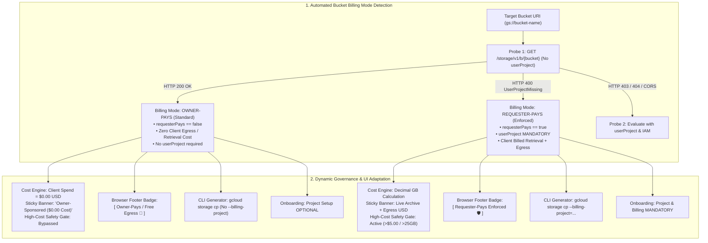
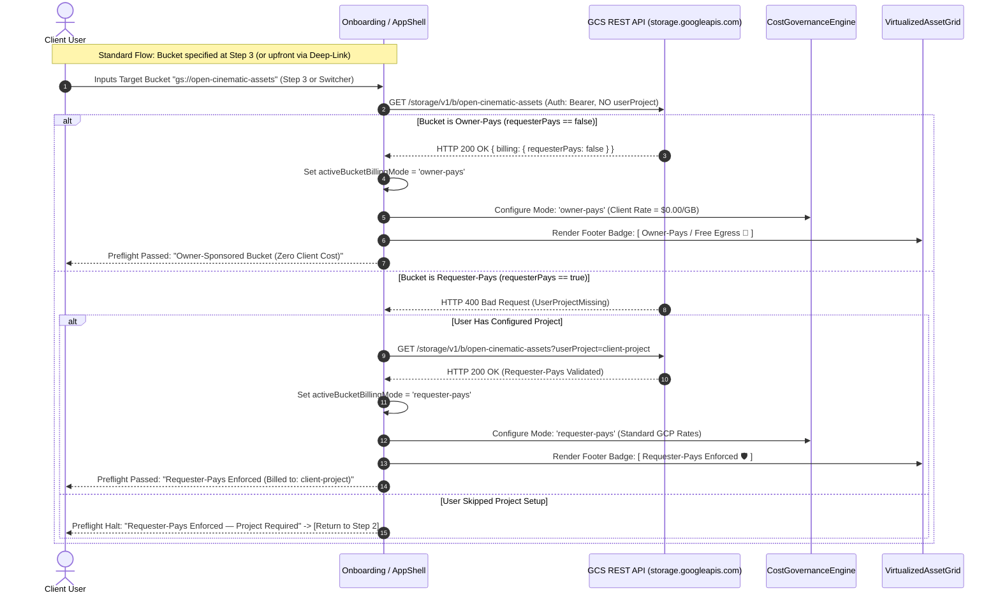

# Module 13: Dual Bucket Billing Mode & Owner-Pays Consumption Specification
## Module ID: `MOD-13-DUAL-BILLING-MODE`

> [!NOTE]
> **Implementation Status**: This document defines the complete architectural design, requirements, sequence diagrams, and interface contracts for Dual Bucket Billing Mode & Owner-Pays Consumption (`MOD-13-DUAL-BILLING-MODE`). This capability has been **fully spec'd and designed**, but is **not yet implemented** in the active application codebase (which currently operates under the Requester-Pays paradigm). Implementation is planned for a subsequent development increment.

---

### 1. Executive Summary & Architectural Motivation

In Google Cloud Storage (GCS), bucket billing attribution falls into two distinct operational paradigms:

1. **Requester-Pays Enforced Buckets (`billing.requesterPays == true`)**:
   - The bucket owner mandates that the requesting client supply an active Google Cloud project (`?userProject={projectId}` or `x-goog-user-project: {projectId}`).
   - All data retrieval charges ($0.050/GB for Archive, $0.020/GB for Coldline, $0.010/GB for Nearline) and internet egress fees ($0.120/GB) are billed directly to the client's GCP billing account.
   - Any request lacking a valid `userProject` is rejected by GCS with `HTTP 400 UserProjectMissing`.
   - The application displays the **`[Requester-Pays Enforced 🛡️]`** security badge, assuring the host of 100% zero egress cost liability.

2. **Standard / Owner-Pays Buckets (`billing.requesterPays == false` or unconfigured)**:
   - The bucket owner (or publishing entity) sponsors all storage retrieval and network internet egress fees.
   - The client **is not billed** for downloading or streaming media assets from the bucket (Client Cost = **$0.00 USD**).
   - Requests do not require a `userProject` query parameter, and anonymous/standard IAM reader requests succeed without client GCP project provisioning.
   - The application displays the **`[Owner-Pays / Standard 🎁]`** or **`[Zero Client Cost 🌐]`** badge.

#### The Problem & Opportunity:
Previously, the portal assumed *every* target bucket enforced Requester-Pays, requiring all clients to configure a GCP Billing Project even when accessing standard or owner-sponsored buckets. The presence of the **`[Requester-Pays Enforced 🛡️]`** badge in the object browser footer and GCP Config Center implies that non-enforced buckets exist and should be first-class citizens.

**Module 13** defines the complete architecture, detection protocols, zero-cost financial governance, adaptive CLI generation, and UI state models required to seamlessly support both **Requester-Pays Enforced** and **Owner-Pays** buckets side-by-side once implemented.



---

### 2. Functional & Non-Functional Requirements

#### Functional Requirements (FR)

- **FR-13.1 (Automated Bucket Billing Mode Detection)**:
  - During the 4-point preflight check (or when switching buckets), the system shall automatically detect whether the target bucket has Requester-Pays enabled:
    1. Issue `GET https://storage.googleapis.com/storage/v1/b/{bucket}` with OAuth Bearer token **without** `userProject`.
    2. If response is `HTTP 200 OK` and `metadata.billing?.requesterPays !== true` $\rightarrow$ classify as `owner-pays`.
    3. If response is `HTTP 400` with `UserProjectMissing` error (or `metadata.billing?.requesterPays === true`) $\rightarrow$ classify as `requester-pays`.
    4. Store detected mode in session/runtime state as `billingMode: 'requester-pays' | 'owner-pays'`.

- **FR-13.2 (Zero-Cost Governance & Banner Adaptation in Owner-Pays Mode)**:
  - When the active bucket is classified as `owner-pays`:
    - The `CostGovernanceEngine` shall compute client financial liability as **`$0.00 USD`** for all selected items (regardless of storage class or file size).
    - The sticky Cost Banner shall render:
      `[🎁 Owner-Sponsored Bucket] Selected 3 items (42.60 GB) | Retrieval: $0.00 | Egress: $0.00 | Total Client Cost: $0.00 USD (Sponsored by Bucket Owner)`.
    - The High-Cost Safety Confirmation Modal shall **not** trigger on dollar thresholds (since client charge is $0.00), but may display a standard transfer volume notice for batch files $>25\text{ GB}$.
    - The Asset Inspector Drawer shall show: `Estimated Client Charge: $0.00 (Owner-Sponsored)`.

- **FR-13.3 (Dual-Pathway Onboarding & Deferred Billing Mode Classification)**:
  - Because the target bucket is **not known at the outset of the standard unseeded onboarding flow** (where bucket entry occurs at Step 3), the onboarding engine shall support three distinct entry pathways:
    1. **Pathway A — Standard Unseeded Flow (Deferred Detection at Step 3/4)**:
       - **Step 2 (Project Setup)**: Provides an explicit bypass link: `[ Skip for now (I am connecting to an Owner-Sponsored bucket) ]`.
       - **Step 3 (Bucket Input)**: User specifies the target bucket URI (`gs://bucket-name`).
       - **Step 4 (4-Point Preflight Handshake)**: Preflight probes the bucket without `userProject`.
         - *If Owner-Pays*: Passes immediately (`billingMode: 'owner-pays'`), confirms $0.00 client cost, and completes onboarding even if Step 2 was skipped.
         - *If Requester-Pays*: If the user skipped Step 2, preflight halts with an actionable banner (*"This bucket enforces Requester-Pays. A Google Cloud project is required."*) and provides a 1-click button `[ Return to Step 2: Configure Project ]` to seamlessly link a project.
    2. **Pathway B — Pre-Seeded / Deep-Linked Flow (Bucket Known at Outset)**:
       - When a user opens an invite deep-link (`#/browse/{bucket}` or `?bucket={bucket}`), the target bucket is known from the start.
       - Immediately upon Step 1 Google Sign-In, the system background-probes the known bucket.
       - *If Owner-Pays*: Step 2 (Project Setup) is automatically bypassed or marked optional, pre-filling Step 3 and fast-tracking the user directly into Step 4 Preflight.
       - *If Requester-Pays*: Step 2 is presented as mandatory, and Step 3 is pre-filled with the deep-linked bucket.
    3. **Pathway C — In-Workspace Bucket Switching (On-the-Fly Detection)**:
       - When an active workspace user connects to a new bucket via the `BucketSwitcher` (*Module 9*), the target bucket is specified at that moment and probed in the background in $<300\text{ ms}$.

- **FR-13.4 (Dynamic Object Browser Footer Badge & Shield Icon)**:
  - The object browser footer (`VirtualizedAssetGrid`) shall dynamically render the appropriate billing status badge:
    - **Requester-Pays Mode**: `[ Requester-Pays Enforced ]` with `ShieldCheck` icon (in emerald green).
    - **Owner-Pays Mode**: `[ Owner-Pays / Free Egress ]` with `Gift` / `Globe` / `Unlock` icon (in sky/cyan).
  - Hovering or clicking the badge opens a descriptive popover explaining the billing attribution model for the active bucket.

- **FR-13.5 (Adaptive CLI Command Generator)**:
  - The `CliScriptBuilder` (*Module 7*) shall inspect the active bucket's billing mode:
    - If `requester-pays`: appends `--billing-project={userProject}` (for `gcloud`) and `-u {userProject}` (for `gsutil`).
    - If `owner-pays`: **omits** the `--billing-project` and `-u` flags, producing clean standard commands that run without requiring project credentials:
      ```bash
      gcloud storage cp gs://owner-bucket/reel_04/cam_A.mxf ./destination_folder/
      ```

- **FR-13.6 (Resilient Service Worker Stream Adaptation)**:
  - The `ResilientSWStreamEngine` (*Module 4* and *Module 12*) shall omit `?userProject=` from upstream GCS URLs when streaming from `owner-pays` buckets, preventing redundant query parameters.

- **FR-13.7 (Mixed-Mode Multi-Bucket Traversal & State Persistence)**:
  - When switching between buckets via `BucketSwitcherPopover` (*Module 9*) or traversing browser history (*Module 11*):
    - The application shall re-evaluate and persist the billing mode per bucket in `recentBuckets` metadata:
      `recentBucketModes: Record<string, 'requester-pays' | 'owner-pays'>`.
    - Transitioning from an Owner-Pays bucket to a Requester-Pays bucket automatically re-activates the active `savedProjectId` and updates all cost calculations instantly.

#### Non-Functional Requirements (NFR)

- **NFR-13.1 (Detection Latency)**: Bucket billing mode detection shall resolve within **$< 300\text{ ms}$** during preflight.
- **NFR-13.2 (Zero-Cost Math Precision)**: In Owner-Pays mode, calculated client charges must strictly equal `$0.0000` with zero rounding artifacts.
- **NFR-13.3 (Backward Compatibility)**: All existing Requester-Pays buckets and strict zero-host-liability constraints remain 100% enforced and undisturbed when `requester-pays` mode is active.

---

### 3. Subsystem Protocol & Preflight Handshake Sequence



---

### 4. TypeScript Interfaces & Data Contracts

```typescript
export type BucketBillingMode = 'requester-pays' | 'owner-pays';

export interface BucketMetadataSummary {
  bucketName: string;
  location: string;
  storageClass: string;
  billingMode: BucketBillingMode;
  requesterPaysEnforced: boolean;
  corsConfigured: boolean;
}

export interface DualModePreflightStatus {
  oauthValid: boolean;
  oauthExpiresInSeconds: number;
  bucketReachable: boolean;
  billingMode: BucketBillingMode;
  requesterPaysActive: boolean;
  iamViewerGranted: boolean;
  corsConfigured: boolean;
  requiresUserProject: boolean;
  userProjectConfigured: boolean;
  errorMessage?: string;
  remediationStep?: string;
}

export interface DualModeCostCalculationOptions {
  items: Array<{ sizeBytes: number; storageClass: string }>;
  rates: RateCard;
  billingMode: BucketBillingMode;
  isFreeTrial: boolean;
}

export class DualModeBillingManager {
  /**
   * Evaluates bucket billing mode from preflight probe responses.
   */
  public static evaluateBillingMode(
    rawMetadata: any,
    statusCode: number,
    errorBody: string
  ): BucketBillingMode {
    if (statusCode === 400 && errorBody.includes('UserProjectMissing')) {
      return 'requester-pays';
    }
    if (rawMetadata?.billing?.requesterPays === true) {
      return 'requester-pays';
    }
    return 'owner-pays';
  }

  /**
   * Generates formatted badge model for UI rendering.
   */
  public static getBadgeDetails(mode: BucketBillingMode): {
    label: string;
    variant: 'emerald' | 'cyan';
    icon: 'shield-check' | 'gift';
    tooltip: string;
  } {
    if (mode === 'requester-pays') {
      return {
        label: 'Requester-Pays Enforced',
        variant: 'emerald',
        icon: 'shield-check',
        tooltip: 'All GCS retrieval and internet egress fees are billed directly to your GCP project.'
      };
    }
    return {
      label: 'Owner-Pays (Zero Client Cost)',
      variant: 'cyan',
      icon: 'gift',
      tooltip: 'This bucket is sponsored by the owner. Retrieval and egress fees are $0.00 to you.'
    };
  }
}
```

---

### 5. UI Components & Layout Adaptations

#### 5.1 Object Browser Footer (`VirtualizedAssetGrid.tsx`)
```
+----------------------------------------------------------------------------------------------------+
|  Showing 48 files (3 folders)     [ Load More Assets ]                                            |
|                                                                                                    |
|  [ When Requester-Pays Bucket Active ]:                                                            |
|  Requester-Pays Enforced [ShieldCheck 🛡️]                                                          |
|                                                                                                    |
|  [ When Owner-Pays Bucket Active ]:                                                                |
|  Owner-Pays (Zero Client Cost) [Gift 🎁]                                                           |
+----------------------------------------------------------------------------------------------------+
```

#### 5.2 Sticky Cost Banner Comparison
```
+----------------------------------------------------------------------------------------------------+
| [REQUESTER-PAYS MODE]                                                                              |
| [!] COST ESTIMATE: 3 items selected (42.60 GB Total)                                                |
| Archive Retrieval: $2.13 | Egress: $5.11 | Total Estimate: $7.24 USD  [Covered by $300 Credits]     |
+----------------------------------------------------------------------------------------------------+
| [OWNER-PAYS MODE]                                                                                  |
| [🎁] OWNER-SPONSORED BUCKET: 3 items selected (42.60 GB Total)                                      |
| Retrieval: $0.00 | Egress: $0.00 | Total Client Cost: $0.00 USD (All fees covered by bucket owner) |
+----------------------------------------------------------------------------------------------------+
```

#### 5.3 CLI Script Generator Modal Comparison
```
[Requester-Pays Output]:
gcloud storage cp \
  gs://partner-archive/reel_04/cam_A.mxf \
  ./destination_folder/ \
  --billing-project=client-prod-2026

[Owner-Pays Output]:
gcloud storage cp \
  gs://open-cinematic-assets/reel_04/cam_A.mxf \
  ./destination_folder/
```

---

### 6. Error Handling & Edge Cases

| Scenario | Root Cause | Handling & Mitigation Protocol |
| :--- | :--- | :--- |
| **Bucket Flips from Owner-Pays to Requester-Pays** | Bucket admin turns on `--requester-pays` | Next API query returns `HTTP 400 UserProjectMissing`. UI automatically updates bucket mode to `requester-pays`, attaches `savedProjectId`, re-runs preflight, and alerts the user. |
| **User Connects to Owner-Pays Bucket Without GCP Project** | User skipped Step 2 of onboarding | Fully supported! Directory querying, metadata inspection, and streaming operate without `userProject`. |
| **User Toggles Between Mixed Buckets** | User has 1 Requester-Pays bucket and 1 Owner-Pays bucket in history | State store persists mode per bucket. Switching buckets instantly toggles Cost Banner, Footer Badge, and CLI format. |

---

### 7. Verification & Test Matrix

- **Unit Tests**:
  - `test_detect_owner_pays_bucket`: Verifies HTTP 200 without userProject yields `owner-pays`.
  - `test_detect_requester_pays_bucket`: Verifies HTTP 400 `UserProjectMissing` yields `requester-pays`.
  - `test_cost_governance_owner_pays`: Asserts total cost equals `$0.00 USD` for 50GB Archive selection.
  - `test_cli_generator_omits_billing_project_on_owner_pays`: Asserts `--billing-project` flag is omitted for Owner-Pays buckets.
- **Integration Tests**:
  - Verify switching between `gs://archive-req-pays` and `gs://open-owner-pays` updates footer badge, cost banner, and CLI generator modal in $<16\text{ ms}$.
  - Verify Service Worker stream executes successfully without `?userProject` on Owner-Pays buckets.

---

### 8. Cross-Module Integration Matrix

- **[Module 1: Auth & Onboarding](module_1_auth_onboarding_design_and_requirements.md)**: Integrates Owner-Pays detection into preflight step and supports optional project setup.
- **[Module 2: GCS Explorer](module_2_gcs_explorer_design_and_requirements.md)**: Dynamically renders Footer Shield vs Gift badge based on `billingMode`.
- **[Module 3: Cost Governance](module_3_cost_governance_design_and_requirements.md)**: Formulates zero-cost financial projections for Owner-Pays buckets.
- **[Module 4 & 12: Streaming Downloader & Browser Integration](module_4_streaming_download_design_and_requirements.md)**: Streams Owner-Pays assets without `userProject`.
- **[Module 7: CLI Companion Generator](module_7_cli_generator_design_and_requirements.md)**: Emits clean CLI commands without billing flags for Owner-Pays buckets.
- **[Module 8 & 9: State Persistence & GCP Config Center](module_9_workspace_and_gcp_config_center_design_and_requirements.md)**: Persists and displays billing mode across workspace views.
