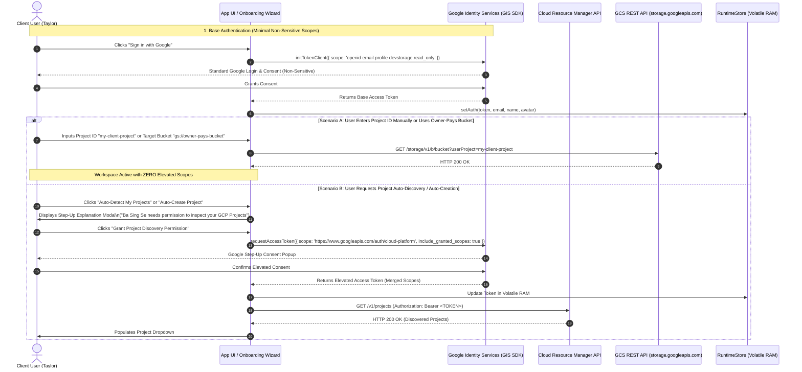

# Module 14: Google API Trust & Safety, Minimal Scopes, Incremental Authorization & Privacy Policy Specification
## Module ID: `MOD-14-TRUST-SAFETY-PRIVACY`

---

### 1. Module Overview & Strategic Intent

The **Google API Trust & Safety, Minimal Scopes, Incremental Authorization & Privacy Governance Module** establishes the technical protocols, OAuth 2.0 scope policies, security boundaries, and regulatory compliance standards for **Files of Ba Sing Se**.

The module guarantees:
1. **Principle of Least Privilege (Scope Minimization)**: Default authentication asks exclusively for non-sensitive scopes (`devstorage.read_only`, `openid`, `userinfo.email`, `userinfo.profile`), eliminating mandatory Google CASA Tier 2/3 security audits for standard users.
2. **Contextual Incremental Authorization (Step-Up Consent)**: Elevated and restricted scopes (`https://www.googleapis.com/auth/cloud-platform`) are requested dynamically and contextually *only* when the user explicitly triggers automated GCP project discovery or project auto-creation.
3. **Zero-Sensitive Scope Fallback**: Users manually supplying an existing GCP Project ID (or connecting to Owner-Pays buckets) can browse and stream 50GB+ files with zero elevated cloud permissions.
4. **Zero-Telemetry Network Isolation**: Strict enforcement that no analytics beacons (Firebase Analytics, Google Tag Manager, Sentry, or third-party trackers) capture or exfiltrate user activity, tokens, or bucket data.
5. **Google OAuth Verification & Privacy Policy Compliance**: Publicly accessible, unauthenticated Privacy Policy meeting Google API Services User Data Policy "Limited Use" criteria.

```mermaid
flowchart TD
    subgraph ScopeArchitecture ["OAuth 2.0 Scope & Consent Architecture"]
        UserVisit["User Visits Application"] --> InitialSignIn["1. Initial Google Sign-In"]
        
        InitialSignIn --> BaseScope["Tier 1: Non-Sensitive Base Scopes\n• openid, email, profile\n• devstorage.read_only"]
        
        BaseScope --> ModeDecision{"User Workflow"}
        
        ModeDecision -->|"Manual Project ID\nor Owner-Pays"| CoreWorkspace["Standard Media Workspace\n(100% GCS Read & Stream Ready)\n🛡️ Zero Elevated Scopes Used"]
        
        ModeDecision -->|"Clicks 'Auto-Detect Projects'\nor '1-Click Auto-Create'"| StepUpPrompt["2. Contextual Step-Up Consent Modal\n(Explains why Cloud Platform access is needed)"]
        
        StepUpPrompt --> IncrementalAuth["GIS requestAccessToken\n(scope: cloud-platform, include_granted_scopes: true)"]
        
        IncrementalAuth --> ProjectDiscovery["GCP Project Discovery & CRM APIs\n(cloudresourcemanager.googleapis.com)"]
        ProjectDiscovery --> CoreWorkspace
    end

    subgraph PrivacyGovernance ["Privacy & Telemetry Boundaries"]
        CSP["Strict CSP Header (connect-src restricted)"]
        RingBuffer["Volatile In-Memory Ring Buffer (100 logs max)"]
        PrivacyModal["In-App Privacy Policy & Limited Use Viewer"]
        
        CSP -->|"Blocks External Analytics"| ZeroTelemetry["100% Zero-Telemetry Guarantee"]
        RingBuffer -->|"Redacts ya29/Bearer Tokens"| SafeDiagnostics["Sanitized Diagnostics Export Only"]
    end
```



---

### 2. Functional & Non-Functional Requirements

#### Functional Requirements

* **FR-14.1 (Default Minimal Scopes)**:
  The default GIS OAuth 2.0 configuration (`GIS_DEFAULT_SCOPES`) **MUST** contain only non-sensitive scopes:
  - `openid`
  - `https://www.googleapis.com/auth/userinfo.email`
  - `https://www.googleapis.com/auth/userinfo.profile`
  - `https://www.googleapis.com/auth/devstorage.read_only`
  Under these base scopes, the user can execute all GCS bucket listings, preflight checks, object metadata queries, and streaming downloads with `?userProject={projectId}` billing attribution.

* **FR-14.2 (Incremental Step-Up Authorization for GCP Project Automation)**:
  Elevated scopes (`https://www.googleapis.com/auth/cloud-platform`) **MUST NOT** be requested during initial sign-in. When a user clicks *"Auto-Detect My Project"* or *"Auto-Create Media Project"*, the application shall:
  1. Present an informative pre-consent modal explaining why elevated permissions are needed.
  2. Request `cloud-platform` dynamically via `client.requestAccessToken({ scope: 'https://www.googleapis.com/auth/cloud-platform', include_granted_scopes: true })`.
  3. Seamlessly append the granted scope to the active in-memory session.

* **FR-14.3 (Manual Project Input Zero-Scope Exemption)**:
  If a user manually enters their GCP Project ID in the onboarding wizard or GCP Configuration Center, the application **MUST NOT** trigger the step-up consent flow. The entered project ID is utilized directly as the `?userProject=` query parameter for GCS REST calls.

* **FR-14.4 (Zero-Telemetry Enforcement & CSP Containment)**:
  The application **MUST NOT** load or initialize Firebase Analytics, Google Tag Manager (`gtag.js`), or any third-party tracking script. Content Security Policy (`connect-src`) must restrict network requests exclusively to authorized Google Cloud endpoints.

* **FR-14.5 (In-App Privacy Policy Viewer & Limited Use Linkage)**:
  The application **MUST** provide an unauthenticated, easily accessible Privacy Policy modal (`AUX-09`) and static link (`/privacy.html` / `#/privacy`) accessible from:
  - Header & persistent footer.
  - Step 1 of the Onboarding Wizard.
  - GCP Configuration Center.
  The policy must explicitly declare the Google API Services User Data Policy Limited Use statement.

* **FR-14.6 (One-Click Token Revocation & Google Security Purge)**:
  Clicking "Sign Out" or "Disconnect Session" must invoke Google Identity Services `google.accounts.oauth2.revoke(token)` to immediately invalidate the token at Google's OAuth endpoints, wipe volatile memory, and confirm storage boundary hygiene.

#### Non-Functional Requirements & Google Trust & Safety SLAs

* **NFR-14.1 (Scope Least-Privilege Verification)**: 
  The application shall pass Google OAuth verification audits by demonstrating that 100% of core streaming capabilities execute without elevated administrative permissions.
* **NFR-14.2 (Zero Token Storage Boundary SLA)**:
  Automated tests and runtime auditors (`StorageBoundaryAuditor`) **MUST** verify that zero OAuth tokens (`ya29.*`) exist in `localStorage`, `sessionStorage`, cookies, or IndexedDB at any time ($0\text{ token leaks}$).
* **NFR-14.3 (Telemetry Zero-Egress SLA)**:
  $0\text{ bytes}$ of telemetry or analytics beacons shall be transmitted to external servers. Internal observability is capped at 100 in-memory entries ($<500\text{ KB}$ RAM) with automatic token redaction.

---

### 3. Subsystem Protocol & Step-Up Sequence Diagram



---

### 4. Technical Contracts & TypeScript Specifications

```typescript
/**
 * OAuth Scope Classification & Policy Constants
 */
export const GIS_BASE_SCOPES = [
  'openid',
  'https://www.googleapis.com/auth/userinfo.email',
  'https://www.googleapis.com/auth/userinfo.profile',
  'https://www.googleapis.com/auth/devstorage.read_only',
] as const;

export const GIS_ELEVATED_SCOPES = [
  'https://www.googleapis.com/auth/cloud-platform',
] as const;

export type BaseOAuthScope = typeof GIS_BASE_SCOPES[number];
export type ElevatedOAuthScope = typeof GIS_ELEVATED_SCOPES[number];

export interface ScopePolicyStatus {
  hasBaseScopes: boolean;
  hasElevatedScopes: boolean;
  activeScopes: string[];
  isLeastPrivilegeCompliant: boolean;
}

export interface StepUpAuthOptions {
  reason: 'PROJECT_DISCOVERY' | 'PROJECT_CREATION' | 'BILLING_CHECK';
  prompt?: string;
}

export interface TrustSafetyEngineContract {
  getBaseScopes(): string[];
  getElevatedScopes(): string[];
  evaluateScopeStatus(grantedScopes: string[]): ScopePolicyStatus;
  requestStepUpConsent(options: StepUpAuthOptions): Promise<boolean>;
  revokeSessionToken(token: string): Promise<boolean>;
}
```

---

### 5. Verification & Test Plan

1. **Automated Unit Tests**:
   - Verify `GIS_DEFAULT_SCOPES` contains only non-sensitive scopes.
   - Verify step-up authorization appends `include_granted_scopes: true`.
   - Verify manual project ID entry succeeds without triggering step-up auth.
2. **Security & Boundary Audits**:
   - Storage Boundary Audit: Verify no tokens or analytics cookies in `localStorage` or `sessionStorage`.
   - Network Egress Audit: Verify no network beacons sent to `google-analytics.com` or `firebaseinstallations.googleapis.com`.
3. **Google Verification Readiness**:
   - Verify Privacy Policy is accessible without login at `/privacy.html` and in-app modal.
   - Verify policy text includes the required Google Limited Use disclosure.
