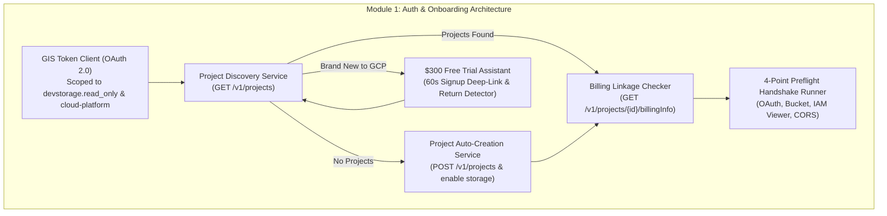
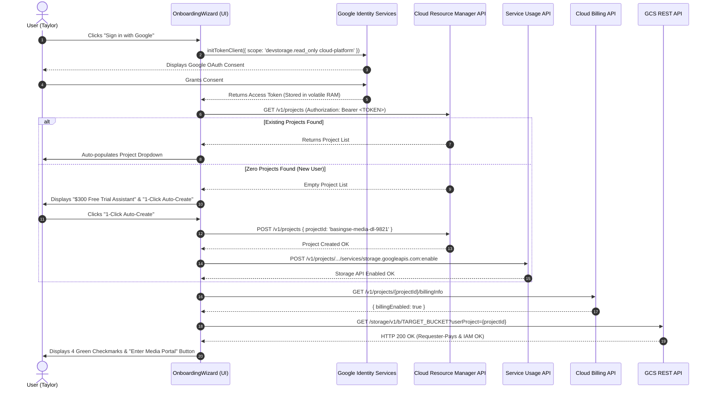

# Module 1: Authentication & GCP Project Onboarding Design & Requirements Specification
## Module ID: `MOD-01-AUTH-ONBOARDING`

---

### 1. Module Overview & Scope

The **Authentication & GCP Project Onboarding Module** is the gateway to Files of Ba Sing Se. It is responsible for user identity authentication via Google Identity Services (GIS OAuth 2.0), automated discovery of client Google Cloud Platform (GCP) projects via the Cloud Resource Manager API, 1-click project auto-provisioning with Storage API activation, the \$300 Free Trial assistant flow for first-time GCP users, billing linkage verification, and automated 4-point preflight validation.



---

### 2. Functional & Non-Functional Requirements

#### Functional Requirements
- **FR-1.1**: Direct Google Sign-In with popup OAuth 2.0 requesting `https://www.googleapis.com/auth/devstorage.read_only` and progressive onboarding scope `https://www.googleapis.com/auth/cloud-platform`.
- **FR-1.2**: Project auto-discovery via `GET https://cloudresourcemanager.googleapis.com/v1/projects`, automatically populating existing projects in a user-friendly dropdown.
- **FR-1.3**: 1-click automated project creation (`basingse-media-dl-XXXX`) via `POST /v1/projects` with automated `storage.googleapis.com` enablement via Service Usage API.
- **FR-1.4**: \$300 Free Trial visual assistant card for clients with zero prior GCP experience, deep-linking to `https://console.cloud.google.com/freetrial` and providing an instant `[Auto-Detect My Project]` return trigger.
- **FR-1.5**: Billing linkage validation via `GET https://cloudbilling.googleapis.com/v1/projects/{projectId}/billingInfo` ensuring `billingEnabled == true`.
- **FR-1.6**: 4-point Preflight handshake executing a lightweight `GET /storage/v1/b/{bucket}?userProject={projectId}` to verify:
  1. OAuth token validity & expiration timer.
  2. Bucket reachability & Requester-Pays enforcement.
  3. IAM `roles/storage.objectViewer` permission.
  4. CORS preflight exposure headers (`x-goog-hash`, `Content-Length`, `Range`, `ETag`).

#### Non-Functional Requirements & Security Constraints
- **NFR-1.1**: OAuth access tokens **MUST NEVER** be written to `localStorage`, `sessionStorage`, or cookies. Tokens reside strictly in volatile closure memory (`Zustand`).
- **NFR-1.2**: Project ID regex validation: `^[a-z0-9-]{6,30}$`.
- **NFR-1.3**: Preflight check timeout: **< 3000 ms** with exponential backoff on network failures.

---

### 3. Subsystem Protocol & Sequence Diagram



---

### 4. TypeScript Interfaces & Data Contracts

```typescript
export interface GCPProject {
  projectId: string;
  name: string;
  projectNumber: string;
  lifecycleState: 'ACTIVE' | 'DELETE_REQUESTED';
}

export interface BillingStatus {
  projectId: string;
  billingAccountName: string;
  billingEnabled: boolean;
}

export interface PreflightCheckResult {
  oauthTokenValid: boolean;
  oauthExpiresInSeconds: number;
  bucketReachable: boolean;
  requesterPaysActive: boolean;
  iamViewerGranted: boolean;
  corsConfigured: boolean;
  errorMessage?: string;
  remediationStep?: string;
}

export interface OnboardingState {
  step: 'auth' | 'project' | 'bucket' | 'verify' | 'ready';
  oauthToken: string | null;
  userEmail: string | null;
  userAvatar: string | null;
  discoveredProjects: GCPProject[];
  selectedProjectId: string;
  targetBucket: string;
  preflight: PreflightCheckResult | null;
  isLoading: boolean;
}
```

---

### 5. UI Components & State Transitions

1. **`OnboardingWizard.tsx`**: Main multi-step modal dialog with linear progress bar.
2. **`GoogleSignInButton.tsx`**: GIS OAuth 2.0 trigger with account switching support.
3. **`ProjectSelector.tsx`**: Smart combo-box containing auto-discovered projects, 1-click create button, and Free Trial assistant card.
4. **`PreflightChecklist.tsx`**: Live checklist with spinning loaders transitioning into animated green checkmarks or error diagnosis alerts.

---

### 6. Error Handling & Edge Cases

| Error Condition | GCS / API Response | User-Facing Diagnostics & Remediation |
| :--- | :--- | :--- |
| **No Billing Linked** | `billingEnabled: false` | Inline warning: *"Billing is unlinked on this project. GCS Requester Pays requires billing."* with 1-click link to GCP Billing Console. |
| **IAM Access Denied** | `HTTP 403 Forbidden` | Card: *"Your Google account lacks Storage Object Viewer access on this bucket. Request roles/storage.objectViewer from the bucket administrator."* |
| **CORS Blocked** | `TypeError: Failed to fetch` | Card: *"Bucket CORS origin not configured for this web domain."* with copyable `cors.json` config. |
| **Token Expired** | Expiry timer reaches 0 | Silent background renewal attempted; if failed, prompts 1-click re-auth without resetting project ID. |

---

### 7. Verification & Test Matrix

- **Unit Tests**:
  - `test_project_id_regex`: Validates string formats.
  - `test_billing_status_parser`: Tests JSON response handling for unlinked accounts.
- **Integration Tests**:
  - Mock GIS popup response and verify token remains in volatile store.
  - Mock CRM API with empty list $\rightarrow$ verify transition to Free Trial Assistant view.
  - Mock preflight HTTP 403 $\rightarrow$ verify actionable IAM diagnosis message.

---

### 8. Relationship with Downstream Modules & Post-Setup Controls

Once initial onboarding completes, configuration management transitions to post-setup controls:
- **[Module 9: Workspace Navigation, Bucket Switcher & GCP Config Center](module_9_workspace_and_gcp_config_center_design_and_requirements.md)** (`MOD-09-WORKSPACE-GCP-CONFIG-CENTER`): Provides on-the-fly bucket switching (`BucketSwitcherControl`), project switching (`ProjectSwitcherControl`), and holistic configuration auditing (`GCPConfigCenterModalShell`) without re-running this onboarding wizard.
- **[Module 8: State Management & Persistence](module_8_state_persistence_design_and_requirements.md)** (`MOD-08-STATE-PERSISTENCE`): Persists `savedProjectId`, `savedBucketName`, and `recentBuckets` across sessions.
