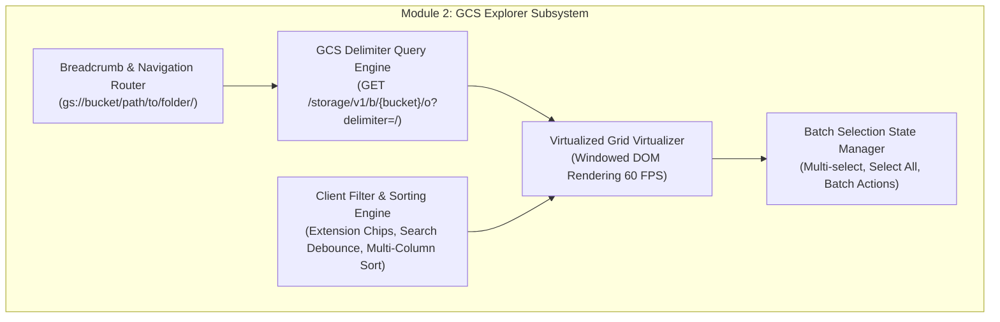
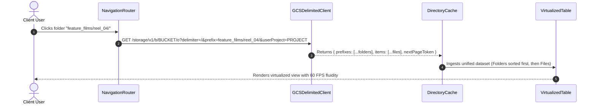

# Module 2: GCS Explorer & Virtualized Asset Grid Design & Requirements Specification
## Module ID: `MOD-02-GCS-EXPLORER`

---

### 1. Module Overview & Scope

The **GCS Explorer & Virtualized Asset Grid Module** is the primary navigation and exploration surface of Files of Ba Sing Se. It is responsible for simulating hierarchical directory structures over flat GCS object stores using delimiters (`delimiter=/`), executing paginated queries, rendering virtualized multi-column tables supporting 10,000+ items at a steady 60 FPS, applying real-time fuzzy search and extension filtering, and managing multi-item selection state for downstream batch operations.



---

### 2. Functional & Non-Functional Requirements

#### Functional Requirements
- **FR-2.1**: Delimiter directory querying (`GET /storage/v1/b/{bucket}/o?delimiter=/&prefix={prefix}&userProject={userProject}`) separating `prefixes` (virtual folders) from `items` (leaf media objects). When connected to an Owner-Pays bucket, `userProject` is omitted.
- **FR-2.2**: Interactive clickable breadcrumb bar reflecting the active directory stack with 1-click ancestor navigation, integrated with the Browser History API.
- **FR-2.3**: Virtualized DOM data grid rendering visible items plus a 5-row overscan buffer to guarantee constant memory footprint and 60 FPS scroll performance.
- **FR-2.4**: Multi-column data display: Checkbox, Media Icon, File Name, Storage Class Badge (`ARCHIVE`, `COLDLINE`, `NEARLINE`, `STANDARD`), File Size (decimal formatted with raw byte tooltip), Last Modified Timestamp (ISO + relative time), Integrity Hash Indicator, and Action Buttons (`[Download]`, `[CLI]`, `[Info]`).
- **FR-2.5**: Real-time fuzzy search (<50ms debounce) and extension filter chips (`All`, `Videos`, `Audio`, `Archives`, `Metadata`).
- **FR-2.6**: Multi-column sorting (ascending/descending) on Name, Size, Storage Class, and Last Modified.
- **FR-2.7**: Multi-selection state management supporting individual checkbox toggling, "Select All in Folder", and emitting selected items to the Cost Governance Engine.
- **FR-2.8**: Browser History API & URL Hash Synchronization (*Module 11*): Every breadcrumb click and folder navigation updates the browser URL hash (`#/browse/{bucket}/{prefix}`) and pushes a history entry via `history.pushState()`. Native browser Back and Forward buttons (`popstate` events) seamlessly rehydrate directory views without page reload.
- **FR-2.9**: Dynamic Table Footer Status Badge: The table footer shall dynamically display `[Requester-Pays Enforced 🛡️]` with a shield icon when Requester-Pays is active, or `[Owner-Pays / Free Egress 🎁]` with a gift icon when the active bucket is owner-sponsored. Clicking the badge opens the GCP Configuration Center.

#### Non-Functional Requirements
- **NFR-2.1**: Grid render latency: **< 16 ms per frame (60 FPS)** when scrolling 10,000 items.
- **NFR-2.2**: Search filter response: **< 50 ms**.
- **NFR-2.3**: Keyboard Accessibility: ARIA `role="grid"` with full keyboard navigation (`Up`/`Down` arrow row focus, `Space` to toggle selection, `Enter` to open directory or inspector).

---

### 3. Subsystem Protocol & Directory Slicing Flow



---

### 4. TypeScript Interfaces & Data Contracts

```typescript
export interface GCSMediaItem {
  id: string;
  name: string; // e.g. "feature_films/reel_04/cam_A.mxf"
  displayName: string; // e.g. "cam_A.mxf"
  type: 'folder' | 'file';
  bucket: string;
  sizeBytes: number;
  formattedSize: string;
  storageClass: 'ARCHIVE' | 'COLDLINE' | 'NEARLINE' | 'STANDARD';
  contentType: string;
  updated: string;
  crc32c: string; // Base64
  etag: string;
}

export interface ExplorerFilterState {
  searchQuery: string;
  categoryFilter: 'all' | 'video' | 'audio' | 'archive' | 'metadata';
  sortColumn: 'name' | 'size' | 'storageClass' | 'updated';
  sortDirection: 'asc' | 'desc';
}

export interface DirectoryViewState {
  currentBucket: string;
  currentPrefix: string;
  items: GCSMediaItem[];
  selectedItemIds: Set<string>;
  isLoading: boolean;
  nextPageToken?: string;
}
```

---

### 5. UI Components & Architectural Layout

1. **`AssetExplorer.tsx`**: Primary container view hosting breadcrumbs, search bar, filter chips, and table.
2. **`BreadcrumbBar.tsx`**: Clickable path segment trail (`gs:// > bucket > folder1 > folder2`).
3. **`VirtualizedAssetTable.tsx`**: Windowed DOM virtualizer rendering rows dynamically based on scroll position.
4. **`StorageClassBadge.tsx`**: Color-coded pill badge with cold-tier visual distinction.
5. **`FilterToolbar.tsx`**: Search input with quick-clear and category chips.

---

### 6. Error Handling & Edge Cases

| Scenario | Condition | Handling & Recovery |
| :--- | :--- | :--- |
| **Empty Directory** | `prefixes.length == 0 && items.length == 0` | Render friendly empty-state illustration: *"No media files found in this directory."* |
| **High Latency Slicing** | Folder contains >5,000 items | Display progressive skeleton loader while streaming and virtualizing items in 250-item batches. |
| **Special Characters in Names** | Object keys contain spaces, quotes, emojis, or unicode | Ensure strict `encodeURIComponent` encoding in all API query strings and download requests. |

---

### 7. Verification & Test Matrix

- **Unit Tests**:
  - `test_gcs_delimiter_parser`: Verifies correct extraction of folder prefixes and leaf objects.
  - `test_fuzzy_search_filter`: Tests searching by substring and extension filtering.
  - `test_table_sorting`: Validates natural alphanumeric and byte size sorting.
- **Performance & Virtualization Tests**:
  - Load 10,000 mock items into `VirtualizedAssetTable` and assert frame render times stay $< 16\text{ ms}$.

---

### 8. Cross-Module Integration & Post-Setup Controls

- **[Module 11: Browser History API, URL Synchronization & Deep Linking](module_11_browser_history_and_navigation_routing_design_and_requirements.md)** (`MOD-11-BROWSER-HISTORY-ROUTING`): Governs `BrowserHistoryRouterEngine` synchronization, `pushState`/`popstate` listeners, and bookmarkable URL hash paths for breadcrumbs and folder navigation.
- **[Module 9: Workspace Navigation, Bucket Switcher & GCP Config Center](module_9_workspace_and_gcp_config_center_design_and_requirements.md)** (`MOD-09-WORKSPACE-GCP-CONFIG-CENTER`): Integrates with `BreadcrumbBar.tsx` to turn the root `gs://[bucket-name]` path segment into an interactive bucket switcher popover with recent bucket memory (`recentBuckets`).
- **[Module 3: Cost Governance](module_3_cost_governance_design_and_requirements.md)** (`MOD-03-COST-GOVERNANCE`): Ingests multi-selected rows to render sticky cost projections.

