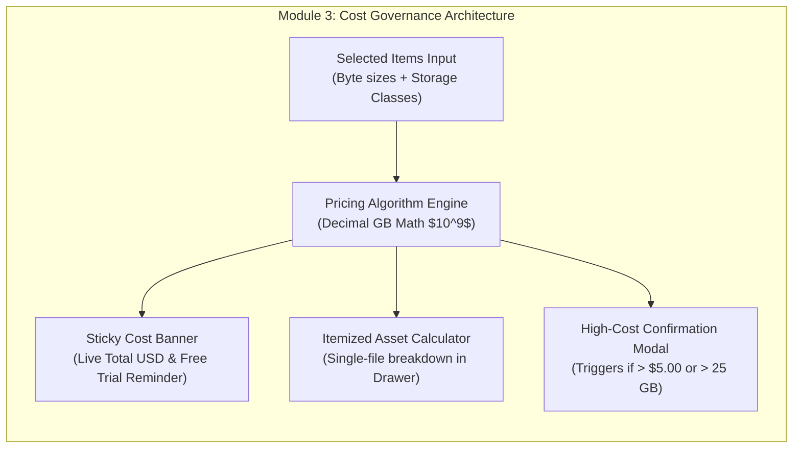

# Module 3: Cost Governance & Real-Time Estimator Design & Requirements Specification
## Module ID: `MOD-03-COST-GOVERNANCE`

---

### 1. Module Overview & Scope

The **Cost Governance & Real-Time Estimator Module** enforces 100% financial transparency for the client by dynamically calculating GCS Archive retrieval and internet data egress charges in real time. It eliminates client "bill shock" by surfacing calculated dollar estimates before any transfer occurs, providing sticky batch selection banners, and enforcing confirmation gates for high-cost or multi-gigabyte cold archive downloads.



---

### 2. Functional & Non-Functional Requirements

#### Functional Requirements
- **FR-3.1**: Decimal gigabyte mathematical standard ($1\text{ GB} = 10^9\text{ bytes} = 1,000,000,000\text{ bytes}$).
- **FR-3.2**: Multi-tier storage class retrieval rate calculation:
  - `ARCHIVE`: \$0.0500 per GB
  - `COLDLINE`: \$0.0200 per GB
  - `NEARLINE`: \$0.0100 per GB
  - `STANDARD`: \$0.0000 per GB
- **FR-3.3**: Standard worldwide internet data egress rate calculation: \$0.1200 per GB.
- **FR-3.4**: Dynamic sticky cost notice banner rendered whenever $\ge 1$ items are selected:
  $$\text{Total Cost} = \sum (\text{Bytes}_{\text{Class}} \times \text{Rate}_{\text{Class}} / 10^9) + \sum (\text{Bytes}_{\text{Total}} \times \$0.1200 / 10^9)$$
- **FR-3.5**: \$300 Free Trial badge indicator reminding eligible users that their estimated charges are covered by Google free credits.
- **FR-3.6**: High-Cost safety threshold gate: Automatically displays a confirmation modal requiring explicit confirmation if total estimated charge $\ge \$5.00\text{ USD}$ or total transfer volume $\ge 25\text{ GB}$.
- **FR-3.7**: Custom Rate Card Override support: Allows enterprise clients to configure discounted contract rates in settings (stored in `localStorage`).

#### Non-Functional Requirements
- **NFR-3.1**: Calculation execution latency: **< 5 ms** for selections of up to 5,000 items.
- **NFR-3.2**: Currency formatting: Always rounded to 2 decimal places with tooltip showing 4-decimal precision on sub-cent transfers.

---

### 3. Mathematical Formula & Pricing Matrix

| Storage Class | Retrieval Rate ($/GB) | Egress Rate ($/GB) | Combined Rate / Decimal GB | Example (18.40 GB Master) | Example (8.00 GB Proxy) |
| :--- | :--- | :--- | :--- | :--- | :--- |
| **`ARCHIVE`** | **\$0.0500** | **\$0.1200** | **\$0.1700** | $18.40 \times \$0.1700 = \mathbf{\$3.13}$ | N/A |
| **`COLDLINE`** | **\$0.0200** | **\$0.1200** | **\$0.1400** | $18.40 \times \$0.1400 = \mathbf{\$2.58}$ | N/A |
| **`NEARLINE`** | **\$0.0100** | **\$0.1200** | **\$0.1300** | $18.40 \times \$0.1300 = \mathbf{\$2.39}$ | N/A |
| **`STANDARD`** | **\$0.0000** | **\$0.1200** | **\$0.1200** | N/A | $8.00 \times \$0.1200 = \mathbf{\$0.96}$ |

---

### 4. TypeScript Interfaces & Data Contracts

```typescript
export interface RateCard {
  archiveRetrievalPerGB: number;
  coldlineRetrievalPerGB: number;
  nearlineRetrievalPerGB: number;
  standardRetrievalPerGB: number;
  internetEgressPerGB: number;
}

export const DEFAULT_GCS_RATES: RateCard = {
  archiveRetrievalPerGB: 0.05,
  coldlineRetrievalPerGB: 0.02,
  nearlineRetrievalPerGB: 0.01,
  standardRetrievalPerGB: 0.0,
  internetEgressPerGB: 0.12
};

export interface CalculatedCostResult {
  totalBytes: number;
  totalDecimalGB: number;
  formattedTotalSize: string;
  itemCount: number;
  retrievalTotalUSD: number;
  egressTotalUSD: number;
  grandTotalUSD: number;
  isHighCostThreshold: boolean;
  coveredByFreeTrial: boolean;
}

export class CostGovernanceEngine {
  public static calculate(
    items: Array<{ sizeBytes: number; storageClass: string }>,
    rates: RateCard = DEFAULT_GCS_RATES,
    isFreeTrial: boolean = false
  ): CalculatedCostResult {
    let totalBytes = 0;
    let retrievalTotalUSD = 0;

    for (const item of items) {
      totalBytes += item.sizeBytes;
      const gb = item.sizeBytes / 1_000_000_000;
      switch (item.storageClass.toUpperCase()) {
        case 'ARCHIVE':
          retrievalTotalUSD += gb * rates.archiveRetrievalPerGB;
          break;
        case 'COLDLINE':
          retrievalTotalUSD += gb * rates.coldlineRetrievalPerGB;
          break;
        case 'NEARLINE':
          retrievalTotalUSD += gb * rates.nearlineRetrievalPerGB;
          break;
        default:
          retrievalTotalUSD += gb * rates.standardRetrievalPerGB;
          break;
      }
    }

    const totalDecimalGB = totalBytes / 1_000_000_000;
    const egressTotalUSD = totalDecimalGB * rates.internetEgressPerGB;
    const grandTotalUSD = retrievalTotalUSD + egressTotalUSD;

    return {
      totalBytes,
      totalDecimalGB,
      formattedTotalSize: this.formatBytes(totalBytes),
      itemCount: items.length,
      retrievalTotalUSD: Math.round(retrievalTotalUSD * 100) / 100,
      egressTotalUSD: Math.round(egressTotalUSD * 100) / 100,
      grandTotalUSD: Math.round(grandTotalUSD * 100) / 100,
      isHighCostThreshold: grandTotalUSD >= 5.0 || totalDecimalGB >= 25.0,
      coveredByFreeTrial: isFreeTrial
    };
  }

  public static formatBytes(bytes: number): string {
    if (bytes === 0) return '0 B';
    const k = 1000;
    const sizes = ['B', 'KB', 'MB', 'GB', 'TB'];
    const i = Math.floor(Math.log(bytes) / Math.log(k));
    return parseFloat((bytes / Math.pow(k, i)).toFixed(2)) + ' ' + sizes[i];
  }
}
```

---

### 5. UI Components & Visual Layout

1. **`CostBanner.tsx`**: Sticky notification bar above the table showing selected count, total GB, retrieval fee, egress fee, and total estimate.
2. **`HighCostConfirmationModal.tsx`**: Modal dialog detailing itemized billing breakdown with explicit `[Confirm & Incur ~$X.XX]` button.
3. **`PricingCustomizerDrawer.tsx`**: Settings panel allowing custom enterprise rate overrides.

---

### 6. Error Handling & Edge Cases

- **Zero Selection**: When selection count is 0, banner gracefully collapses to 0 height.
- **Sub-Cent Transfers**: For tiny metadata JSONs (e.g. 4KB), total cost displays as `< $0.01` with tooltip showing `$0.00048 USD`.
- **Mixed Storage Class Selections**: Retrieval fees apply exclusively to the respective storage tier bytes without overcharging standard objects.

---

### 7. Verification & Test Matrix

- **Unit Tests**:
  - `test_exact_archive_retrieval_math`: $18.4\text{ GB} \times \$0.05 = \$0.9200$.
  - `test_egress_rate_math`: $18.4\text{ GB} \times \$0.12 = \$2.2080$.
  - `test_mixed_batch_calculation`: 2 Archive + 1 Standard item batch calculation precision.
  - `test_high_cost_trigger_boundary`: Evaluates threshold at \$4.99 (false) vs \$5.00 (true).
