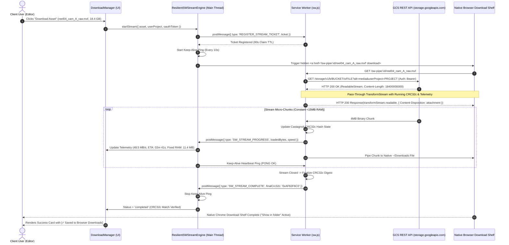

# Module 4: Resilient Service Worker Streaming Download Pipeline Design & Requirements Specification
## Module ID: `MOD-04-STREAM-DOWNLOADER`

---

### 1. Module Overview & Architectural Convergence

The **Resilient Service Worker Streaming Download Pipeline Module** is the high-performance media transfer core of Files of Ba Sing Se. It is engineered to stream multi-gigabyte media assets (10GB–50GB+) directly from Google Cloud Storage to the client's local workstation disk with **zero browser crashes / zero Out-of-Memory (OOM) failures** and **full native browser download manager integration**.

#### The Architectural Shift: Deprecating FSAA in Favor of Resilient Service Worker Streaming
Previously, direct disk streaming was split between the File System Access API (FSAA) on Chromium and Service Worker streaming on Safari. However, FSAA created severe usability friction due to **post-download inscrutability**:
1. **Bypassed Chrome Download Shelf**: FSAA writes directly to a private disk handle, completely bypassing `chrome://downloads` and the browser toolbar download tray.
2. **Missing Native "Show in Folder"**: Users lost the standard browser magnifying glass / "Show in folder" button, necessitating artificial shell command generators (`open -R`, `explorer.exe /select,`).
3. **User Disorientation**: Creative professionals expect downloaded assets to appear in their browser's download history.

**Files of Ba Sing Se** converges entirely onto an **Engineered, Resilient Service Worker Stream Interceptor** as the unified **Tier 1 Primary Streaming Engine** across all modern desktop browsers (Google Chrome, Microsoft Edge, Brave, Arc, and Apple Safari).

#### Unified Multi-Tier Streaming Strategy:
- **Tier 1 (Universal Primary Streaming)**: Resilient Service Worker Stream Interceptor (`/sw-pipe/:streamId/:filename`) with keep-alive heartbeat, pass-through Castagnoli CRC32c `TransformStream`, and native browser download shelf tracking (`chrome://downloads`).
- **Tier 2 (Universal Lightweight Assets)**: In-memory Blob handling for small metadata files and audio snippets (<200MB).
- **Tier 3 (Headless & Companion CLI)**: Pre-formatted 1-click `gcloud storage cp --billing-project` commands for headless render nodes, terminal power users, and Firefox users.

```mermaid
flowchart TD
    Start([Download Request Initiated]) --> SizeCheck{File Size > 200 MB?}
    
    SizeCheck -->|No| Tier2[Tier 2: Universal Memory Blob\nfetch -> Blob -> URL.createObjectURL -> <a download>]
    SizeCheck -->|Yes| BrowserCheck{Detect Browser Engine}
    
    BrowserCheck -->|Chromium & WebKit\n(Chrome, Edge, Safari, Brave, Arc)| Tier1[Tier 1: Resilient Service Worker Stream\n1. Register stream ticket with SW\n2. Intercept GET /sw-pipe/:id/:filename\n3. Fetch GCS with Bearer token & userProject\n4. Pass-through TransformStream with CRC32c & Telemetry\n5. Keep-Alive Heartbeat (10s ping)\n6. Stream to ~/Downloads & Native Browser Shelf]
    
    BrowserCheck -->|Gecko / Mozilla Firefox| Tier3[Tier 3: Companion CLI Generator\nInline Notice + 1-Click gcloud storage cp]
    
    Tier1 --> Verified([Stream Complete & CRC32c Integrity Verified])
    Tier2 --> Verified
    Tier3 --> Verified
```

---

### 2. Functional & Non-Functional Requirements

#### Functional Requirements
- **FR-4.1: Unified Resilient Service Worker Stream Interception**: Intercepts synthetic `/sw-pipe/:streamId/:filename` routes inside `sw.js`, attaching `Authorization: Bearer <TOKEN>` and `?userProject=<PROJECT>` headers to the upstream GCS fetch, and returning a streaming `Response` with `Content-Disposition: attachment; filename="..."` and `Content-Length`.
- **FR-4.2: Service Worker Keep-Alive & Lifecycle Management**: Implements an active 10-second heartbeat ping (`SW_KEEP_ALIVE_PING`) between the main thread application and the Service Worker to prevent Chromium/WebKit from terminating the worker thread during long-running 30-minute 50GB transfers.
- **FR-4.3: Pass-Through `TransformStream` CRC32c Calculation**: Pipes incoming GCS micro-chunks through a `TransformStream` in the Service Worker that calculates a rolling Castagnoli CRC32c hash (`0x1EDC6F41`) on the fly, emitting progress telemetry to the UI and verifying parity against `x-goog-hash` upon stream completion.
- **FR-4.4: Real-Time Stream Telemetry Dispatch**: Dedicated `MessageChannel` / `BroadcastChannel` emitting transfer metrics every 500ms:
  - Instantaneous and smoothed throughput speed in `MB/s`.
  - Dynamic estimated time remaining (`ETA: XXm YYs`).
  - Total elapsed transfer time (`Elapsed: XXm YYs`).
  - Transferred bytes vs total bytes with percentage (`XX.XX GB / YY.YY GB - ZZ%`).
  - Bounded memory heap gauge (`RAM: ~11.4 MB - Stable`).
- **FR-4.5: Native Browser Download Manager Integration**: Transfers appear natively in `chrome://downloads`, the Chrome/Edge toolbar download tray, and the Safari Downloads list. The native OS "Show in folder" magnifying glass operates out of the box.
- **FR-4.6: Instantaneous Stream Cancellation**: User clicking `[Cancel]` immediately dispatches `SW_ABORT_STREAM` via `postMessage` and triggers `AbortController.abort()`, severing the upstream GCS connection and halting egress billing within <200ms.
- **FR-4.7: Floating Non-Blocking Download Manager Widget**: Dockable, collapsible bottom-right UI card displaying live metrics, progress bar, minimize button, and cancel action while allowing unimpeded bucket browsing.
- **FR-4.8: Post-Download Completion State**: Renders verified filename, completed byte count, CRC32c match badge (`[✓ CRC32c Match: 0xAF82F6C0]`), and confirms the file is safely saved in the user's default downloads location with native browser download manager visibility.

#### Non-Functional Requirements
- **NFR-4.1: Memory Ceiling SLA**: JavaScript heap consumption across main thread and Service Worker **MUST REMAIN < 25 MB** (typical: ~11.4 MB) throughout a 50GB file download.
- **NFR-4.2: Cancellation Latency**: Network egress and GCS data transfer termination within **< 200 ms** upon user clicking `[Cancel]`.
- **NFR-4.3: Stream Backpressure Handling**: Native browser stream piping (`ReadableStream` $\rightarrow$ `TransformStream` $\rightarrow$ browser download consumer) automatically throttles network ingress if disk I/O slows.
- **NFR-4.4: Zero Credential Storage in Worker**: Stream tickets in the Service Worker are held strictly in ephemeral worker memory with a 60-second claim TTL; tokens are never cached in CacheStorage or IndexedDB.

---

### 3. Service Worker Streaming & Lifecycle Sequence



---

### 4. TypeScript Interfaces & Data Contracts

```typescript
export interface StreamTicket {
  streamId: string;
  url: string;
  filename: string;
  totalBytes: number;
  userProject: string;
  oauthToken: string;
  expectedCrc32c?: string;
  createdAt: number;
}

export interface DownloadProgressTelemetry {
  streamId: string;
  loadedBytes: number;
  totalBytes: number;
  percentage: number;
  speedBytesPerSec: number;
  formattedSpeed: string; // e.g. "48.5 MB/s"
  etaSeconds: number;
  formattedETA: string; // e.g. "02m 41s"
  elapsedSeconds: number;
  formattedElapsed: string; // e.g. "03m 42s"
  memoryHeapMB: number; // e.g. 11.4
  crc32cCurrentHex?: string; // e.g. "0xAF82F6C0"
  status: 'initializing' | 'streaming' | 'verifying' | 'completed' | 'cancelled' | 'error';
  errorMessage?: string;
}

export interface StreamDownloadOptions {
  bucketName: string;
  objectName: string;
  suggestedFilename: string;
  totalBytes: number;
  userProject: string;
  oauthToken: string;
  expectedCrc32c?: string;
  onProgress: (progress: DownloadProgressTelemetry) => void;
  abortSignal?: AbortSignal;
}

export class ResilientSWStreamEngine {
  private static keepAliveTimer: number | null = null;

  /**
   * Registers stream ticket with Service Worker and launches browser download.
   */
  public static async startStream(options: StreamDownloadOptions): Promise<void> {
    if (!('serviceWorker' in navigator) || !navigator.serviceWorker.controller) {
      throw new Error('Service Worker is not active. Please reload the page.');
    }

    const streamId = `stream-${Date.now()}-${Math.random().toString(36).slice(2, 7)}`;
    const cleanBucket = options.bucketName.replace(/^gs:\/\//i, '').replace(/\/+$/, '');
    const cleanObject = options.objectName.replace(/^\/+/, '');
    const gcsUrl = `https://storage.googleapis.com/storage/v1/b/${encodeURIComponent(cleanBucket)}/o/${encodeURIComponent(cleanObject)}?alt=media&userProject=${encodeURIComponent(options.userProject)}`;

    const ticket: StreamTicket = {
      streamId,
      url: gcsUrl,
      filename: options.suggestedFilename,
      totalBytes: options.totalBytes,
      userProject: options.userProject,
      oauthToken: options.oauthToken,
      expectedCrc32c: options.expectedCrc32c,
      createdAt: Date.now()
    };

    // 1. Register ticket with SW
    await this.registerTicketWithWorker(ticket);

    // 2. Start Keep-Alive Heartbeat
    this.startKeepAlive(streamId);

    // 3. Trigger native browser download shelf
    const link = document.createElement('a');
    link.href = `/sw-pipe/${streamId}/${encodeURIComponent(options.suggestedFilename)}`;
    link.download = options.suggestedFilename;
    document.body.appendChild(link);
    link.click();
    document.body.removeChild(link);
  }

  private static startKeepAlive(streamId: string): void {
    if (this.keepAliveTimer) clearInterval(this.keepAliveTimer);
    this.keepAliveTimer = window.setInterval(() => {
      navigator.serviceWorker.controller?.postMessage({
        type: 'SW_KEEP_ALIVE_PING',
        streamId,
        timestamp: Date.now()
      });
    }, 10000);
  }

  public static stopKeepAlive(): void {
    if (this.keepAliveTimer) {
      clearInterval(this.keepAliveTimer);
      this.keepAliveTimer = null;
    }
  }

  private static registerTicketWithWorker(ticket: StreamTicket): Promise<void> {
    return new Promise((resolve, reject) => {
      const channel = new MessageChannel();
      channel.port1.onmessage = (event) => {
        if (event.data?.success) resolve();
        else reject(new Error(event.data?.error || 'Failed to register stream ticket with Service Worker'));
      };
      navigator.serviceWorker.controller?.postMessage(
        { type: 'REGISTER_STREAM_TICKET', ticket },
        [channel.port2]
      );
    });
  }
}
```

---

### 5. UI Components & Layout

1. **`DownloadManager.tsx`**: Floating bottom-right dockable card (360px width) with animated progress bar, speed gauge, ETA counter, memory usage meter, and cancel button.
2. **`PostDownloadSuccessCard.tsx`**: Post-completion view in `DownloadManager` rendering verified local filename, browser download manager status (`[✓ Saved to Browser Downloads]`), CRC32c integrity verification badge, and direct prompt confirming availability in `chrome://downloads` and `~/Downloads`.
3. **`StreamProgressIndicator.tsx`**: Compact inline progress gauge for row-level feedback.
4. **`FloatingMiniWidget.tsx`**: Collapsed pill-shaped state showing percentage and speed when minimized.

---

### 6. Error Handling & Edge Cases

| Failure Mode | Detection | Mitigation & Recovery |
| :--- | :--- | :--- |
| **Service Worker Inactive / Blocked** | `navigator.serviceWorker.controller === null` | Display immediate banner prompting user to reload page or switch to 1-click CLI generator. |
| **Network Dropped Mid-Stream** | SW fetch stream disconnects | SW emits `SW_STREAM_ERROR`, cleans up ticket, and UI presents 1-click retry button. |
| **SW Thread Idle Termination Risk** | Browser background tab throttling | Keep-alive heartbeat pings every 10s keep SW event loop active. |
| **User Cancels Download** | User clicks `[Cancel]` | Main thread sends `SW_ABORT_STREAM`, aborting the upstream fetch within <200ms. |

---

### 7. Verification & Test Matrix

- **Unit Tests**:
  - `test_speed_calculation`: Moving average speed smoothing algorithm test.
  - `test_eta_calculation`: Remaining seconds calculation under fluctuating speeds.
  - `test_ticket_registration`: Verifies ticket registration, validation, and 60-second claim TTL.
- **Memory & Stress Tests**:
  - Stream 10GB test binary using Service Worker pipe and monitor heap memory to verify it stays strictly below 25MB.
- **Browser Download Shelf Conformance**:
  - Verify download item appears in `chrome://downloads` and the Chrome toolbar download tray with the native "Show in folder" button functioning.
