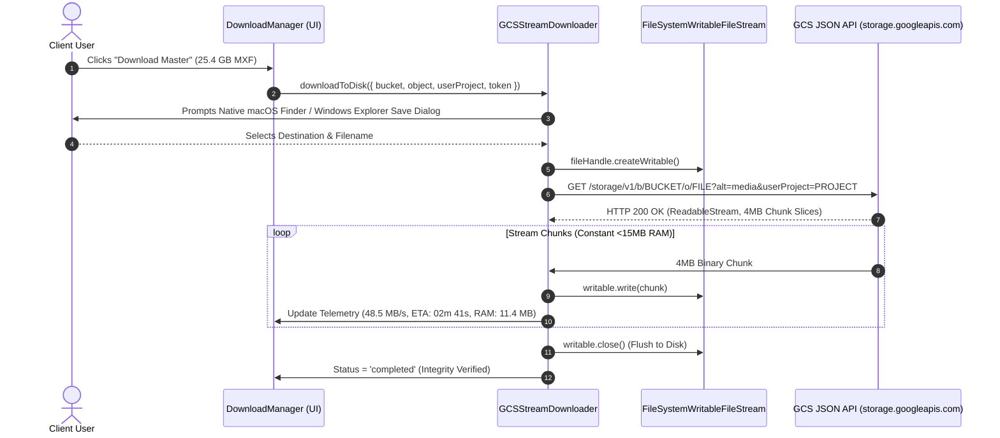

# Module 4: Memory-Bounded Streaming Download Pipeline Design & Requirements Specification
## Module ID: `MOD-04-STREAM-DOWNLOADER`

---

### 1. Module Overview & Scope

The **Memory-Bounded Streaming Download Pipeline Module** is the high-performance media transfer core of Files of Ba Sing Se. It is engineered to stream multi-gigabyte media assets (10GB–50GB+) directly from Google Cloud Storage to the client's local workstation disk without accumulating data in browser memory or causing tab crashes (Out of Memory / OOM).

It implements a multi-tier streaming strategy:
- **Tier 1 (Chromium Primary)**: Direct-to-disk streaming via the **File System Access API** in 4MB micro-chunks with constant <15MB RAM heap.
- **Tier 2 (WebKit Safari Hybrid)**: Direct browser download pipe via a registered **Service Worker Stream Interceptor**.
- **Tier 3 (Universal Small Files)**: In-memory Blob handling for lightweight metadata (<200MB).

```mermaid
flowchart TD
    Start([Download Request Initiated]) --> SizeCheck{File Size > 200 MB?}
    
    SizeCheck -->|No| Tier3[Tier 3: Memory Blob Engine\nfetch -> Blob -> createObjectURL]
    SizeCheck -->|Yes| BrowserCheck{Detect Browser Engine}
    
    BrowserCheck -->|Chromium on Mac / PC| Tier1[Tier 1: File System Access API\n1. showSaveFilePicker()\n2. createWritable()\n3. 4MB micro-chunk pipeTo]
    
    BrowserCheck -->|WebKit on Mac / Safari| Tier2[Tier 2: Service Worker Interceptor\n1. Intercept stream via SW\n2. Pipe ReadableStream to synthetic attachment\n3. Stream to ~/Downloads]
    
    BrowserCheck -->|Gecko / Firefox| Degradation[Firefox Routing\nInline Notice + 1-Click CLI Generator]
    
    Tier1 --> Verified([Stream Complete & CRC32c Verified])
    Tier2 --> Verified
    Tier3 --> Verified
```

---

### 2. Functional & Non-Functional Requirements

#### Functional Requirements
- **FR-4.1**: Direct-to-Disk Streaming via `window.showSaveFilePicker()` and `FileSystemWritableFileStream` for Chromium-based browsers.
- **FR-4.2**: 4MB micro-chunk reader loop passing binary `Uint8Array` buffers directly from `ReadableStreamDefaultReader.read()` into `writableStream.write()`.
- **FR-4.3**: Real-time throughput telemetry: Smoothed moving average speed in `MB/s` (sampled every 500ms), dynamic ETA seconds counter, elapsed time counter, and percentage progress.
- **FR-4.4**: Memory Heap Metric: Live telemetry reporting constant bounded memory footprint (~11.4 MB RAM).
- **FR-4.5**: Graceful Stream Cancellation: Instantaneous stream abort via `AbortController.abort()` and `FileSystemWritableFileStream.abort()` terminating network egress in <200ms.
- **FR-4.6**: Floating Download Manager Widget: Non-blocking, dockable, collapsible bottom-right UI card displaying live metrics, progress bar, minimize button, and cancel action.

#### Non-Functional Requirements
- **NFR-4.1**: Memory Ceiling SLA: JavaScript heap consumption **MUST REMAIN < 25 MB** throughout a 50GB file download.
- **NFR-4.2**: Cancellation Latency: Network egress termination within **< 200 ms** upon user clicking `[Cancel]`.
- **NFR-4.3**: Backpressure Handling: Native stream piping automatically throttles network ingress if disk I/O slows.

---

### 3. Stream Pipeline & Backpressure Sequence



---

### 4. TypeScript Interfaces & Data Contracts

```typescript
export interface DownloadProgressTelemetry {
  loadedBytes: number;
  totalBytes: number;
  percentage: number;
  speedBytesPerSec: number;
  formattedSpeed: string; // e.g. "48.5 MB/s"
  etaSeconds: number;
  formattedETA: string; // e.g. "02m 41s"
  elapsedSeconds: number;
  formattedElapsed: string; // e.g. "03m 42s"
  memoryHeapMB: number; // e.g. 11.4
  status: 'initializing' | 'streaming' | 'verifying' | 'completed' | 'cancelled' | 'error';
  errorMessage?: string;
}

export interface StreamDownloadOptions {
  bucketName: string;
  objectName: string;
  suggestedFilename: string;
  userProject: string;
  oauthToken: string;
  expectedCrc32c?: string;
  onProgress: (progress: DownloadProgressTelemetry) => void;
  abortSignal?: AbortSignal;
}
```

---

### 5. UI Components & Layout

1. **`DownloadManager.tsx`**: Floating bottom-right dockable card (360px width) with animated progress bar, speed gauge, ETA counter, memory usage meter, and cancel button.
2. **`StreamProgressIndicator.tsx`**: Compact inline progress gauge for row-level feedback.
3. **`FloatingMiniWidget.tsx`**: Collapsed pill-shaped state showing percentage and speed when minimized.

---

### 6. Error Handling & Edge Cases

| Failure Mode | Detection | Mitigation & Recovery |
| :--- | :--- | :--- |
| **Disk Space Exhaustion** | `QuotaExceededError` or write failure | Catch write error, abort writable stream, display alert: *"Insufficient local disk space to complete file write."* |
| **Network Dropped Mid-Stream** | Fetch stream broken | Abort incomplete stream, clean up temporary file handle, surface 1-click retry action. |
| **User Cancels Download** | User clicks `[Cancel]` | Issue `abortSignal.abort()`, execute `writable.abort()`, update UI to `[Cancelled]` within <200ms. |

---

### 7. Verification & Test Matrix

- **Unit Tests**:
  - `test_speed_calculation`: Moving average speed smoothing algorithm test.
  - `test_eta_calculation`: Remaining seconds calculation under fluctuating speeds.
- **Memory & Stress Tests**:
  - Stream 10GB test binary using File System Access API and monitor `performance.memory.usedJSHeapSize` to verify memory stays strictly below 25MB.
