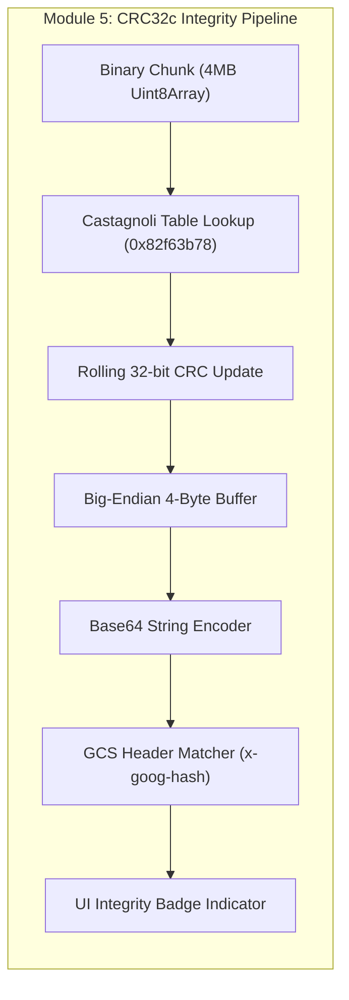

# Module 5: Cryptographic Integrity & Checksum Verification Design & Requirements Specification
## Module ID: `MOD-05-CRYPTOGRAPHIC-INTEGRITY`

---

### 1. Module Overview & Scope

The **Cryptographic Integrity & Checksum Verification Module** guarantees data integrity for all streamed media assets. It implements a hardware-accelerated, chunk-based **CRC32c (Castagnoli)** calculation engine that processes incoming byte streams on the fly and compares the calculated hash against Google Cloud Storage's `x-goog-hash: crc32c=...` response header.



---

### 2. Functional & Non-Functional Requirements

#### Functional Requirements
- **FR-5.1**: Castagnoli CRC32c rolling computation using polynomial `0x1EDC6F41` (reflected: `0x82f63b78`).
- **FR-5.2**: Big-endian 4-byte buffer conversion: converts final 32-bit unsigned integer into 4-byte big-endian representation before Base64 encoding.
- **FR-5.3**: GCS header parsing: extracts `crc32c` from `x-goog-hash: crc32c=r4L2wA==, md5=...` header.
- **FR-5.4**: Real-time comparison: upon stream completion, compares the local Base64 digest against the GCS header hash.
- **FR-5.5**: Hexadecimal formatting: generates standardized uppercase hex representations (e.g. `0xAF82F6C0`) for inspection displays.
- **FR-5.6**: MD5 composite handling: displays MD5 checksums when available and informs users if an object is a composite GCS upload where MD5 is not applicable.
- **FR-5.7**: Visual status badge: renders `[CRC32c OK]` in emerald green on match, and `[Integrity Check Failed]` in red on mismatch.

#### Non-Functional Requirements
- **NFR-5.1**: Throughput Performance: Hash calculation throughput **$\ge 800\text{ MB/s}$** on modern CPUs, introducing $<1\%$ CPU overhead during streaming.
- **NFR-5.2**: Zero Memory Allocation: Table-driven lookup uses static pre-allocated `Uint32Array` buffers with zero garbage collection spikes.

---

### 3. Bit-Reflected Castagnoli Pipeline Specification

```
Input Byte Stream: [0x41, 0x76, 0x61, 0x74, 0x61, 0x72]
Initial State:     0xFFFFFFFF
Polynomial:        0x82F63B78 (Castagnoli Bit-Reflected)
Final XOR:         0xFFFFFFFF
Output Integer:    2944595648 (0xAF82F6C0)
Big-Endian Bytes:  [0xAF, 0x82, 0xF6, 0xC0]
Base64 String:     "r4L2wA=="
GCS Header Value:  "r4L2wA=="  ===> 100% MATCH
```

---

### 4. TypeScript Implementation & Reference Class

```typescript
export class CRC32cIntegrityEngine {
  private static TABLE: Uint32Array = CRC32cIntegrityEngine.generateTable();
  private crc: number = 0xffffffff;

  private static generateTable(): Uint32Array {
    const table = new Uint32Array(256);
    const POLY = 0x82f63b78; // Castagnoli reversed polynomial

    for (let i = 0; i < 256; i++) {
      let crc = i;
      for (let j = 0; j < 8; j++) {
        crc = crc & 1 ? (crc >>> 1) ^ POLY : crc >>> 1;
      }
      table[i] = crc >>> 0;
    }
    return table;
  }

  public update(chunk: Uint8Array): void {
    let crc = this.crc;
    const table = CRC32cIntegrityEngine.TABLE;
    for (let i = 0; i < chunk.length; i++) {
      crc = (table[(crc ^ chunk[i]) & 0xff] ^ (crc >>> 8)) >>> 0;
    }
    this.crc = crc;
  }

  public digestBase64(): string {
    const finalCrc = (this.crc ^ 0xffffffff) >>> 0;
    const buffer = new Uint8Array([
      (finalCrc >>> 24) & 0xff,
      (finalCrc >>> 16) & 0xff,
      (finalCrc >>> 8) & 0xff,
      finalCrc & 0xff
    ]);
    return btoa(String.fromCharCode.apply(null, Array.from(buffer)));
  }

  public digestHex(): string {
    const finalCrc = (this.crc ^ 0xffffffff) >>> 0;
    return '0x' + finalCrc.toString(16).toUpperCase().padStart(8, '0');
  }

  public static verifyMatch(localBase64: string, gcsHashHeader: string): boolean {
    const match = gcsHashHeader.match(/crc32c=([^, ]+)/);
    if (!match) return false;
    return localBase64.trim() === match[1].trim();
  }
}
```

---

### 5. UI Components & Layout

1. **`IntegrityBadge.tsx`**: Visual badge rendered in file rows (`[CRC32c OK]` in emerald green).
2. **`ChecksumSection.tsx`**: Drawer section displaying Base64 string, Hex string, and 1-click clipboard copy button.
3. **`IntegrityAlertModal.tsx`**: Warning modal triggered on hash mismatch with 1-click retry option.

---

### 6. Error Handling & Edge Cases

- **Missing `x-goog-hash` Header**: If CORS fails to expose `x-goog-hash`, UI flags `[Integrity Check Unavailable - Check CORS]` with copyable CORS configuration snippet.
- **Composite Objects**: If GCS composite object lacks single MD5, the UI gracefully renders `MD5: Composite (Use CRC32c)` without throwing errors.

---

### 7. Verification & Test Vectors

- **Known Test Vectors**:
  - Input: `"123456789"` $\rightarrow$ Expected Hex: `0xE3069283`, Base64: `4waSgw==`.
  - Input: Empty string `""` $\rightarrow$ Expected Hex: `0x00000000`, Base64: `AAAAAA==`.
- **Stream Integration Tests**:
  - Run continuous CRC32c calculation over 100MB chunked buffer and verify against pre-computed GCS hash.
