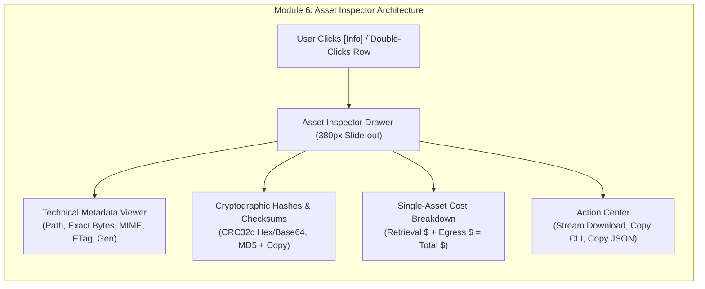

# Module 6: Asset Deep-Inspection & Technical Metadata Drawer Design & Requirements Specification
## Module ID: `MOD-06-ASSET-INSPECTOR`

---

### 1. Module Overview & Scope

The **Asset Deep-Inspection & Technical Metadata Drawer Module** provides detailed technical metadata visualization and single-asset actions for video engineers, pipeline TDs, and client supervisors. Triggered by clicking `[Info]` or double-clicking any file row, the drawer slides in from the right edge without disrupting directory navigation context, exposing cryptographic hashes, exact byte sizes, GCS generation tags, and an itemized single-asset cost calculation.



---

### 2. Functional & Non-Functional Requirements

#### Functional Requirements
- **FR-6.1**: Smooth slide-out panel from the right edge (380px fixed width on desktop, full-width overlay on tablet/mobile).
- **FR-6.2**: Comprehensive technical property display:
  - Object Full Path (e.g. `feature_films/reel_04/reel04_cam_A_raw.mxf`).
  - Bucket URI (`gs://bucket-name`).
  - MIME Content-Type (e.g. `application/mxf`, `video/quicktime`, `audio/wav`).
  - Exact Byte Count & Decimal/Binary formats (e.g. `18,400,000,000 bytes (18.40 GB / 17.13 GiB)`).
  - Storage Class with badge (`ARCHIVE`, `COLDLINE`, `STANDARD`).
  - Creation & Last Modified timestamps in UTC ISO format.
  - ETag, Generation ID, and Metageneration ID.
- **FR-6.3**: Cryptographic Checksum display:
  - CRC32c Base64 string (e.g. `r4L2wA==`).
  - CRC32c Hexadecimal string (e.g. `0xAF82F6C0`).
  - MD5 hash string with composite notice if applicable.
- **FR-6.4**: 1-Click Clipboard Copy buttons beside each property with instantaneous visual toast feedback.
- **FR-6.5**: Itemized single-asset cost calculator box displaying retrieval charge, egress charge, and total estimate when in Requester-Pays mode, or displaying `$0.00 USD (Sponsored by Bucket Owner)` when in Owner-Pays mode.
- **FR-6.6**: Action triggers: `[Stream Download to Local Disk]`, `[Copy gcloud CLI Command]`, `[Copy Raw JSON Metadata]`.

#### Non-Functional Requirements
- **NFR-6.1**: Slide-in Animation Performance: **< 150 ms** at 60 FPS using GPU-accelerated CSS transforms.
- **NFR-6.2**: Non-Blocking Navigation: Drawer operates as a persistent or modal layer without causing re-fetching of parent directory lists.

---

### 3. UI Component & Wireframe Layout

```
+-------------------------------------------------------------+
|  ASSET DETAILS & COST BREAKDOWN                         [X] |
+-------------------------------------------------------------+
|  [Video Icon] reel04_cam_A_raw.mxf                          |
|               18,400,000,000 bytes (18.40 GB / 17.13 GiB)   |
|                                                             |
|  Storage Class:       ARCHIVE (Cold Tier)                   |
|  Content-Type:        video/mxf                             |
|  CRC32c (Hex):        0xAF82F6C0                            |
|  CRC32c (Base64):     r4L2wA==                              |
|  MD5 Checksum:        3a4f8d9b1c2e4f6a7b8c9d0e1f2a3b4c      |
|  Created:             2026-07-14 10:22:15 UTC               |
|  Generation ID:       1689330135892104                      |
|                                                             |
|  +-------------------------------------------------------+  |
|  | [REQUESTER-PAYS MODE]:                                |  |
|  | • Archive Retrieval ($0.05/GB):                $0.92  |  |
|  | • Internet Egress ($0.12/GB):                   $2.21  |  |
|  | ----------------------------------------------------- |  |
|  | TOTAL ESTIMATED CHARGE:                        $3.13  |  |
|  |                                                       |  |
|  | [OWNER-PAYS MODE]:                                    |  |
|  | • Estimated Client Charge:                     $0.00  |  |
|  | (100% Covered by Bucket Owner)                        |  |
|  +-------------------------------------------------------+  |
|                                                             |
|  [ Stream Download to Local Disk ]                          |
|  [ Copy gcloud CLI Command       ]                          |
|  [ Copy Raw JSON Metadata        ]                          |
+-------------------------------------------------------------+
```

---

### 4. TypeScript Interfaces & Data Contracts

```typescript
export interface AssetDetailProps {
  item: GCSMediaItem | null;
  isOpen: boolean;
  onClose: () => void;
  onInitiateDownload: (item: GCSMediaItem) => void;
  onGenerateCli: (item: GCSMediaItem) => void;
}
```

---

### 5. UI Components

1. **`AssetInspectorDrawer.tsx`**: Main drawer component with transition effects.
2. **`PropertyRow.tsx`**: Key-value property row with hover-triggered clipboard copy button.
3. **`SingleAssetCostBox.tsx`**: High-visibility callout box calculating single-file fees.

---

### 6. Error Handling & Edge Cases

- **Missing Metadata**: If an object lacks MIME type or MD5 (e.g. composite files), UI renders fallback badges (`application/octet-stream`, `MD5: Composite (See CRC32c)`).
- **Escape Key Handling**: Pressing `Escape` automatically dismisses the drawer and returns focus to the corresponding table row.

---

### 7. Verification & Test Matrix

- **Unit Tests**:
  - `test_single_asset_cost_breakdown`: Confirms 18.4GB Archive evaluates to \$0.92 retrieval and \$2.21 egress (\$3.13 total).
  - `test_clipboard_copy_helper`: Verifies clipboard API integration with fallback for unsupported contexts.
