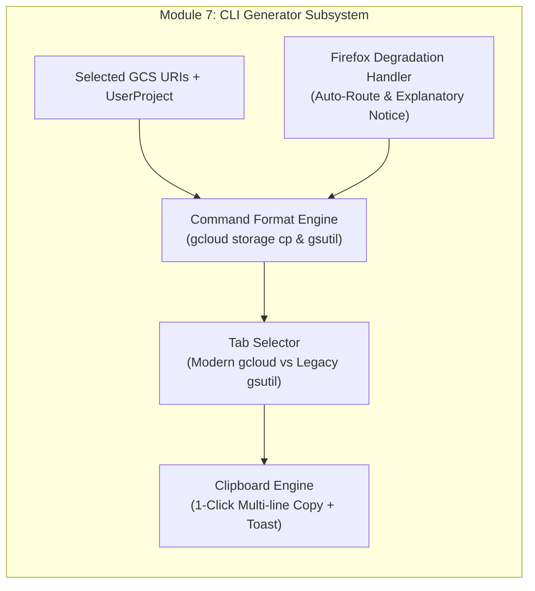

# Module 7: Automated Batch & CLI Companion Generator Design & Requirements Specification
## Module ID: `MOD-07-CLI-GENERATOR`

---

### 1. Module Overview & Scope

The **Automated Batch & CLI Companion Generator Module** bridges the browser portal with terminal and headless engineering pipelines. It empowers technical users to generate pre-formatted, multi-threaded Google Cloud CLI commands with the client's active billing project pre-populated (`--billing-project` or `-u`), and acts as the graceful fallback for Mozilla Firefox users where multi-gigabyte browser streaming is restricted.



---

### 2. Functional & Non-Functional Requirements

#### Functional Requirements
- **FR-7.1**: Modern Google Cloud CLI (`gcloud storage cp`) multi-line command formatting:
  ```bash
  # Requester-Pays Bucket:
  gcloud storage cp \
    gs://BUCKET/path/to/file1.mxf \
    gs://BUCKET/path/to/file2.mxf \
    ./destination_folder/ \
    --billing-project=CLIENT_PROJECT_ID

  # Owner-Pays Bucket:
  gcloud storage cp \
    gs://OWNER_BUCKET/path/to/file1.mxf \
    ./destination_folder/
  ```
- **FR-7.2**: Legacy `gsutil` multi-threaded script formatting:
  ```bash
  # Requester-Pays Bucket:
  gsutil -u CLIENT_PROJECT_ID -m cp \
    gs://BUCKET/path/to/file1.mxf \
    ./destination_folder/

  # Owner-Pays Bucket:
  gsutil -m cp \
    gs://OWNER_BUCKET/path/to/file1.mxf \
    ./destination_folder/
  ```
- **FR-7.3**: Whole-Folder recursive command generation: when a folder is selected, automatically appends recursive flags (`-r`).
- **FR-7.4**: 1-Click "Copy Command to Clipboard" button with instantaneous visual toast confirmation.
- **FR-7.5**: Mozilla Firefox Detection & Routing: automatically presents the CLI generator modal when Firefox users attempt to download files $>200\text{ MB}$, accompanied by a clear explanatory banner.
- **FR-7.6**: Adaptive Billing Flag Injection: The command formatter dynamically inspects `activeBucketBillingMode`. When in Owner-Pays mode, billing flags (`--billing-project`, `-u`) are omitted to produce clean terminal scripts that do not require project configuration.

#### Non-Functional Requirements
- **NFR-7.1**: Shell Escaping: All object keys containing spaces or special characters are safely escaped for macOS/Linux `zsh`/`bash` and Windows PowerShell.

---

### 3. UI Component & Wireframe Layout

```
+----------------------------------------------------------------------------------------------------+
|  Automated Batch & CLI Command Generator                                                       [X] |
|  3 assets selected (42.60 GB Total)                                                                |
|                                                                                                    |
|  [ Google Cloud CLI (gcloud storage) ]      [ Legacy gsutil Script ]                               |
|  +----------------------------------------------------------------------------------------------+  |
|  | $ multi-threaded high-performance transfer command:                                          |  |
|  |                                                                                              |  |
|  | gcloud storage cp \                                                                          |  |
|  |   gs://partner-raw-master-archives-2026/feature_films/reel_04/reel04_cam_A_raw.mxf \         |  |
|  |   gs://partner-raw-master-archives-2026/feature_films/reel_04/reel04_cam_B_raw.mxf \         |  |
|  |   gs://partner-raw-master-archives-2026/feature_films/reel_04/reel04_prores_proxy.mov \       |  |
|  |   ./destination_folder/ \                                                                    |  |
|  |   --billing-project=client-prod-media-2026                                                   |  |
|  +----------------------------------------------------------------------------------------------+  |
|  [ Copy Command to Clipboard ]                                                                     |
|                                                                                                    |
|  +----------------------------------------------------------------------------------------------+  |
|  | (i) Multi-threaded terminal transfers support auto-resume (-C) and are ideal for headless    |  |
|  |     servers, render farms, or Firefox users.                                                 |  |
|  +----------------------------------------------------------------------------------------------+  |
|                                                                                         [ Close ]  |
+----------------------------------------------------------------------------------------------------+
```

---

### 4. TypeScript Implementation

```typescript
export interface CLIGeneratorOptions {
  bucketName: string;
  selectedPaths: string[];
  userProject: string;
  destinationDir?: string;
}

export class CliScriptBuilder {
  public static buildGcloud(opts: CLIGeneratorOptions): string {
    const { bucketName, selectedPaths, userProject, destinationDir = './destination_folder/' } = opts;
    const cleanBucket = bucketName.replace(/^gs:\/\//, '').replace(/\/+$/, '');

    if (selectedPaths.length === 1) {
      return `gcloud storage cp gs://${cleanBucket}/${selectedPaths[0]} ${destinationDir} --billing-project=${userProject}`;
    }

    const paths = selectedPaths.map((p) => `  gs://${cleanBucket}/${p}`).join(' \\\n');
    return `gcloud storage cp \\\n${paths} \\\n  ${destinationDir} \\\n  --billing-project=${userProject}`;
  }

  public static buildGsutil(opts: CLIGeneratorOptions): string {
    const { bucketName, selectedPaths, userProject, destinationDir = './' } = opts;
    const cleanBucket = bucketName.replace(/^gs:\/\//, '').replace(/\/+$/, '');

    if (selectedPaths.length === 1) {
      return `gsutil -u ${userProject} -m cp gs://${cleanBucket}/${selectedPaths[0]} ${destinationDir}`;
    }

    const paths = selectedPaths.map((p) => `  gs://${cleanBucket}/${p}`).join(' \\\n');
    return `gsutil -u ${userProject} -m cp \\\n${paths} \\\n  ${destinationDir}`;
  }
}
```

---

### 5. Error Handling & Edge Cases

- **Empty Selection**: If opened with zero items selected, defaults to generating the command for the entire active directory (`gs://bucket/prefix/ -r`).
- **No Project Specified**: If `userProject` is missing, the generator highlights the missing project field and prompts the user to enter their GCP Project ID.

---

### 6. Verification & Test Matrix

- **Unit Tests**:
  - `test_gcloud_single_item_generation`: Verifies single-line formatting.
  - `test_gcloud_multi_item_generation`: Verifies multi-line backslash escaping and `--billing-project` flag.
  - `test_gsutil_flag_generation`: Verifies `-u` and `-m` flags.
