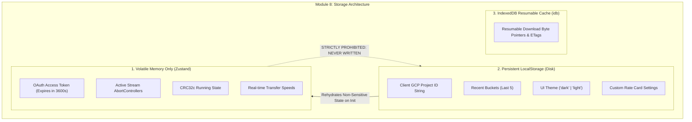

# Module 8: State Management, Security Boundary & Persistence Design & Requirements Specification
## Module ID: `MOD-08-STATE-PERSISTENCE`

---

### 1. Module Overview & Scope

The **State Management, Security Boundary & Persistence Module** governs all client-side state lifecycles and strictly enforces security isolation boundaries across volatile runtime memory, persistent browser local storage, and IndexedDB. It ensures that sensitive credentials (Google OAuth access tokens) exist **only in volatile RAM**, while non-sensitive workflow preferences (GCP Project ID string, recent bucket history, UI theme) persist across sessions for user convenience.



---

### 2. Functional & Non-Functional Requirements

#### Functional Requirements
- **FR-8.1**: Volatile Credential Storage: OAuth access tokens, expiration countdowns, and active download `AbortController` instances reside exclusively in volatile Zustand state.
- **FR-8.2**: LocalStorage Persistence: Automatically synchronizes non-sensitive client preferences:
  - `savedProjectId`: string (e.g. `"client-prod-media-2026"`).
  - `recentBuckets`: array of strings (capped at 5 items).
  - `theme`: `"dark" | "light"`.
  - `customPricing`: optional object.
- **FR-8.3**: IndexedDB Range Cache: Persists download progress checkpoints and ETags via `idb` for resuming interrupted transfers.
- **FR-8.4**: Logout & Memory Flush: Clicking "Sign Out" or "Disconnect" immediately purges all volatile memory, aborts active streams, and resets application state.
- **FR-8.5**: Prohibited Storage Enforcement: The application strictly rejects, strips, and prohibits storage of Google Service Account JSON files, private keys, or refresh tokens.

#### Non-Functional Requirements
- **NFR-8.1**: XSS Protection: Content Security Policy (CSP) header enforcement restricting script origins exclusively to Google Identity Services and Google Storage endpoints.
- **NFR-8.2**: State Sync Latency: LocalStorage writes executed asynchronously without blocking the UI thread (<1ms).

---

### 3. TypeScript Implementation & Zustand Store Definition

```typescript
import { create } from 'zustand';
import { persist } from 'zustand/middleware';

// 1. Persistent Store (Non-Sensitive Disk Storage)
export interface PersistentPreferences {
  savedProjectId: string;
  recentBuckets: string[];
  theme: 'dark' | 'light';
  customPricing: {
    archiveRetrieval?: number;
    coldlineRetrieval?: number;
    egress?: number;
  };
  setSavedProjectId: (id: string) => void;
  addRecentBucket: (bucket: string) => void;
  setTheme: (theme: 'dark' | 'light') => void;
  setCustomPricing: (pricing: Partial<PersistentPreferences['customPricing']>) => void;
}

export const usePersistentStore = create<PersistentPreferences>()(
  persist(
    (set) => ({
      savedProjectId: '',
      recentBuckets: [],
      theme: 'dark',
      customPricing: {},
      setSavedProjectId: (id) => set({ savedProjectId: id.trim() }),
      addRecentBucket: (bucket) =>
        set((state) => {
          const clean = bucket.replace(/^gs:\/\//, '').replace(/\/+$/, '');
          const filtered = state.recentBuckets.filter((b) => b !== clean);
          return { recentBuckets: [clean, ...filtered].slice(0, 5) };
        }),
      setTheme: (theme) => set({ theme }),
      setCustomPricing: (pricing) =>
        set((state) => ({ customPricing: { ...state.customPricing, ...pricing } }))
    }),
    { name: 'basingse-media-client-prefs' }
  )
);

// 2. Volatile Runtime Store (Strictly Volatile RAM)
export interface VolatileRuntimeSession {
  oauthToken: string | null;
  userEmail: string | null;
  userAvatar: string | null;
  tokenExpiresAt: number | null;
  activeAbortController: AbortController | null;
  currentDownloadItem: string | null;
  setAuthSession: (token: string, email: string, avatar: string, expiresInSeconds: number) => void;
  clearAuthSession: () => void;
  setActiveStream: (controller: AbortController | null, itemName: string | null) => void;
}

export const useRuntimeStore = create<VolatileRuntimeSession>((set, get) => ({
  oauthToken: null,
  userEmail: null,
  userAvatar: null,
  tokenExpiresAt: null,
  activeAbortController: null,
  currentDownloadItem: null,
  setAuthSession: (token, email, avatar, expiresInSeconds) =>
    set({
      oauthToken: token,
      userEmail: email,
      userAvatar: avatar,
      tokenExpiresAt: Date.now() + expiresInSeconds * 1000
    }),
  clearAuthSession: () => {
    const { activeAbortController } = get();
    if (activeAbortController) {
      try {
        activeAbortController.abort();
      } catch (_) {}
    }
    set({
      oauthToken: null,
      userEmail: null,
      userAvatar: null,
      tokenExpiresAt: null,
      activeAbortController: null,
      currentDownloadItem: null
    });
  },
  setActiveStream: (controller, itemName) =>
    set({
      activeAbortController: controller,
      currentDownloadItem: itemName
    })
}));
```

---

### 4. UI Components

1. **`Header.tsx`**: Top navigation bar displaying connected bucket, active project badge, Google user profile avatar, theme switcher, and disconnect button.
2. **`StorageBoundaryValidator.tsx`**: Diagnostic component auditing `localStorage` on boot to confirm zero credential leakage.

---

### 5. Error Handling & Edge Cases

- **LocalStorage Quota Exceeded**: Catch quota exceptions and gracefully degrade to memory-only storage for recent bucket lists.
- **Tab Crash / Refresh**: Session token is cleared from RAM, prompting 1-click silent re-auth via GIS iframe without losing the user's selected project ID.

---

### 6. Verification & Security Audit Matrix

- **Automated Security Tests**:
  - `test_zero_token_in_localstorage`: Performs `localStorage.getItem('basingse-media-client-prefs')` and asserts that `oauthToken`, `access_token`, and `bearer` keys do NOT exist.
  - `test_clear_auth_flushes_all_state`: Asserts that `clearAuthSession()` resets token to `null` and invokes `abort()`.
