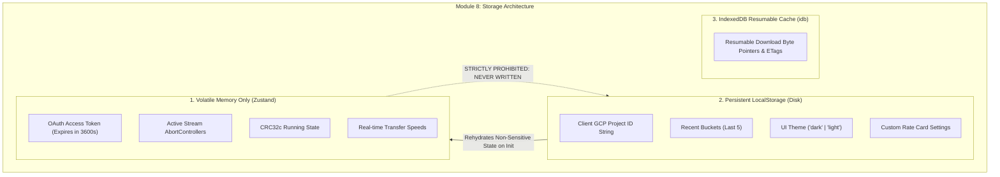

# Module 8: State Management, Security Boundary & Persistence Design & Requirements Specification
## Module ID: `MOD-08-STATE-PERSISTENCE`

---

### 1. Module Overview & Scope

The **State Management, Security Boundary & Persistence Module** governs all client-side state lifecycles and strictly enforces security isolation boundaries across volatile runtime memory, persistent browser local storage, and IndexedDB. It ensures that sensitive credentials (Google OAuth access tokens) exist **only in volatile RAM**, while non-sensitive workflow preferences (GCP Project ID string, recent bucket history, UI theme) persist across sessions for user convenience.



---

### 2. Functional & Non-Functional Requirements

#### Functional Requirements
- **FR-8.1**: Volatile Credential Storage: OAuth access tokens, expiration countdowns, and active download `AbortController` instances reside exclusively in volatile Zustand state.
- **FR-8.2**: LocalStorage Persistence: Automatically synchronizes non-sensitive client preferences:
  - `savedProjectId`: string (e.g. `"client-prod-media-2026"`).
  - `savedBucketName`: string (e.g. `"my-bucket"`).
  - `activeBucketBillingMode`: `'requester-pays' | 'owner-pays'`.
  - `recentBuckets`: array of strings (capped at 5 items).
  - `recentBucketModes`: mapping of bucket name to billing mode.
  - `theme`: `"dark" | "light"`.
  - `customPricing`: optional object.
- **FR-8.3**: IndexedDB Range Cache: Persists download progress checkpoints and ETags via `idb` for resuming interrupted transfers.
- **FR-8.4**: Logout & Memory Flush: Clicking "Sign Out" or "Disconnect" immediately purges all volatile memory, aborts active streams, and resets application state.
- **FR-8.5**: Prohibited Storage Enforcement: The application strictly rejects, strips, and prohibits storage of Google Service Account JSON files, private keys, or refresh tokens.
- **FR-8.6**: Zero-Telemetry Web Storage Boundary: Persistent web storage (`localStorage`, `sessionStorage`, cookies, IndexedDB) is strictly prohibited from storing tracking IDs, advertising identifiers, or analytics payloads (*Module 14*, `MOD-14-TRUST-SAFETY-PRIVACY`).

#### Non-Functional Requirements
- **NFR-8.1**: XSS Protection: Content Security Policy (CSP) header enforcement restricting script origins exclusively to Google Identity Services and Google Storage endpoints.
- **NFR-8.2**: State Sync Latency: LocalStorage writes executed asynchronously without blocking the UI thread (<1ms).

---

### 3. TypeScript Implementation & Zustand Store Definition

```typescript
import { create } from 'zustand';
import { persist } from 'zustand/middleware';

export type BucketBillingMode = 'requester-pays' | 'owner-pays';

// 1. Persistent Store (Non-Sensitive Disk Storage)
export interface PersistentPreferences {
  savedProjectId: string;
  savedBucketName: string;
  activeBucketBillingMode: BucketBillingMode;
  recentBuckets: string[];
  recentBucketModes: Record<string, BucketBillingMode>;
  theme: 'dark' | 'light';
  customPricing: {
    archiveRetrieval?: number;
    coldlineRetrieval?: number;
    egress?: number;
  };
  isFreeTrialAccount: boolean;
  hasCompletedOnboarding: boolean;
  lastAuthUserEmail: string | null;
  lastAuthUserName: string | null;
  lastAuthTimestamp: number | null;
  setSavedProjectId: (id: string) => void;
  setSavedBucketName: (bucket: string) => void;
  setActiveBucketBillingMode: (mode: BucketBillingMode) => void;
  addRecentBucket: (bucket: string, mode?: BucketBillingMode) => void;
  setTheme: (theme: 'dark' | 'light') => void;
  setCustomPricing: (pricing: Partial<PersistentPreferences['customPricing']>) => void;
  setFreeTrialAccount: (isFreeTrial: boolean) => void;
  setHasCompletedOnboarding: (completed: boolean) => void;
  setLastAuthUserEmail: (email: string | null) => void;
  setLastAuthUserName: (name: string | null) => void;
  resetPreferences: () => void;
}

export const usePersistentStore = create<PersistentPreferences>()(
  persist(
    (set) => ({
      savedProjectId: '',
      savedBucketName: '',
      recentBuckets: [],
      theme: 'dark',
      customPricing: {},
      isFreeTrialAccount: false,
      hasCompletedOnboarding: false,
      lastAuthUserEmail: null,
      lastAuthUserName: null,
      lastAuthTimestamp: null,
      setSavedProjectId: (id) => set({ savedProjectId: id.trim() }),
      setSavedBucketName: (bucket) => {
        const clean = bucket.replace(/^gs:\/\//i, '').replace(/\/+$/, '').trim();
        set({ savedBucketName: `gs://${clean}` });
      },
      addRecentBucket: (bucket) =>
        set((state) => {
          const clean = bucket.replace(/^gs:\/\//i, '').replace(/\/+$/, '').trim();
          if (!clean) return state;
          const filtered = state.recentBuckets.filter((b) => b !== clean);
          return { recentBuckets: [clean, ...filtered].slice(0, 5) };
        }),
      setTheme: (theme) => set({ theme }),
      setCustomPricing: (pricing) =>
        set((state) => ({ customPricing: { ...state.customPricing, ...pricing } })),
      setFreeTrialAccount: (isFreeTrial) => set({ isFreeTrialAccount: isFreeTrial }),
      setHasCompletedOnboarding: (completed) =>
        set({
          hasCompletedOnboarding: completed,
          lastAuthTimestamp: completed ? Date.now() : null
        }),
      setLastAuthUserEmail: (email) => set({ lastAuthUserEmail: email }),
      setLastAuthUserName: (name) => set({ lastAuthUserName: name }),
      resetPreferences: () =>
        set({
          savedProjectId: '',
          savedBucketName: '',
          recentBuckets: [],
          theme: 'dark',
          customPricing: {},
          isFreeTrialAccount: false,
          hasCompletedOnboarding: false,
          lastAuthUserEmail: null,
          lastAuthUserName: null,
          lastAuthTimestamp: null
        })
    }),
    { name: 'basingse-media-client-prefs' }
  )
);

// 2. Volatile Runtime Store (Strictly Volatile RAM)
export interface VolatileRuntimeSession {
  oauthToken: string | null;
  userEmail: string | null;
  userName: string | null;
  userAvatar: string | null;
  tokenExpiresAt: number | null;
  activeAbortController: AbortController | null;
  currentDownloadItem: string | null;
  isRestoringSession: boolean;
  sessionRestorationError: string | null;
  isDemoMode: boolean;
  setAuthSession: (token: string, email: string, name?: string, avatar?: string, expiresInSeconds?: number) => void;
  clearAuthSession: () => void;
  setActiveStream: (controller: AbortController | null, itemName: string | null) => void;
  setIsRestoringSession: (restoring: boolean, error?: string | null) => void;
  setDemoMode: (isDemo: boolean) => void;
}

export const useRuntimeStore = create<VolatileRuntimeSession>((set, get) => ({
  oauthToken: null,
  userEmail: null,
  userName: null,
  userAvatar: null,
  tokenExpiresAt: null,
  activeAbortController: null,
  currentDownloadItem: null,
  isRestoringSession: false,
  sessionRestorationError: null,
  isDemoMode: false,
  setAuthSession: (token, email, name = 'Google User', avatar = undefined, expiresInSeconds = 3600) =>
    set({
      oauthToken: token,
      userEmail: email,
      userName: name,
      userAvatar: avatar,
      tokenExpiresAt: Date.now() + expiresInSeconds * 1000,
      isRestoringSession: false,
      sessionRestorationError: null
    }),
  clearAuthSession: () => {
    const { activeAbortController } = get();
    if (activeAbortController) {
      try {
        activeAbortController.abort();
      } catch (_) {}
    }
    set({
      oauthToken: null,
      userEmail: null,
      userName: null,
      userAvatar: null,
      tokenExpiresAt: null,
      activeAbortController: null,
      currentDownloadItem: null,
      isRestoringSession: false,
      sessionRestorationError: null
    });
  },
  setActiveStream: (controller, itemName) =>
    set({
      activeAbortController: controller,
      currentDownloadItem: itemName
    }),
  setIsRestoringSession: (restoring, error = null) =>
    set({
      isRestoringSession: restoring,
      sessionRestorationError: error
    }),
  setDemoMode: (isDemo) => set({ isDemoMode: isDemo })
}));
```

---

### 4. UI Components

1. **`Header.tsx`**: Top navigation bar displaying connected bucket, active project badge, Google user profile avatar, theme switcher, and disconnect button.
2. **`StorageBoundaryValidator.tsx`**: Diagnostic component auditing `localStorage` on boot to confirm zero credential leakage.
3. **`SessionReconnectCard.tsx`**: 1-click interactive re-authentication component for expired or cookie-partitioned sessions.

---

### 5. Error Handling & Edge Cases

- **LocalStorage Quota Exceeded**: Catch quota exceptions and gracefully degrade to memory-only storage for recent bucket lists.
- **Tab Crash / Refresh**: Volatile access token is lost from RAM; application reads non-sensitive session hints and executes silent background renewal via GIS iframe without resetting project ID or forcing the 4-step onboarding wizard.

---

### 6. Verification & Security Audit Matrix

- **Automated Security Tests**:
  - `test_zero_token_in_localstorage`: Performs `localStorage.getItem('basingse-media-client-prefs')` and asserts that `oauthToken`, `access_token`, and `bearer` keys do NOT exist.
  - `test_session_hints_do_not_contain_secrets`: Asserts that `hasCompletedOnboarding`, `lastAuthUserEmail`, `savedProjectId` do not match token regexes.
  - `test_clear_auth_flushes_all_state`: Asserts that `clearAuthSession()` resets token to `null` and invokes `abort()`.

---

### 7. Cross-Module Integration with Module 9 & Module 10

- **[Module 10: Session Continuity, Silent Token Restoration & Onboarding Bypass](module_10_session_lifecycle_and_restoration_design_and_requirements.md)** (`MOD-10-SESSION-LIFECYCLE`): Manages the boot restoration lifecycle and onboarding bypass using `hasCompletedOnboarding` and silent GIS token requests.
- **[Module 9: Workspace Navigation, Bucket Switcher & GCP Config Center](module_9_workspace_and_gcp_config_center_design_and_requirements.md)** (`MOD-09-WORKSPACE-GCP-CONFIG-CENTER`): Directly queries and mutates persistent storage via `usePersistentStore` for `savedBucketName`, `recentBuckets` (capped at 5 FIFO items), `savedProjectId`, and `customPricing` rate card overrides. It also provides the live **Storage Boundary Audit** widget verifying zero token leakage.

