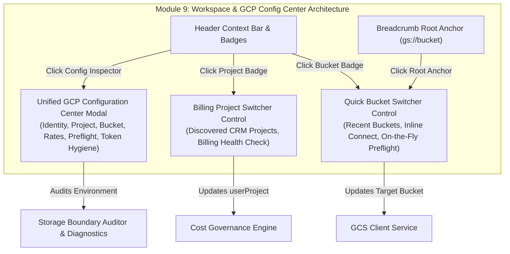
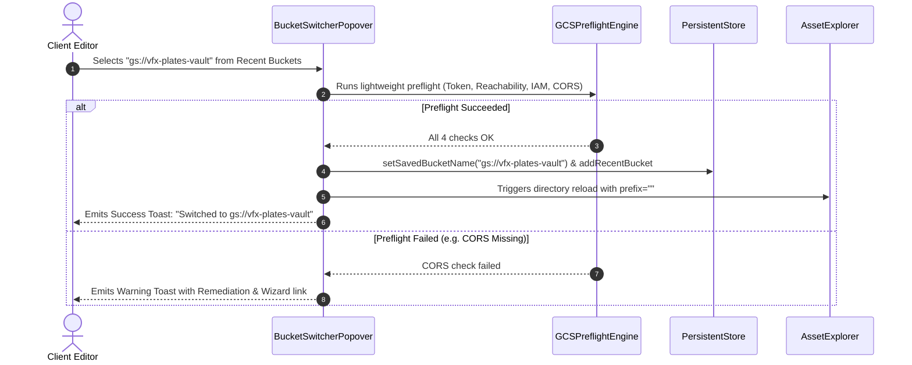

# Module 9: Workspace Navigation, Bucket Switcher & GCP Config Center Specification
## Module ID: `MOD-09-WORKSPACE-GCP-CONFIG-CENTER`

---

### 1. Executive Summary & Problem Statement

In media production environments (editorial finishing, color grading, VFX compositing, audio stems mastering), client users frequently work across multiple distinct Google Cloud Storage buckets (e.g., `gs://dailies-vault-2026`, `gs://vfx-pulls-stems`, `gs://color-masters-archive`) and multiple GCP billing projects (`userProject`).

While initial onboarding validates identity, project attribution, and bucket preflight via a linear wizard (*Module 1*), the active application workspace requires agile, non-disruptive controls to:
1. **Switch target GCS buckets on-the-fly** without re-running the 4-step onboarding flow.
2. **Switch active billing projects (`userProject`)** for Requester-Pays attribution on-demand.
3. **Inspect the holistic GCP configuration and health state** of the application in a unified **GCP Configuration Center**.



---

### 2. Functional & Non-Functional Requirements

#### Functional Requirements (FR)

##### Section A: Post-Setup Bucket Switcher Control (`BucketSwitcherControl`)
- **FR-9.1.1 (Interactive Header & Breadcrumb Trigger)**: Clicking the connected bucket badge in the Header or clicking the root `gs://[bucket-name]` element in the Breadcrumb Navigation shall open the interactive Bucket Switcher Popover.
- **FR-9.1.2 (Recent Bucket Quick Switch with Mode Badges)**: The popover shall display the list of recently connected buckets (`recentBuckets`, capped at 5) annotated with their billing mode badges (`[Requester-Pays 🛡️]` or `[Owner-Pays 🎁]`) with 1-click instant switching.
- **FR-9.1.3 (Inline Target Bucket Input)**: The popover shall provide an inline text input with real-time GCP bucket syntax validation (3–63 chars, lowercase, no consecutive dots, non-IP format).
- **FR-9.1.4 (Background On-the-Fly Preflight Handshake)**: Switching to a new bucket shall automatically execute a lightweight 4-point preflight check in the background using the active OAuth token and billing project.
  - Automatically detects whether the target bucket is `requester-pays` or `owner-pays`.
  - If preflight passes $\rightarrow$ updates `savedBucketName`, `activeBucketBillingMode`, prepends to `recentBuckets`, reloads root directory (`prefix=''`), and emits a success toast.
  - If preflight fails (e.g. CORS missing or IAM denied) $\rightarrow$ surfaces actionable remediation toast with 1-click action to launch the Onboarding Preflight Wizard.
- **FR-9.1.5 (Wizard Fallback Trigger)**: Includes a direct button: `[Launch Full Preflight Wizard for New Bucket]`.
- **FR-9.1.6 (Mixed-Mode Multi-Bucket Switching)**: Seamlessly supports switching between Requester-Pays and Owner-Pays buckets in the same session, instantly toggling Cost Banner and Footer badges without session reset.

##### Section B: Billed Project Switcher Control (`ProjectSwitcherControl`)
- **FR-9.2.1 (Interactive Project Badge Trigger)**: Clicking the "Billed to:" project badge in the Header shall open the Project Switcher Popover.
- **FR-9.2.2 (Project Discovery Listing)**: Lists discovered Google Cloud projects fetched via the Cloud Resource Manager API (`cloudresourcemanager.googleapis.com/v1/projects`).
- **FR-9.2.3 (Billing Account Status Indicator)**: Displays real-time Cloud Billing status (Active / Unlinked) for each selectable project.
- **FR-9.2.4 (Manual Project ID Input)**: Allows entering an unlisted project ID for IT-delegated client accounts.

##### Section C: Unified GCP Configuration Center (`GCPConfigCenterModal`)
- **FR-9.3.1 (Global Access Trigger)**: Accessible via Header "GCP Config" action button or keyboard shortcut (`Ctrl+G` / `Cmd+G`).
- **FR-9.3.2 (Identity & Credential Card)**: Displays:
  - Google Account Email, Display Name, Profile Avatar.
  - Granted OAuth 2.0 Scopes (`devstorage.read_only`, `cloud-platform`).
  - Active Token TTL Countdown with live minute ticker.
  - Auto-Renewal status (Silent background token refresh timer).
  - Actions: `[Switch Google Account]`, `[Refresh Token Now]`.
- **FR-9.3.3 (Billed GCP Project Card)**: Displays:
  - Active Project ID, Project Name, Project Number.
  - Cloud Billing Account attachment status.
  - Estimated total retrieval/egress spend in current session.
  - Actions: `[Switch Project]`, `[Check Billing in Console]`.
- **FR-9.3.4 (Target GCS Bucket Card)**: Displays:
  - Active Bucket URI (`gs://bucket-name`).
  - Storage Location & Region (e.g., `US Multi-Region`).
  - Default Storage Class (`STANDARD`, `NEARLINE`, `COLDLINE`, `ARCHIVE`).
  - Billing Attribution Mode: `Requester-Pays Enforced 🛡️` OR `Owner-Pays (Standard / Sponsored) 🎁`.
  - CORS Preflight Configuration status (`x-goog-hash`, `Content-Length`, `Range`, `ETag` exposed).
  - Actions: `[Switch Bucket]`, `[View Bucket Details]`.
- **FR-9.3.5 (Pricing & Rate Card Card)**: Displays:
  - Current $/GB rates for Archive, Coldline, Nearline, Standard, and Internet Egress (displays $0.00 / GB Client Cost when active bucket is Owner-Pays).
  - Indicates whether standard GCP list prices, Owner-Sponsored rates, or negotiated enterprise contract rates apply.
  - $300 Free Trial promotional credit absorption indicator.
  - Actions: `[Configure Rate Overrides]`.
- **FR-9.3.6 (Live Preflight Health Matrix)**: Displays 4 discrete live check indicators:
  1. OAuth 2.0 Token Valid (>60s remaining).
  2. Bucket Reachable & Billing Mode Confirmed (`Requester-Pays Enforced` vs `Owner-Pays (Zero Client Cost)`).
  3. IAM `roles/storage.objectViewer` Granted.
  4. CORS Preflight & Header Exposure Configured.
  - Action: `[Re-Run Complete Preflight Diagnostic]`.
- **FR-9.3.7 (Security & Storage Boundary Verification)**: Displays real-time token hygiene audit results confirming zero credential leakage into `localStorage`, `sessionStorage`, or `IndexedDB`.
- **FR-9.3.8 (Session Action Center)**:
  - `[Export Diagnostic Report (JSON)]` (Sanitized support bundle).
  - `[Disconnect & Purge Memory]` (Revokes token, wipes volatile RAM, flushes active streams).

#### Non-Functional Requirements (NFR)

- **NFR-9.1 (Zero Interruption)**: Switching buckets or projects shall update the active view in $< 200\text{ ms}$ without requiring full page reload.
- **NFR-9.2 (Zero Token Persistence)**: All newly selected buckets or projects shall only be associated with in-memory volatile tokens. No private keys or tokens shall be stored.
- **NFR-9.3 (Accessibility & Keyboard)**: The Config Center and Popovers shall adhere to **WCAG 2.1 AA** with full keyboard navigation (`Tab`, `Enter`, `Escape` to dismiss, ARIA modal dialogs).

---

### 3. UI / UX Wireframes

#### 3.1 Header Bucket Switcher Popover Wireframe
```
+-------------------------------------------------------------------------+
| [Layers] gs://partner-raw-master-archives-2026 [▾]                      |
+-------------------------------------------------------------------------+
| CONNECTED BUCKET                                                        |
| ● gs://partner-raw-master-archives-2026 (Active)                        |
|                                                                         |
| RECENT BUCKETS                                                          |
| ↳ gs://avatar-fire-nation-stems-2026                 [ Switch ]         |
| ↳ gs://ba-sing-se-vfx-vault                          [ Switch ]         |
| ↳ gs://dailies-reel-05-archive                       [ Switch ]         |
|                                                                         |
| CONNECT ANOTHER BUCKET                                                  |
| [ gs://new-production-bucket-2026           ]        [ Connect ]        |
|                                                                         |
| ----------------------------------------------------------------------- |
| [⚡ Launch Full Preflight Wizard for New Bucket]                         |
+-------------------------------------------------------------------------+
```

#### 3.2 Unified GCP Configuration Center Modal Wireframe
```
+---------------------------------------------------------------------------------------+
|  [Shield] Google Cloud Platform Configuration & Session Inspector                [X]  |
+---------------------------------------------------------------------------------------+
|                                                                                       |
|  [ 1. GOOGLE IDENTITY ]                              [ 2. BILLED GCP PROJECT ]        |
|  User: Taylor (Colorist)                             Project: client-media-prod-2026  |
|  Email: taylor@freelance-edit.com                    Name: Client Post Studio         |
|  Scopes: devstorage.read_only, cloud-platform        Number: 891029384712             |
|  Token TTL: ~54m remaining (Auto-Renewing)           Billing: Linked (Active) ●       |
|  [ Switch Account ]     [ Refresh Token ]            [ Switch Project ]               |
|                                                                                       |
|  [ 3. TARGET GCS BUCKET ]                            [ 4. COST & RATE CARD ]          |
|  Bucket: gs://partner-raw-master-archives-2026       Archive: $0.05/GB                |
|  Region: US Multi-Region                             Coldline: $0.02/GB | Egress: $0.12|
|  Requester-Pays: Enforced ●                          Contract: Standard GCP Rates     |
|  CORS Headers: x-goog-hash, Content-Length Exposed   Free Trial Credit: Active ($300) |
|  [ Switch Bucket ]      [ Quick Preflight ]          [ Edit Rates ]                   |
|                                                                                       |
|  -----------------------------------------------------------------------------------  |
|  4-POINT PREFLIGHT HEALTH MATRIX:                                                     |
|  [✓] 1. OAuth 2.0 Token (>60s)        [✓] 2. Requester-Pays Enforced                  |
|  [✓] 3. IAM Object Viewer Granted     [✓] 4. CORS Preflight Headers OK                |
|                                                                                       |
|  STORAGE BOUNDARY AUDIT: [ Clean (0 Leaked Tokens) ]                                  |
|                                                                                       |
+---------------------------------------------------------------------------------------+
|  [ Export Diagnostics JSON ]                      [ Disconnect & Purge Session ]     |
+---------------------------------------------------------------------------------------+
```

---

### 4. Technical Architecture & Component Contracts

#### 4.1 TypeScript Interfaces

```typescript
export interface GCPConfigurationSummary {
  // Identity & Session Continuity
  userEmail: string | null;
  userName: string | null;
  userAvatar: string | null;
  tokenExpiresAt: number | null;
  remainingTokenMinutes: number;
  scopes: string[];
  hasCompletedOnboarding: boolean;
  lastAuthTimestamp: number | null;
  sessionContinuityActive: boolean;

  // GCP Project
  savedProjectId: string;
  projectName?: string;
  projectNumber?: string;
  billingEnabled: boolean;
  billingAccountName?: string;

  // GCS Bucket
  savedBucketName: string;
  recentBuckets: string[];
  bucketLocation?: string;
  requesterPaysActive: boolean;
  corsConfigured: boolean;

  // Pricing
  rates: RateCard;
  isCustomRates: boolean;
  isFreeTrialAccount: boolean;

  // Preflight Health
  preflightMatrix: {
    tokenValid: boolean;
    bucketReachable: boolean;
    iamGranted: boolean;
    corsOk: boolean;
  };

  // Storage Boundary
  storageBoundaryClean: boolean;
  violationsCount: number;
}
```

#### 4.2 Component Breakdown
1. **`BucketSwitcherPopover.tsx`**: Dropdown component anchored to Header bucket badge and Breadcrumb root.
2. **`ProjectSwitcherPopover.tsx`**: Dropdown component anchored to Header "Billed to:" badge.
3. **`GCPConfigCenterModalShell.tsx`**: Full modal view rendering the comprehensive GCP configuration inspector.

---

### 5. Sequence Diagram: On-the-Fly Bucket Switching



---

### 6. Edge Cases & Error Handling

| Scenario | Trigger / Condition | Handling & Recovery Protocol |
| :--- | :--- | :--- |
| **Non-Existent Target Bucket** | User types invalid bucket name in quick switcher | Displays inline error: *"Bucket gs://xyz does not exist (HTTP 404)"*. Does not alter active workspace until valid bucket is confirmed. |
| **Permission Denied on New Bucket** | User lacks `roles/storage.objectViewer` on selected bucket | Displays warning banner with direct link to request IAM access or launch Preflight Wizard. |
| **CORS Unconfigured on New Bucket** | Target bucket lacks `x-goog-hash` exposure | Shows quick `[Copy cors.json]` button and CLI update command. |
| **Switching Projects with Unlinked Billing** | User selects project without active Cloud Billing | Flags project with amber warning pill: *"Requester-Pays requires active billing account"*. |

---

### 7. Verification & Test Matrix

- **Unit Tests**:
  - `test_bucket_switcher_validation`: Validates syntax parsing and bucket name formatting.
  - `test_recent_buckets_cap`: Asserts `recentBuckets` FIFO list caps at 5 items and avoids duplicates.
  - `test_gcp_config_summary`: Asserts correct aggregation of identity, project, bucket, pricing, and health state.
- **Integration Tests**:
  - `test_on_the_fly_bucket_switch`: Verifies switching bucket reloads directory metadata and updates cost estimates.
  - `test_project_switch_billing_attribution`: Verifies changed `userProject` is propagated to all GCS API requests.
- **Accessibility Tests**:
  - ARIA popover focus management (`Esc` closes, `ArrowDown` navigates items, screen reader announcements).
