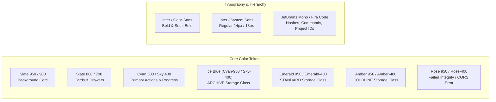
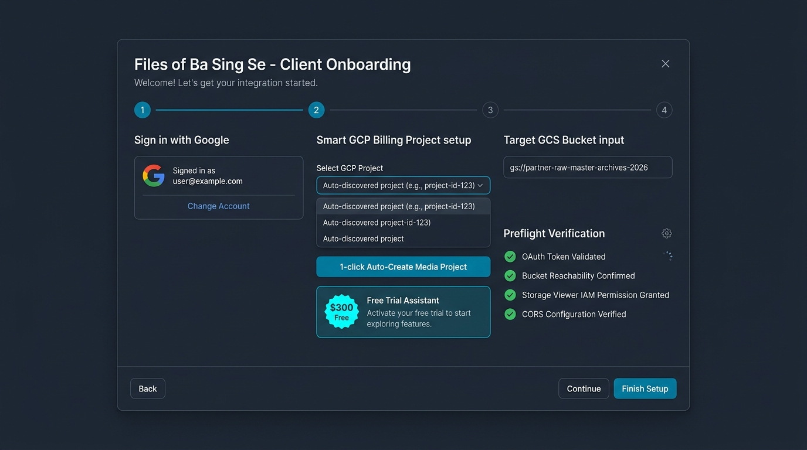
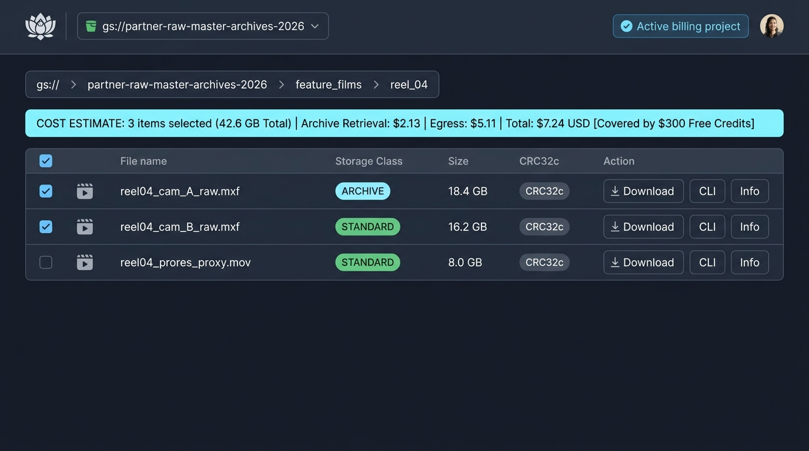
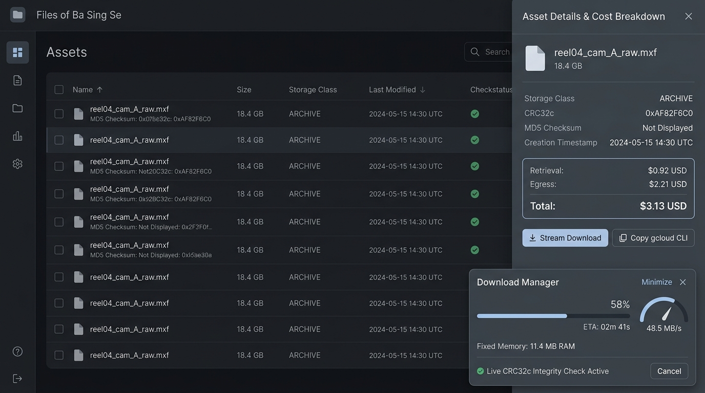
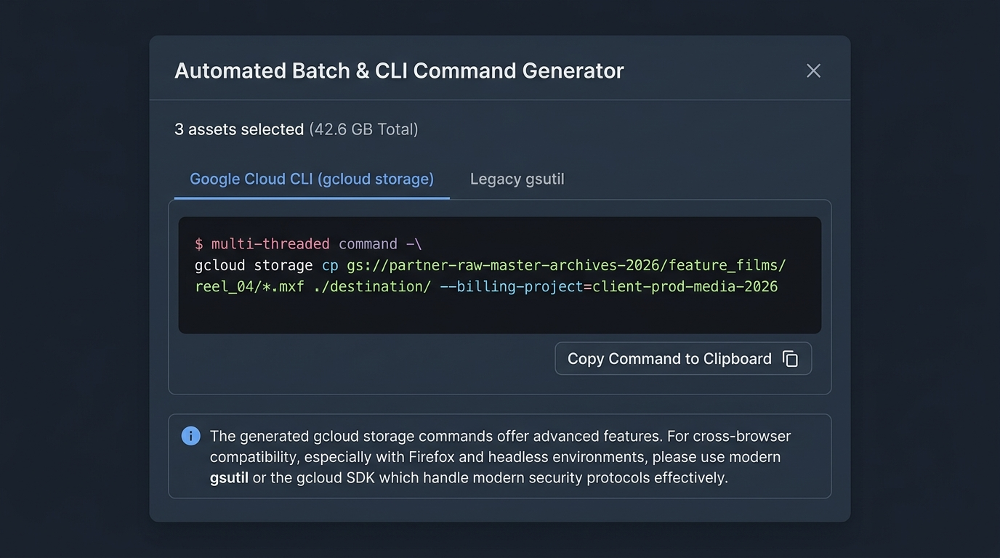

# User Interface Specification & High-Fidelity Wireframes
## Project: Files of Ba Sing Se — GCS Requester-Pays Media Distribution Portal

---

### Executive UI/UX Design Philosophy

**Files of Ba Sing Se** is built with a high-density, professional Dark-Mode-first interface tailored for creative media engineers, video editors, audio specialists, and post-production directors.

The interface prioritizes three design tenets:
1. **Frictionless Non-Technical Onboarding**: Zero jargon barriers. A solo freelance editor can sign in, auto-discover or auto-create a GCP project in 1-click, and claim Google's \$300 Free Trial in under 60 seconds without ever touching the Google Cloud Console.
2. **Absolute Financial Transparency**: Zero surprise billing. Real-time cost estimator banners dynamically calculate Archive retrieval (\$0.05/GB) and egress (\$0.12/GB) fees before any transfer is initiated.
3. **Live Stream Telemetry & Control**: Non-blocking floating download manager widgets with real-time speed gauges (MB/s), ETA counters, constant memory monitoring (<15MB RAM), and live CRC32c cryptographic integrity verification.

---

## 1. Design System & Visual Foundation



### Color & Badge Palette| UI Element | Dark Mode Token | Light Mode Token | Purpose |
| :--- | :--- | :--- | :--- |
| **App Background** | `#0a0f1d` (`slate-950`) | `#f8fafc` (`slate-50`) | Deep neutral background minimizing eye strain during long editorial sessions. |
| **Surface & Cards** | `#131b2e` (`slate-900`) | `#ffffff` (`white`) | High-contrast elevated panels with 1px border (`slate-800` / `slate-200`). |
| **Primary Brand / Accent** | `#06b6d4` (`cyan-500`) | `#0284c7` (`sky-600`) | Primary buttons, active tabs, breadcrumb highlights, progress bars. |
| **`ARCHIVE` Class Badge** | BG `#082f49`, Text `#38bdf8` | BG `#e0f2fe`, Text `#0369a1` | Cold-tier storage indicator informing users of \$0.05/GB retrieval fee. |
| **`STANDARD` Class Badge** | BG `#064e3b`, Text `#34d399` | BG `#d1fae5`, Text `#065f46` | Hot-tier storage indicator informing users of \$0.00/GB retrieval fee. |
| **`COLDLINE` Class Badge** | BG `#451a03`, Text `#fbbf24` | BG `#fef3c7`, Text `#92400e` | Cool-tier storage indicator informing users of \$0.02/GB retrieval fee. |
| **Integrity Verified Badge**| BG `#064e3b`, Text `#6ee7b7` | BG `#dcfce7`, Text `#15803d` | Cryptographic CRC32c hash match indicator. |
| **`Requester-Pays Enforced`**| BG `#064e3b`, Text `#34d399` | BG `#d1fae5`, Text `#065f46` | Emerald badge with Shield icon indicating client billing attribution. |
| **`Owner-Pays / Free Egress`**| BG `#082f49`, Text `#38bdf8` | BG `#e0f2fe`, Text `#0369a1` | Sky/Cyan badge with Gift icon indicating zero client egress/retrieval cost. |

---

## 2. Screen 1: Frictionless Onboarding & GCP Auto-Provisioning Wizard

**Trigger**: Displayed automatically on first visit, when unauthenticated, or when the user clicks "Configure Connection".



### Component Breakdown & Interaction Flow

```
+----------------------------------------------------------------------------------------------------+
|  Files of Ba Sing Se - Client Onboarding                                                       [X] |
|  Welcome! Let's get your media access configured in 60 seconds.                                    |
|                                                                                                    |
|  ( 1 ) Sign In with Google ---- ( 2 ) GCP Billing Setup ---- ( 3 ) Target Bucket ---- ( 4 ) Verify |
|                                                                                                    |
|  +-----------------------------+  +-------------------------------------------------------------+  |
|  | STEP 1: Google Identity     |  | STEP 2: Smart GCP Billing Project Setup                     |  |
|  |                             |  |                                                             |  |
|  |  [ G  Signed in as:       ] |  |  Select GCP Project:                                        |  |
|  |  taylor@freelance-edit.com  |  |  [ Client Post-Production (client-prod-media-123)       v ] |  |
|  |                             |  |                                                             |  |
|  |  [ Change Google Account ]  |  |  -- OR --                                                   |  |
|  |                             |  |                                                             |  |
|  |  Scope: Storage Read-Only   |  |  [ + 1-Click Auto-Create Media Project ]                    |  |
|  +-----------------------------+  |                                                             |  |
|                                   |  +-------------------------------------------------------+  |  |
|  +-----------------------------+  |  | ✨ $300 FREE TRIAL ASSISTANT                          |  |  |
|  | STEP 3: Target GCS Bucket   |  |  | New to Google Cloud? Google gives all new users $300  |  |  |
|  |                             |  |  | free credits. This completely covers download fees.  |  |  |
|  |  Bucket URI:                |  |  | [ 🚀 Open 60s Free Trial Signup ]  [ 🔄 Auto-Detect ]  |  |  |
|  |  [ gs://open-cinematic-     |  |  +-------------------------------------------------------+  |  |
|  |    assets                 ] |  |  [v] Manual Project ID Override (For IT-managed clients)    |  |
|  +-----------------------------+  +-------------------------------------------------------------+  |
|                                                                                                    |
|  +----------------------------------------------------------------------------------------------+  |
|  | PREFLIGHT VERIFICATION CHECKLIST:                                                            |  |
|  | [ OK ] OAuth 2.0 Token Valid (Expires in 58m)             [ OK ] IAM Viewer Role Granted     |  |
|  | [ OK ] Billing Mode: Owner-Pays (Zero Client Cost 🎁)      [ OK ] CORS Preflight Headers OK   |  |
|  +----------------------------------------------------------------------------------------------+  |
|                                                                                                    |
|  [ Cancel ]                              [ Skip Project Setup (Owner-Pays) ]  [ Finish Setup & Enter ]|
+----------------------------------------------------------------------------------------------------+
```

### Behavioral Specifications
1. **Google Identity Step**: Direct popup OAuth via Google Identity Services (`devstorage.read_only`). Once authenticated, displays user email and avatar.
2. **Auto-Discovery Dropdown**: Calls Google Cloud Resource Manager API (`cloudresourcemanager.googleapis.com/v1/projects`) in the background. If projects exist, they populate automatically in the dropdown.
3. **1-Click Auto-Create Media Project**: For users with billing accounts but no project, clicking this button triggers `POST /v1/projects` with `name: "Ba Sing Se Media Downloads"` and automatically enables `storage.googleapis.com` via `serviceusage.googleapis.com`.
4. **$300 Free Trial Assistant Card**: For brand-new GCP users connecting to Requester-Pays buckets, provides an inviting card explaining that Google's \$300 credits eliminate out-of-pocket costs, with a direct 1-click link to Google's sign-up and an `[Auto-Detect My Project]` return button.
5. **Dual-Pathway Preflight Checklist & Deferred Mode Detection (Target Design Specification — Module 13)**: 
   - **Standard Flow (Bucket entered at Step 3)**: In Step 2, users are provided with an explicit `[ Skip for now (Owner-Sponsored bucket) ]` option. In Step 4, preflight probes the bucket entered at Step 3 without `userProject`. If `Owner-Pays` is detected, Checkpoint 2 renders `[ OK ] Billing Mode: Owner-Pays (Zero Client Cost 🎁)` and completes setup immediately. If `Requester-Pays` is detected and Step 2 was skipped, preflight halts with an actionable notification to configure a project.
   - **Deep-Linked Flow (Bucket known upfront)**: When launching with a pre-seeded bucket URL, preflight probes the bucket immediately upon Step 1 authentication, automatically bypassing Step 2 if `Owner-Pays` is detected.
   - *(Note: The runtime application currently implements the Requester-Pays onboarding flow; Owner-Pays deferred detection is fully specified and designed for future release).*

---

## 3. Screen 2: Main Media Asset Explorer & Dynamic Cost Estimator

**Trigger**: Primary portal screen once onboarding/preflight verification passes.



### Component Breakdown & Interaction Flow

```
+----------------------------------------------------------------------------------------------------+
|  [Logo] Files of Ba Sing Se  |  [gs://media-vault-bucket v]  | [Billed: client-prod] [Av]|
+----------------------------------------------------------------------------------------------------+
|  Breadcrumbs: [ gs:// ] > [ media-vault-bucket ] > [ feature_films ] > [ reel_04 ]   |
+----------------------------------------------------------------------------------------------------+
|                                                                                                    |
|  [!] COST ESTIMATE: 3 items selected (42.60 GB Total)                                              |
|  Archive Retrieval: $2.13 | Egress: $5.11 | Total Estimate: $7.24 USD  [Covered by $300 Credits]|
+----------------------------------------------------------------------------------------------------+
|  [MODE B: OWNER-PAYS / STANDARD SPONSORED — Spec'd Target Design]                                  |
|  [🎁] OWNER-SPONSORED BUCKET: 3 items selected (42.60 GB Total)                                    |
|  Retrieval: $0.00 | Egress: $0.00 | Total Client Cost: $0.00 USD (Covered by Bucket Owner)         |
+----------------------------------------------------------------------------------------------------+
|                                                                                                    |
|  [+ Select All]  [Download Selected (3)]  [Generate CLI Script]   Filter: [Videos v]  Search: [reel] |
|                                                                                                    |
|  [ ] Name                     Storage Class    Size       Last Modified       CRC32c    Actions    |
|  ------------------------------------------------------------------------------------------------  |
|  [x] reel04_cam_A_raw.mxf     ARCHIVE          18.40 GB   2026-07-14 10:22    [CRC32c]  [v] [CLI] [i]|
|  [x] reel04_cam_B_raw.mxf     ARCHIVE          16.20 GB   2026-07-14 10:45    [CRC32c]  [v] [CLI] [i]|
|  [x] reel04_prores_proxy.mov  STANDARD          8.00 GB   2026-07-14 11:30    [CRC32c]  [v] [CLI] [i]|
|  [ ] reel04_sound_mix.wav     ARCHIVE           1.20 GB   2026-07-14 11:45    [CRC32c]  [v] [CLI] [i]|
|  [ ] metadata_manifest.json   STANDARD          4.20 KB   2026-07-14 12:00    [CRC32c]  [v] [CLI] [i]|
|                                                                                                    |
|  Showing 5 of 142 items in this directory                          [Page 1 of 15]  [< Prev] [Next >]|
|  ------------------------------------------------------------------------------------------------  |
|  [Requester-Pays Mode (Implemented)]: Requester-Pays Enforced [ShieldCheck 🛡️]                     |
|  [Owner-Pays Mode (Spec'd Design)]  : Owner-Pays (Zero Client Cost) [Gift 🎁]                      |
+----------------------------------------------------------------------------------------------------+
```

### Behavioral Specifications
1. **Interactive Breadcrumb Navigation & Browser History Synchronization**:
   - Each folder segment is a clickable, focusable button with accessible label (`aria-label="Navigate up to folder..."`). Clicking `feature_films` navigates up one level; clicking `gs://` returns to root.
   - Every breadcrumb click or folder drill-down automatically invokes `history.pushState()` and synchronizes the browser address bar to `#/browse/{bucketName}/{encodedPrefix}` (*Module 11*).
   - Pressing browser **Back** / **Forward** buttons (or `Alt+Left`/`Alt+Right`, `Cmd+[`/`Cmd+]`) dispatches `popstate`, re-rendering the exact historical breadcrumb stack and directory contents in $<16\text{ ms}$ without reloading the page.
2. **Dual-Mode Sticky Cost Notification Banner**:
   - In **Requester-Pays Mode (Implemented)**: Multiplies `ARCHIVE` bytes by \$0.05/GB, `COLDLINE` by \$0.02/GB, and all bytes by \$0.12/GB egress. Displays reminder `[Covered by your $300 Free Credits]` if applicable.
   - In **Owner-Pays Mode (Spec'd & Designed)**: Renders zero client cost notice ($0.00 Retrieval, $0.00 Egress, Total = $0.00 USD) confirming owner sponsorship once dual mode is implemented.
3. **Dynamic Table Footer Status Badge**:
   - In Requester-Pays mode, displays `Requester-Pays Enforced` with `ShieldCheck` icon (emerald green).
   - In Owner-Pays mode (spec'd target), displays `Owner-Pays (Zero Client Cost)` with `Gift` icon (sky/cyan).
4. **Virtualized Table & Multi-Selection**: Renders thousands of files at a constant 60 FPS using DOM virtualization.
5. **Instant Fuzzy Search & Filter Chips**: Filters file rows instantaneously (<50ms) by extension (`.mov`, `.mxf`, `.wav`, `.tar`) or keyword.r keyword.

---

## 4. Screen 3: Slide-Out Asset Deep-Inspection Drawer & Floating Download Manager

**Trigger**: Clicking `[Info]` or double-clicking any file row opens the Inspector Drawer; clicking `[Download]` launches the Floating Download Manager.



### Component Breakdown & Interaction Flow

```
+----------------------------------------------------------------+  +--------------------------------+
|  MAIN ASSET EXPLORER (Dimmed / Focus Mode)                     |  | ASSET DETAILS & COST [X Close] |
|                                                                |  +--------------------------------+
|  [x] reel04_cam_A_raw.mxf     ARCHIVE   18.4 GB  [CRC32c OK]   |  | [Video Icon] reel04_cam_A_raw  |
|  [ ] reel04_cam_B_raw.mxf     ARCHIVE   16.2 GB  [CRC32c OK]   |  |              18.40 GB          |
|  [ ] reel04_prores_proxy.mov  STANDARD   8.0 GB  [CRC32c OK]   |  |                                |
|                                                                |  | Storage Class:    ARCHIVE (Cold)|
|                                                                |  | Content-Type:     video/mxf    |
|                                                                |  | CRC32c (Hex):     0xAF82F6C0   |
|                                                                |  | CRC32c (Base64):  r4L2wA==     |
|                                                                |  | MD5 Checksum:     3a4f8d9b1c2e |
|                                                                |  | Created:          2026-07-14   |
|                                                                |  |                                |
|                                                                |  | +----------------------------+ |
|                                                                |  | | ITEM COST BREAKDOWN        | |
|                                                                |  | | [Requester-Pays Mode]:     | |
|                                                                |  | | • Retrieval Fee:     $0.92 | |
|                                                                |  | | • Egress Fee:        $2.21 | |
|                                                                |  | | TOTAL ESTIMATE:      $3.13 | |
|                                                                |  | | -------------------------- | |
|                                                                |  | | [Owner-Pays Mode]:         | |
|                                                                |  | | • Client Charge:     $0.00 | |
|                                                                |  | | (Owner-Sponsored Bucket)   | |
|                                                                |  | +----------------------------+ |
|                                                                |  |                                |
|                                                                |  | [ Stream Download to Local ]  |
|                                                                |  | [ Copy gcloud CLI Command  ]  |
|                                                                |  +--------------------------------+
|                                                                                                    |
|                                 +---------------------------------------------------------------+  |
|                                 | ACTIVE DOWNLOAD MANAGER                           [_ Min] [X] |  |
|                                 +---------------------------------------------------------------+  |
|                                 | Downloading: reel04_cam_A_raw.mxf                             |  |
|                                 | [=========================>------------------] 58% (10.67 GB) |  |
|                                 | Speed: 48.5 MB/s | ETA: 02m 41s | Fixed RAM: 11.4 MB (Stable) |  |
|                                 | [OK] Live CRC32c Integrity Check Active                       |  |
|                                 | [ Pause Stream ]                     [ Cancel Download ]      |  |
|                                 +---------------------------------------------------------------+  |
+----------------------------------------------------------------------------------------------------+
```

### Behavioral Specifications
1. **Asset Inspector Drawer**:
   - Slides smoothly from the right viewport edge (380px fixed width).
   - Displays cryptographic checksums with 1-click copy buttons.
   - Shows itemized single-file cost calculation (live GCP rates in Requester-Pays mode, or $0.00 Owner-Sponsored in Owner-Pays mode).
2. **Floating Download Manager**:
   - Fixed position at the bottom-right corner of the viewport (z-index: 50).
   - Shows continuous 4MB micro-chunk stream piping progress via Resilient Service Worker Stream Interceptor with native browser download manager logging (`chrome://downloads`).
   - **Constant Memory Footprint Gauge**: Proves memory is strictly capped (<15MB RAM) even when streaming a 25GB file.
   - **Live CRC32c Hash Stream**: Calculates hash on the fly and confirms match against `x-goog-hash` upon stream completion.

---

## 5. Screen 4: Automated Batch & CLI Command Generator Modal

**Trigger**: Clicking `[Generate CLI Script]` or triggered automatically when Firefox is detected.



### Component Breakdown & Interaction Flow

```
+----------------------------------------------------------------------------------------------------+
|  Automated Batch & CLI Command Generator                                                       [X] |
|  3 assets selected (42.60 GB Total)                                                                |
|                                                                                                    |
|  [ Google Cloud CLI (gcloud storage) ]      [ Legacy gsutil Script ]                               |
|  +----------------------------------------------------------------------------------------------+  |
|  | $ multi-threaded high-performance transfer command:                                          |  |
|  |                                                                                              |  |
|  | [MODE A: REQUESTER-PAYS BUCKET (Includes --billing-project)]                                 |  |
|  | gcloud storage cp \                                                                          |  |
|  |   gs://media-vault-bucket/feature_films/reel_04/reel04_cam_A_raw.mxf \         |  |
|  |   ./destination_folder/ \                                                                    |  |
|  |   --billing-project=client-prod-media-2026                                                   |  |
|  |                                                                                              |  |
|  | [MODE B: OWNER-PAYS BUCKET (Clean Command - No Project Required)]                            |  |
|  | gcloud storage cp \                                                                          |  |
|  |   gs://open-cinematic-assets/feature_films/reel_04/reel04_cam_A_raw.mxf \                    |  |
|  |   ./destination_folder/                                                                      |  |
|  +----------------------------------------------------------------------------------------------+  |
|  [ Copy Command to Clipboard ]                                                                     |
|                                                                                                    |
|  +----------------------------------------------------------------------------------------------+  |
|  | (i) Multi-threaded terminal transfers support auto-resume (-C) and are ideal for headless    |  |
|  |     servers, render farms, or Firefox users.                                                 |  |
|  +----------------------------------------------------------------------------------------------+  |
|                                                                                         [ Close ]  |
+----------------------------------------------------------------------------------------------------+
```

### Behavioral Specifications
1. **Tabs**: Switches between modern `gcloud storage cp` (recommended) and legacy `gsutil -m cp`.
2. **Adaptive Pre-Populated Parameters**:
   - For **Requester-Pays buckets (Implemented)**: Automatically inserts `--billing-project={userProject}` (or `-u {userProject}`).
   - For **Owner-Pays buckets (Spec'd & Designed — Module 13)**: Generates clean standard commands **omitting** billing flags once dual mode is implemented.
3. **1-Click Copy**: Copies full multi-line shell script to clipboard with instantaneous visual checkmark feedback.
4. **Firefox Graceful Degradation**: If Mozilla Firefox is detected, the UI explains why browser streaming is restricted (>200MB) and automatically surfaces this modal for instantaneous copy-pasting.

---

## 6. Error Diagnostics & Remediation Dialogs

Standardized, human-friendly error cards replace cryptic raw HTTP codes:

```
+----------------------------------------------------------------------------------------------------+
|  [!] CLOUD PERMISSION NOTICE: Storage Object Viewer Required                                   [X] |
+----------------------------------------------------------------------------------------------------+
|  Your Google account (taylor@freelance-edit.com) does not have read access to this bucket.        |
|                                                                                                    |
|  GCS Error: 403 Forbidden (Caller does not have storage.objects.list access)                       |
|                                                                                                    |
|  HOW TO RESOLVE:                                                                                   |
|  1. Contact the bucket administrator at the host organization.                                     |
|  2. Request that they add your email (taylor@freelance-edit.com) with the role:                    |
|     Storage Object Viewer (roles/storage.objectViewer)                                             |
|                                                                                                    |
|  [ Copy Request Email Template ]                                             [ Re-test Connection ] |
+----------------------------------------------------------------------------------------------------+
```

---

## 7. Screen 5: Post-Setup Bucket Switcher & Project Switcher Popovers

**Trigger**: Clicking the Header bucket badge, project badge, or Breadcrumb root segment (`gs://[bucket-name] ▾`).

```
+-------------------------------------------------------------------------+
| [Layers] gs://media-vault-bucket [▾]                      |
+-------------------------------------------------------------------------+
| CONNECTED BUCKET                                                        |
| ● gs://media-vault-bucket [Requester-Pays 🛡️] (Active)   |
|                                                                         |
| RECENT BUCKETS                                                          |
| ↳ gs://open-cinematic-assets             [Owner-Pays 🎁]    [ Switch ]  |
| ↳ gs://avatar-fire-nation-stems-2026     [Requester-Pays 🛡️] [ Switch ]  |
| ↳ gs://ba-sing-se-vfx-vault              [Requester-Pays 🛡️] [ Switch ]  |
|                                                                         |
| CONNECT ANOTHER BUCKET                                                  |
| [ gs://new-production-bucket-2026           ]        [ Connect ]        |
|                                                                         |
| ----------------------------------------------------------------------- |
| [⚡ Launch Full Preflight Wizard for New Bucket]                         |
+-------------------------------------------------------------------------+
```

---

## 8. Screen 6: Unified GCP Configuration Center & Session Inspector Modal

**Trigger**: Clicking the Header `[GCP Config]` button, settings trigger, or pressing `Ctrl+G` / `Cmd+G`.

```
+---------------------------------------------------------------------------------------+
|  [Shield] Google Cloud Platform Configuration & Session Inspector                [X]  |
+---------------------------------------------------------------------------------------+
|                                                                                       |
|  [ 1. GOOGLE IDENTITY ]                              [ 2. BILLED GCP PROJECT ]        |
|  User: Taylor (Colorist)                             Project: client-media-prod-2026  |
|  Email: taylor@freelance-edit.com                    Name: Client Post Studio         |
|  Scopes: devstorage.read_only, cloud-platform        Number: 891029384712             |
|  Token TTL: ~54m remaining (Auto-Renewing)           Billing: Linked (Active) ●       |
|  [ Switch Account ]     [ Refresh Token ]            [ Switch Project ]               |
|                                                                                       |
|  [ 3. TARGET GCS BUCKET ]                            [ 4. COST & RATE CARD ]          |
|  Bucket: gs://open-cinematic-assets                  Billing Mode: Owner-Pays 🎁      |
|  Region: US Multi-Region                             Client Cost: $0.00 / GB (Free)   |
|  Mode: Owner-Pays (Spec'd Target Design) 🎁          Contract: Owner-Sponsored        |
|  CORS Headers: x-goog-hash, Content-Length Exposed   Free Trial Credit: Active ($300) |
|  [ Switch Bucket ]      [ Quick Preflight ]          [ Edit Rates ]                   |
|                                                                                       |
|  -----------------------------------------------------------------------------------  |
|  4-POINT PREFLIGHT HEALTH MATRIX:                                                     |
|  [✓] 1. OAuth 2.0 Token (>60s)        [✓] 2. Billing Mode: Owner-Pays 🎁 (Zero Cost)  |
|  [✓] 3. IAM Object Viewer Granted     [✓] 4. CORS Preflight Headers OK                |
|                                                                                       |
|  STORAGE BOUNDARY AUDIT: [ Clean (0 Leaked Tokens) ]                                  |
|                                                                                       |
+---------------------------------------------------------------------------------------+
|  [ Export Diagnostics JSON ]                      [ Disconnect & Purge Session ]     |
+---------------------------------------------------------------------------------------+
```

---

## 9. Screen 7: Re-Authentication & Session Reconnect Card

**Trigger**: Displayed when a returning user (`hasCompletedOnboarding: true`) reloads or opens the application and silent GIS refresh encounters partitioned cookies or requires user confirmation.

```
+----------------------------------------------------------------------------------------------------+
|  [Logo] Files of Ba Sing Se  | [gs://media-vault-bucket] | [Billed: client-prod]     |
+----------------------------------------------------------------------------------------------------+
|                                                                                                    |
|  +----------------------------------------------------------------------------------------------+  |
|  | [Key] RESUME GOOGLE CLOUD SESSION                                                            |  |
|  |                                                                                              |  |
|  | Welcome back, Taylor (taylor@freelance-edit.com)!                                            |  |
|  | Your workspace configuration is saved and ready. Please re-authenticate your Google          |  |
|  | account to resume browsing files and direct streaming.                                      |  |
|  |                                                                                              |  |
|  | ACTIVE CONFIGURATION:                                                                        |  |
|  | • Billed Project: client-prod-media-2026                                                      |  |
|  | • Target Bucket:  gs://media-vault-bucket                                       |  |
|  |                                                                                              |  |
|  | [ ⚡ Reconnect Google Session (1-Click) ]             [ Switch Account / Reconfigure ]        |  |
|  +----------------------------------------------------------------------------------------------+  |
|                                                                                                    |
+----------------------------------------------------------------------------------------------------+
```

### Behavioral Specifications
1. **Zero State Loss**: Project ID and bucket remain intact; no wizard steps or re-selection needed.
2. **1-Click GIS Popup**: Clicking "Reconnect Google Session" triggers GIS popup (`signIn()`). Once consented, the card dissolves and mounts the `AssetExplorer` with the loaded directory in $< 200\text{ ms}$.
3. **Switch Account Option**: Allows clearing the hint and logging in with a different identity or project.

---

## 10. Responsive Layout & Viewport Specifications

| Viewport Breakpoint | Target Devices | Layout Adaptations |
| :--- | :--- | :--- |
| **Desktop Wide (1440px+)** | Mac Studio, iMac 5K, Multi-Monitor Workstations | Full multi-column virtualized table, persistent breadcrumb trail, side-by-side Asset Inspector drawer, centered multi-column GCP Configuration Center modal. |
| **Tablet / Touch (768px–1023px)** | iPad Pro, Mobile Tablets | Touch-friendly row height (48px), simplified column set (Name, Class, Size, Action), bottom sheet for Inspector Drawer. |

---

## 11. Screen 8: Breadcrumb Browser History & URL Navigation Wireframe & Interaction States

**Trigger**: Active within the main `AssetExplorer` surface during folder navigation, breadcrumb ancestor selection, deep-link boot hydration, or browser Back/Forward traversal.

```
+----------------------------------------------------------------------------------------------------+
|  URL Bar: https://media.basingse.io/#/browse/media-vault-bucket/feature_films/reel_04/  |
+----------------------------------------------------------------------------------------------------+
|  [ ⬅️ Back (Alt+←) ]  [ ➡️ Fwd (Alt+→) ]                                                             |
|                                                                                                    |
|  BREADCRUMB TRAIL (Interactive & Focusable):                                                       |
|  +----------------------------------------------------------------------------------------------+  |
|  | [ gs://media-vault-bucket ] > [ feature_films ] > [ reel_04 (Active) ]         |  |
|  |   ^ clickable (root)                         ^ clickable           ^ current location (bold) |  |
|  +----------------------------------------------------------------------------------------------+  |
|                                                                                                    |
|  NAVIGATION INTERACTION STATES:                                                                    |
|  • Normal State:     Slate-400 text, monospace font (`font-mono`), subtle hover underline           |
|  • Hover State:      Emerald-400 text (`hover:text-emerald-400`), pointer cursor                     |
|  • Focus-Visible:    2px Cyan focus ring (`focus-visible:ring-2 focus-visible:ring-cyan-400`)      |
|  • Active Leaf Node: Bold White text (`font-bold text-white`), `aria-current="location"`            |
|  • Separator:        ChevronRight icon (`w-3.5 h-3.5 text-slate-600`), `aria-hidden="true"`          |
|                                                                                                    |
|  RAPID TRAVERSAL & DEEP LINK STATES:                                                               |
|  • In-Flight Popstate: Instant path re-render (<16ms) + subtle pulse loader on table body           |
|  • Abort Guard:        Active AbortController cancels superseded folder network fetch               |
|  • Screen Reader:      ARIA Live Announcement: "Navigated to folder feature_films/reel_04/"        |
+----------------------------------------------------------------------------------------------------+
```

### Behavioral Specifications
1. **Bidirectional URL & Breadcrumb Sync**:
   - Clicking `feature_films` navigates to `#/browse/media-vault-bucket/feature_films/` and pushes a new browser history entry.
   - Clicking `gs://media-vault-bucket` returns to root `#/browse/media-vault-bucket/`.
   - Browser Back button traversal pops state and restores the exact ancestor view in $<16\text{ ms}$.
2. **Keyboard Navigation Support**:
   - `Tab` / `Shift+Tab` cycles focus sequentially through breadcrumb buttons.
   - `Enter` / `Space` activates the focused breadcrumb link.
   - Browser history shortcuts (`Alt+LeftArrow` / `Cmd+[` for Back, `Alt+RightArrow` / `Cmd+]` for Forward) trigger history traversal cleanly.

---

## 12. Screen 9: Post-Download Success Card & Browser Download Shelf Integration

**Trigger**: Displayed automatically inside `DownloadManager` when the Service Worker stream reaches 100% and CRC32c verification completes.

```
+----------------------------------------------------------------------------------------------------+
|  ACTIVE DOWNLOAD MANAGER                                                               [_ Min] [X] |
+----------------------------------------------------------------------------------------------------+
|  [✓] DOWNLOAD COMPLETE & SAVED TO BROWSER DOWNLOADS                                                |
|                                                                                                    |
|  [Video Icon] reel04_cam_A_raw.mxf                                                                 |
|               18,400,000,000 bytes (18.40 GB / 17.13 GiB)                                          |
|                                                                                                    |
|  Transfer Speed:      48.5 MB/s (Average)             Duration:        03m 42s                     |
|  Integrity Status:    CRC32c 0xAF82F6C0 (Match Confirmed ●)            Memory Peak: 11.4 MB (Fixed)|
|  Destination:         Default Downloads (~/Downloads) • Native Browser Shelf Tracked               |
|                                                                                                    |
|  +----------------------------------------------------------------------------------------------+  |
|  | [Chrome / Safari Downloads Icon] BROWSER DOWNLOAD SHELF READY:                              |  |
|  | • This download is logged in chrome://downloads and your browser's toolbar tray.           |  |
|  | • Click the native 'Show in folder' magnifying glass icon in your browser to highlight file.|  |
|  |                                                                                              |  |
|  | [ 🔍 Inspect Stream Diagnostics ]                       [ 📂 Download Another File ]          |  |
|  +----------------------------------------------------------------------------------------------+  |
|                                                                                                    |
|  Status: [Req-Pays]: Billed to client-prod ($3.13 USD) | [Owner-Pays]: Owner-Sponsored ($0.00 USD) |
+----------------------------------------------------------------------------------------------------+
```

### Behavioral Specifications
1. **Native Browser Download Shelf Integration**:
   - The transfer is logged automatically in `chrome://downloads` and the browser toolbar download tray.
   - Users can open the file or click the native browser "Show in folder" magnifying glass to highlight the file in macOS Finder, Windows File Explorer, or Linux Dolphin/Nautilus.
2. **Stream Diagnostics & Health Drawer**:
   - Clicking `[ 🔍 Inspect Stream Diagnostics ]` opens a slide-out drawer presenting verified byte counts, duration, average speed, CRC32c Hex/Base64, MD5, and Service Worker stream telemetry.
3. **Audio / Visual Confirmation**:
   - Emits a non-intrusive green toast confirming transfer completion and CRC32c checksum verification.


