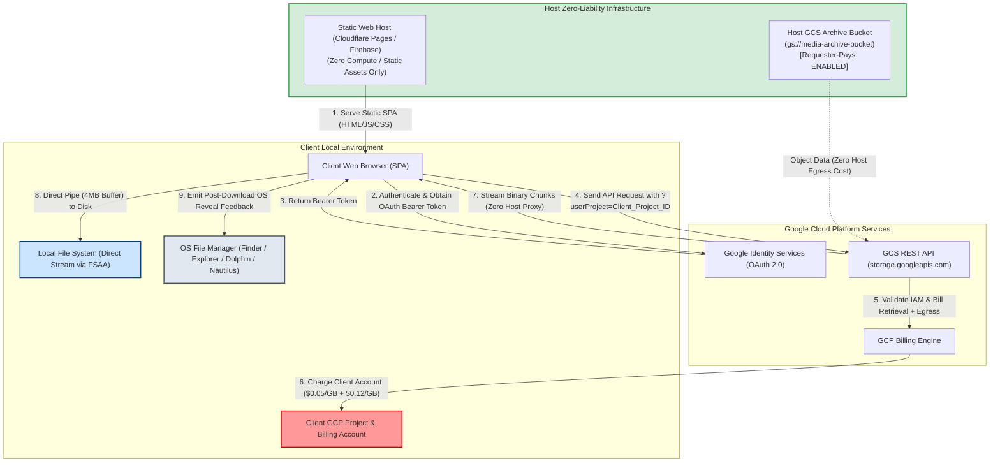
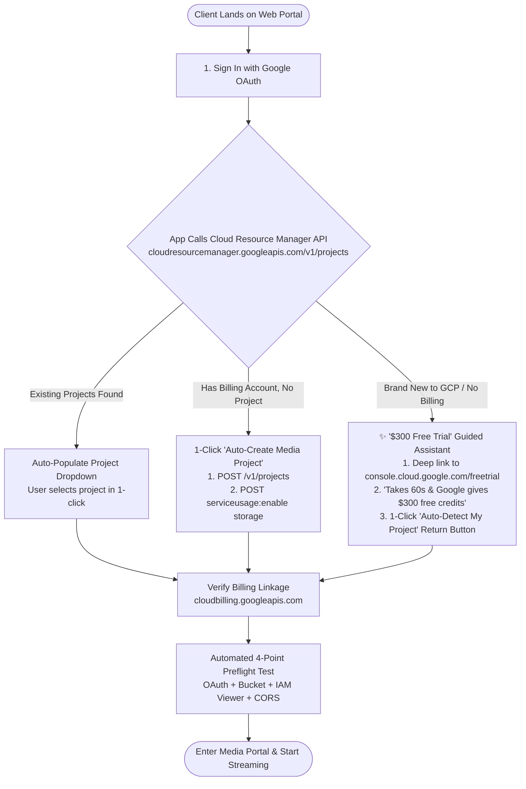
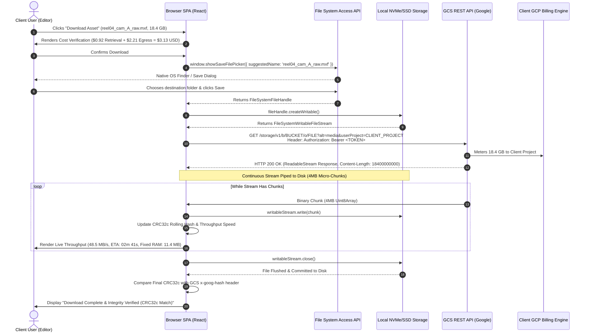
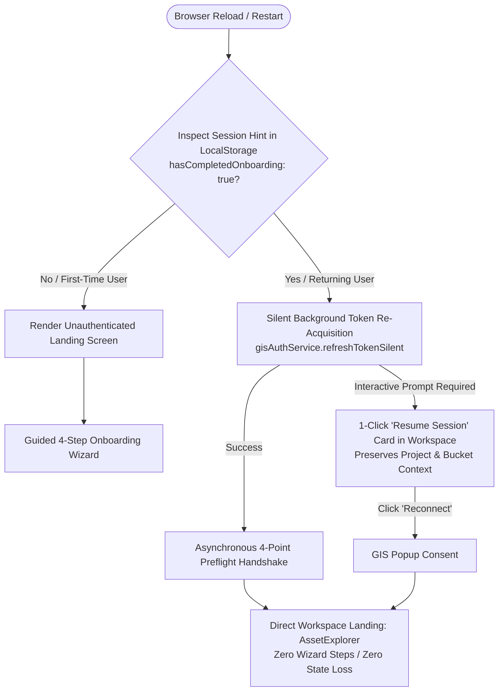
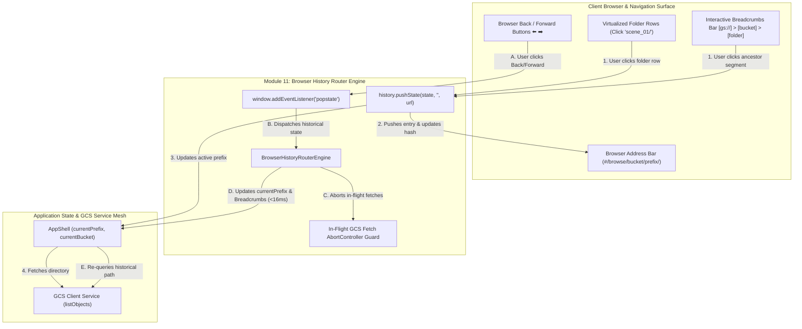
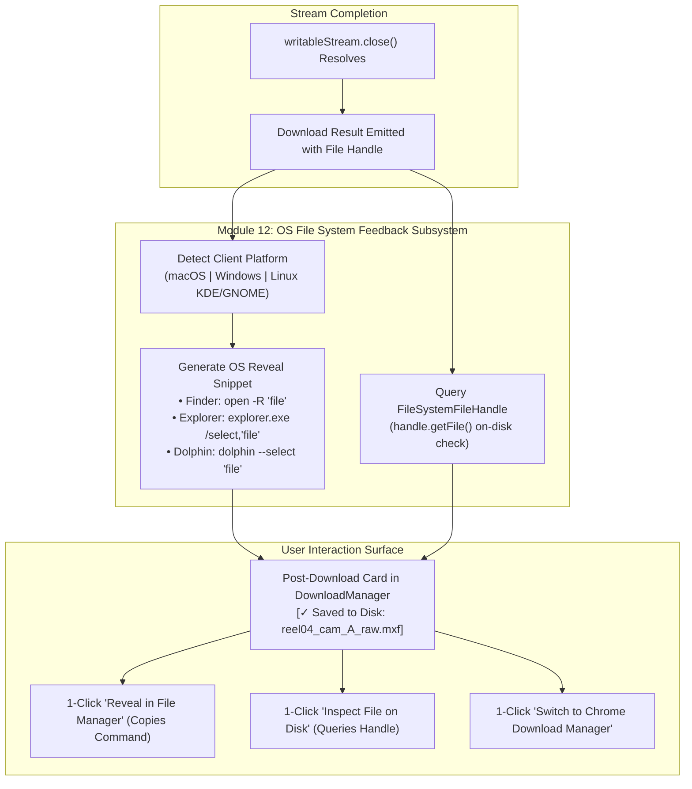

# Product Requirements & User Stories Specification
## Project: Files of Ba Sing Se — GCS Requester-Pays Media Distribution Portal

---

### Executive Overview & Strategic Intent

**Files of Ba Sing Se** is a client-side Single Page Application (SPA) designed to empower external clients (independent video editors, freelance audio engineers, boutique VFX studios, and data partners) to browse, inspect, and stream multi-gigabyte media assets (500MB to 50GB+) directly from a Google Cloud Storage (GCS) Archive-tier bucket to their local workstations.

The system guarantees **zero bandwidth and retrieval cost liability for the host** by strictly enforcing GCS **Requester Pays** (`userProject`). All data retrieval fees ($0.05/GB) and egress fees ($0.12/GB) are billed directly to the client's Google Cloud project.

Crucially, because external clients are often **single-person freelancers or creative professionals who have never interacted with Google Cloud Platform (GCP)**, the application includes a **first-class GCP Onboarding & Project Auto-Provisioning Engine**. This engine automatically detects existing projects, auto-provisions new media projects via Google Cloud Resource Manager APIs, verifies billing account linkage, and provides a 2-minute guided wizard for claiming Google's $300 Free Trial credits.

Furthermore, the application achieves **zero browser crashes / zero Out-of-Memory (OOM) failures** through a constant-memory direct-to-disk streaming engine using the **File System Access API** and **Service Worker stream interception**.



---

### User Personas

| Persona | Role | Technical Familiarity | Primary Goals | Key Pain Points |
| :--- | :--- | :--- | :--- | :--- |
| **Taylor (Solo Freelance Video Editor)** | Independent Colorist / Editor on macOS | **Novice / Zero GCP Experience** | Download 20GB+ master reels without knowing GCP technical jargon; get set up in under 2 minutes. | Does not know what a "GCP Project ID" is; gets intimidated by cloud consoles; fears hidden costs. |
| **Alex (Post-Production Lead)** | Video Editor / Producer at a Production Co. | **Intermediate** | Browse shoot dates, estimate batch download costs for the team, stream files directly to local NVMe drive. | Browser freezing/crashing on large downloads; unexpected cloud bills; clunky IT processes. |
| **Devon (VFX / Data Pipeline Lead)** | Technical Director / Pipeline Engineer | **Advanced / Cloud Native** | Inspect exact file checksums (CRC32c/MD5), batch download raw footage, generate shell scripts for render farm ingestion. | Missing checksum verifications; slow sequential UI downloads; lack of scriptable commands. |
| **Sam (Media Client Exec)** | Budget Owner / Production Manager | **Business / Non-Technical** | Verify estimated GCP billing charges before committing to downloading 2TB of cold archives. | "Bill shock" from unexpected Archive retrieval costs; confusing GCP console permissions. |

---

## Epic 1: Frictionless Client Onboarding & GCP Project Provisioning Engine

### Epic Goal
Transform the onboarding experience so that even a first-time Google Cloud user (who has never seen the GCP console) can sign in with their standard Google account, auto-discover or auto-create a GCP project in 1-click via API, link billing ($300 free trial supported), and validate bucket access in under 2 minutes.




---

### Story 1.1: Direct Google Identity Authentication (OAuth 2.0) & Progressive Consent
**As a** solo freelance client (Taylor),  
**I want to** sign in using my standard Google account (`@gmail.com` or Google Workspace),  
**So that** I don't have to create a separate application account or manage API keys.

#### Acceptance Criteria
1. **Given** a user opens the application, **When** the page loads, **Then** the UI displays an inviting, clear welcome screen: *"Welcome to Files of Ba Sing Se Media Portal. Sign in with your Google account to access your project files."*
2. **Given** the user clicks "Sign in with Google", **When** the GIS OAuth prompt appears, **Then** it initially requests standard read permissions (`devstorage.read_only` and user profile).
3. **Given** authentication succeeds, **When** the access token is returned:
   - The token is held **strictly in volatile runtime memory** (`Zustand` store) and **never written** to `localStorage`, `sessionStorage`, or cookies.
   - The user's name, email, and avatar render in the header.
   - The application immediately checks whether the user has existing GCP projects.

---

### Story 1.2: Automated In-App GCP Project Discovery via Resource Manager API
**As a** client user,  
**I want the** application to automatically detect and list my Google Cloud projects in a simple dropdown,  
**So that** I don't have to navigate to the Google Cloud Console, search for project settings, or manually copy-paste cryptic project IDs.

#### Acceptance Criteria
1. **Given** an authenticated user, **When** checking for GCP projects, **Then** the application queries the Google Cloud Resource Manager API: `GET https://cloudresourcemanager.googleapis.com/v1/projects` (or `v3/projects`) with `Authorization: Bearer {TOKEN}`.
2. **Given** projects are found, **When** returned, **Then**:
   - The UI populates a friendly dropdown selector showing project names and IDs (e.g., `Client Post Production (client-prod-media-99)`).
   - If the user previously selected a project on this browser, that project is auto-selected from `localStorage`.
   - The app immediately tests billing status on the selected project.
3. **Given** no projects are found (or user has no active project), **When** detected, **Then** the UI automatically transitions into the **"New to Google Cloud? 1-Click Setup"** flow.

---

### Story 1.3: One-Click Automated Media Project Creation & Storage API Activation
**As a** freelance editor who has a GCP billing account but no media project,  
**I want to** click "Auto-Create Media Project",  
**So that** the app creates a dedicated project for me and enables the Google Cloud Storage API automatically via API without manual console setup.

#### Acceptance Criteria
1. **Given** a user clicks "Auto-Create Media Project", **When** initiated, **Then** the application:
   - Generates a clean project name and ID (e.g., `basingse-media-dl-XXXX` where `XXXX` is a random 4-digit suffix).
   - Issues a `POST https://cloudresourcemanager.googleapis.com/v1/projects` request with `{ projectId, name: "Ba Sing Se Media Downloads" }`.
2. **Given** project creation initiates, **When** the operation completes, **Then** the app automatically invokes `POST https://serviceusage.googleapis.com/v1/projects/{projectId}/services/storage.googleapis.com:enable` to ensure Cloud Storage API is fully enabled.
3. **Given** completion, **When** verified, **Then** the newly created project is set as the active `userProject` and saved to `localStorage`.

---

### Story 1.4: "New to Google Cloud" Guided Onboarding & \$300 Free Trial Assistant
**As a** solo client who has never used Google Cloud before (Taylor),  
**I want** clear, visual, step-by-step guidance on how to activate Google Cloud (including claiming the \$300 Free Trial credits),  
**So that** I can complete the one-time Google setup in 60 seconds without confusion or fear of unexpected costs.

#### Acceptance Criteria
1. **Given** a user with no GCP account or billing profile, **When** viewing the onboarding wizard, **Then** the UI presents a streamlined 3-step visual card:
   - **Card 1: Activate Google Cloud Free Trial**:
     - Headline: *"Google gives all new users \$300 in free credits for 90 days. This will completely cover your media download charges."*
     - Button: `[ 🚀 Open Google Cloud Free Trial Signup (External Link) ]` (opens `https://console.cloud.google.com/freetrial` in a new tab).
     - Subtext: *"Takes ~60 seconds to link your Google account. No charges will be made beyond your \$300 free credits."*
   - **Card 2: Auto-Detect My Project**:
     - Button: `[ 🔄 I've Signed Up — Auto-Detect My Project ]`.
     - When clicked, re-queries `cloudresourcemanager.googleapis.com` to discover the newly created project.
   - **Card 3: Manual Project ID Override**:
     - An expandable toggle: *"I already have a Project ID from my IT department"* allowing direct text input for corporate users.
2. **Given** the user completes signup in the external tab and clicks "Auto-Detect My Project", **When** verified, **Then** the wizard transitions directly to the Preflight Verification check.

---

### Story 1.5: Cloud Billing Linkage Verification (`cloudbilling.googleapis.com`)
**As a** client user,  
**I want the** app to check whether my selected project has an active billing account linked,  
**So that** my downloads will not fail with cryptic `UserProjectAccessDenied` errors.

#### Acceptance Criteria
1. **Given** a selected GCP project, **When** verified, **Then** the app queries `GET https://cloudbilling.googleapis.com/v1/projects/{projectId}/billingInfo`.
2. **Given** `billingEnabled == true`, **When** received, **Then** the UI marks the Billing Checkpoint as `[OK Billing Active]`.
3. **Given** `billingEnabled == false`, **When** received, **Then** the UI displays an inline warning banner: *"This project does not have a linked billing account. GCS Requester Pays requires billing to be enabled."* with a direct 1-click link to `https://console.cloud.google.com/billing/linkedaccount?project={projectId}`.

---

### Story 1.6: Automated 4-Point Preflight Connection & Permission Test
**As a** client user,  
**I want to** see an automated live preflight check before entering the media browser,  
**So that** I know immediately if my GCP project ID is invalid, if I lack IAM permissions, or if CORS/Requester-Pays is misconfigured.

#### Acceptance Criteria
1. **Given** valid OAuth token, Project ID, and Bucket name inputs, **When** the preflight runs, **Then** the application executes: `GET https://storage.googleapis.com/storage/v1/b/{BUCKET}?userProject={PROJECT_ID}` with `Authorization: Bearer {TOKEN}`.
2. **Given** the preflight check runs, **When** evaluating responses, **Then** the UI displays live status badges for 4 discrete checkpoints:
   - **OAuth 2.0 Token**: `[OK Valid]` (displays expiration countdown).
   - **GCS Bucket Reachability & Requester Pays**: `[OK Active]` (validates `billing.requesterPays == true`).
   - **Client IAM Permissions**: `[OK Granted]` (verifies `roles/storage.objectViewer` read capability).
   - **CORS & Origin Configuration**: `[OK Verified]` (confirms preflight headers `x-goog-hash`, `Content-Length`, `Range` are exposed).
3. **Given** any preflight failure, **When** an error occurs, **Then** the system displays a clear, non-cryptic error card with actionable instructions and 1-click retry.
4. **Given** all 4 checkpoints pass, **When** validated, **Then** the "Enter Media Portal" button illuminates green and advances the user into the asset explorer.

---

## Epic 2: Media Asset Explorer & Hierarchical Navigation

### Epic Goal
Enable intuitive, lightning-fast exploration of massive GCS buckets containing tens of thousands of media files, with folder hierarchy, rich file metadata, and smooth virtualized rendering.


---

### Story 2.1: Hierarchical Directory & Breadcrumb Navigation
**As a** post-production lead (Alex) or freelance editor (Taylor),  
**I want to** navigate through nested folders using interactive breadcrumbs and folder rows,  
**So that** I can locate specific scenes, reels, and shoot dates without feeling overwhelmed by a flat list of 50,000 files.

#### Acceptance Criteria
1. **Given** an entered bucket, **When** the root loads, **Then** the application queries the GCS JSON API using `delimiter=/` and `prefix=""` with `?userProject={PROJECT_ID}` to separate common prefixes (folders) from leaf objects (files).
2. **Given** subfolders exist, **When** rendered, **Then** folders appear at the top of the list with folder icons and child item counts (if available).
3. **Given** a user clicks on a folder (e.g., `feature_films/reel_04/`), **When** clicked, **Then**:
   - The navigation path updates immediately.
   - Interactive breadcrumbs update at the top: `[ gs:// ] > [ bucket-name ] > [ feature_films ] > [ reel_04 ]`.
   - Each breadcrumb segment is clickable to navigate directly back up the tree.
   - The browser URL hash and history stack update synchronously (e.g., `#/browse/bucket-name/feature_films/reel_04/`) via the Browser History Router Engine (*Module 11*, `MOD-11-BROWSER-HISTORY-ROUTING`), enabling bookmarking and native browser Back/Forward navigation.

---

### Story 2.2: High-Performance Virtualized Asset Data Grid
**As a** client user,  
**I want to** scroll smoothly through directories containing thousands of media assets,  
**So that** the browser interface remains fluid (60 FPS) without lag or DOM bloat.

#### Acceptance Criteria
1. **Given** a directory with >500 items, **When** displayed, **Then** the data table uses virtualized windowing rendering only visible DOM rows.
2. **Given** the asset table, **When** rendered, **Then** each row presents:
   - **Checkbox**: Selection state for batch operations.
   - **Name & Extension Icon**: Visual icon indicating media type (Video `.mov`/`.mxf`/`.mp4`, Audio `.wav`/`.aac`, Archive `.tar`/`.zip`/`.bsp`, Document `.json`/`.pdf`/`.xml`).
   - **Storage Class Badge**: Color-coded pill tag (`ARCHIVE` in ice-blue, `COLDLINE` in cyan, `NEARLINE` in amber, `STANDARD` in emerald green).
   - **Size**: Formatted human-readable string (e.g., `18.40 GB`, `340.2 MB`, `4.2 KB`) with raw byte tooltip ($1\text{ GB} = 10^9\text{ bytes}$).
   - **Last Modified**: Localized date/time string with relative time ("2 days ago").
   - **Integrity Indicator**: `[CRC32c OK]` badge indicating pre-computed hash availability in GCS metadata.
   - **Action Buttons**: Quick action icons `[Download]`, `[CLI]`, `[Info]`.
3. **Given** multi-page GCS API results, **When** `nextPageToken` is returned, **Then** the grid supports seamless infinite scrolling or responsive pagination controls (`Page X of Y`).

---

### Story 2.3: Live Filtering, Search & Multi-Column Sorting
**As a** video editor,  
**I want to** filter by file extension, search by file name, and sort by file size or date,  
**So that** I can instantly find the master ProRes file among hundreds of auxiliary files.

#### Acceptance Criteria
1. **Given** the search bar, **When** the user types (e.g., `reel04` or `.mov`), **Then** the table filters in real-time (<50ms debounce) against names in the current folder view.
2. **Given** preset filter chips (`All`, `Videos`, `Audio`, `Archives`, `Metadata`), **When** clicked, **Then** the table restricts view to matching MIME types or file extensions.
3. **Given** table column headers (`Name`, `Size`, `Storage Class`, `Last Modified`), **When** clicked, **Then** the dataset sorts ascending/descending with visual sort direction indicators.

---

## Epic 3: Cost Governance, Transparency & Real-Time Estimation Engine

### Epic Goal
Provide 100% upfront financial transparency to the client by calculating exact GCS Archive retrieval and internet egress fees before any download occurs, preventing bill shock and accidental charges.

---

### Story 3.1: Real-Time Dynamic Cost Estimation Banner
**As a** media client budget owner (Sam) or freelance editor (Taylor),  
**I want to** see an accurate dollar calculation of retrieval and egress costs whenever I select files,  
**So that** I know the exact charge that will appear on my GCP billing statement before downloading.

#### Acceptance Criteria
1. **Given** pricing rates configured for GCS (Decimal $10^9$ Byte Scale):
   - **Archive Retrieval Rate**: `$0.050 per GB` (applied to `ARCHIVE` storage class objects).
   - **Coldline Retrieval Rate**: `$0.020 per GB` (applied to `COLDLINE` storage class objects).
   - **Nearline Retrieval Rate**: `$0.010 per GB` (applied to `NEARLINE` storage class objects).
   - **Standard Retrieval Rate**: `$0.000 per GB`.
   - **Google Internet Egress Rate**: `$0.120 per GB` (standard worldwide internet egress tier).
2. **Given** the user selects one or more items via checkboxes, **When** selections change, **Then** a sticky **Cost Notice Banner** updates dynamically:
   - Formula: $\text{Total Cost} = \sum (\text{Bytes}_{\text{Archive}} \times \$0.05/10^9) + \sum (\text{Bytes}_{\text{Coldline}} \times \$0.02/10^9) + \sum (\text{Bytes}_{\text{Total}} \times \$0.12/10^9)$.
   - Example: `3 items selected (Total: 42.60 GB) | Estimated Charges: Archive Retrieval: $1.73 | Egress: $5.11 | Total Estimate: $6.84 USD`.
   - If user is on the \$300 Free Trial, an inline pill reminds them: `[ Covered by your $300 Free Credits ]`.
3. **Given** selection includes zero items, **When** no files are checked, **Then** the cost banner collapses gracefully into an idle state.

---

### Story 3.2: High-Cost & Cold-Tier Confirmation Dialog
**As a** client user,  
**I want to** receive a confirmation prompt when initiating a high-cost or multi-gigabyte Archive download,  
**So that** I do not inadvertently initiate a \$50+ download by accidental double-click.

#### Acceptance Criteria
1. **Given** a single or batch download request whose total estimated charge exceeds a safety threshold (default: >\$5.00 USD or >25 GB), **When** the user clicks "Download Selected", **Then** a high-visibility modal opens:
   - Displays total byte size, item count, and itemized billing breakdown.
   - Shows the active target GCP Billing Project ID (`basingse-media-dl-2026`).
   - Requires explicit user confirmation: `[Confirm & Incur ~$X.XX Charge]` vs `[Cancel]`.
2. **Given** user confirms, **When** accepted, **Then** the download stream pipeline initiates immediately.

---

## Epic 4: Asset Deep Inspection & Metadata Drawer

### Epic Goal
Provide comprehensive, technical object inspection including cryptographic hashes, exact byte counts, GCS generation IDs, and direct command generators for technical media workflows.


---

### Story 4.1: Slide-Out Asset Details & Integrity Drawer
**As a** VFX/Data engineer (Devon),  
**I want to** open a detailed inspection drawer for any specific file,  
**So that** I can review cryptographic hashes (CRC32c, MD5), exact byte sizing, GCS generation IDs, and MIME types.

#### Acceptance Criteria
1. **Given** a user clicks the `[Info]` button or double-clicks any file row, **When** triggered, **Then** a slide-out drawer smoothly opens from the right side of the screen.
2. **Given** the drawer is open, **When** rendered, **Then** it presents:
   - **Object Full Path**: (e.g., `feature_films/reel_04/reel04_cam_A_raw.mxf`).
   - **Bucket**: `gs://partner-raw-master-archives-2026`.
   - **Content-Type**: (e.g., `application/mxf` or `video/quicktime`).
   - **Exact Size**: (e.g., `18,400,000,000 bytes (18.40 GB / 17.13 GiB)`).
   - **Storage Class**: `ARCHIVE` with cold tier warning badge.
   - **Created / Updated Timestamps**: Exact UTC timestamp ISO format.
   - **ETag**: GCS object entity tag.
   - **CRC32c Hash**: Base64 encoded (`r4L2wA==`) and Hex representation (`0xAF82F6C0`).
   - **MD5 Checksum**: 32-character hexadecimal MD5 hash (with notice if composite object).
   - **Generation & Metageneration**: GCS versioning identifiers.
3. **Given** individual metadata fields, **When** hovered, **Then** a 1-click "Copy to Clipboard" button appears with visual toast confirmation.

---

### Story 4.2: Asset-Specific Cost Calculator & Action Center
**As a** client user,  
**I want to** see an itemized cost calculation and select my preferred download method inside the inspection drawer,  
**So that** I can choose between streaming to disk or generating terminal commands for that specific asset.

#### Acceptance Criteria
1. **Given** the drawer is open, **When** viewing the billing section, **Then** it calculates the exact cost for that single asset (Retrieval + Egress).
2. **Given** action buttons in the drawer:
   - `[Stream Download to Local Disk]`: Launches the memory-bounded stream download pipeline.
   - `[Copy gcloud Command]`: Copies a pre-formatted CLI command to clipboard.
   - `[Copy gsutil Command]`: Copies legacy gsutil command.
   - `[Copy Object JSON Metadata]`: Copies raw GCS JSON object metadata.

---

## Epic 5: Memory-Bounded Direct-to-Disk Stream Download Pipeline

### Epic Goal
Stream multi-gigabyte media files (10GB–50GB+) directly from GCS to the client's local disk with constant, minimal memory footprint (<15MB RAM), zero browser crashes, and automated integrity validation.



---

### Story 5.1: Tier 1 Direct-to-Disk Streaming via File System Access API (Chromium / macOS & Windows)
**As an** editor on Google Chrome (macOS / Windows),  
**I want to** choose my local destination folder and stream 25GB+ files directly to disk,  
**So that** the file writes continuously to my hard drive without loading into system RAM or crashing my browser tab.

#### Acceptance Criteria
1. **Given** the user is running a Chromium-based browser (Chrome, Edge, Brave, Arc), **When** initiating a download (>200MB), **Then** the application triggers `window.showSaveFilePicker()` with suggested filename and extension.
2. **Given** the user selects a save destination in the native macOS Finder / Windows Explorer sheet, **When** confirmed, **Then** the app creates a `FileSystemWritableFileStream`.
3. **Given** the writable stream is ready, **When** fetching `https://storage.googleapis.com/storage/v1/b/{BUCKET}/o/{OBJECT}?alt=media&userProject={PROJECT_ID}`, **Then**:
   - The browser connects with `Authorization: Bearer {TOKEN}`.
   - The response stream is read in 4MB micro-chunks.
   - Each chunk is written directly to `FileSystemWritableFileStream.write(chunk)`.
   - The browser's active heap memory consumption remains **strictly bounded under 15MB** throughout the entire transfer.
4. **Given** all chunks are read, **When** the stream completes, **Then** the app invokes `writableStream.close()`, flushing the file to disk.

---

### Story 5.2: Real-Time Stream CRC32c Integrity Validation
**As a** technical post-production supervisor (Alex/Devon),  
**I want the** application to verify the cryptographic integrity of the downloaded file in real-time,  
**So that** I am 100% confident the multi-gigabyte file is uncorrupted before opening it in my editing suite.

#### Acceptance Criteria
1. **Given** an active stream, **When** each binary chunk arrives, **Then** the app computes a running CRC32c checksum (Castagnoli polynomial `0x1EDC6F41`) on the byte stream.
2. **Given** the download completes, **When** `writableStream.close()` finishes, **Then** the computed CRC32c hash is compared against the GCS `x-goog-hash: crc32c=...` header.
3. **Given** hashes match, **When** verified, **Then** the UI displays `[Integrity Verified: CRC32c Match]` in green.
4. **Given** a hash mismatch (bit corruption), **When** detected, **Then** the UI flags an immediate alert `[Integrity Check Failed]` and offers a 1-click retry.

---

### Story 5.3: Tier 2 Hybrid Service Worker Streaming (Safari on macOS)
**As a** client using Apple Safari on macOS,  
**I want to** stream large files without browser memory crashing,  
**So that** I can still download large assets even though Safari lacks the File System Access API.

#### Acceptance Criteria
1. **Given** Apple Safari is detected (where `showSaveFilePicker` is unavailable), **When** the user clicks download, **Then** the app routes the transfer through a registered **Service Worker Stream Interceptor**.
2. **Given** the Service Worker pipeline, **When** executed, **Then**:
   - The Service Worker attaches the required `Authorization` and `userProject` headers.
   - The stream is piped directly into a synthetic browser download response (`Content-Disposition: attachment`).
   - The file streams directly into the user's macOS `~/Downloads` directory with constant memory consumption.

---

### Story 5.4: Tier 3 In-Memory Blob Handling for Small Assets (<200MB)
**As a** client user,  
**I want** small metadata files, PDFs, and audio snippets to download instantly without file picker prompts,  
**So that** lightweight operations are fast and frictionless.

#### Acceptance Criteria
1. **Given** any file under 200MB (or when explicitly opted), **When** clicked, **Then** the application performs standard `fetch()` into memory, converts to `URL.createObjectURL(blob)`, and triggers synthetic `<a download>` click.

---

## Epic 6: Active Download Manager & Stream Telemetry

### Epic Goal
Provide a non-blocking, dockable download manager widget that gives live telemetry (speed, ETA, memory, bytes transferred, integrity) during long-running media transfers.

---

### Story 6.1: Floating Non-Blocking Download Manager Widget
**As a** client user,  
**I want to** monitor active downloads in a dockable widget while continuing to browse other folders in the bucket,  
**So that** my navigation is not blocked during a 15-minute video download.

#### Acceptance Criteria
1. **Given** a download starts, **When** initiated, **Then** a floating card appears in the bottom-right viewport corner.
2. **Given** the floating card, **When** viewed, **Then** it provides:
   - **File Name & Destination**: Truncated name with hover tooltip.
   - **Progress Bar**: Smooth CSS gradient progress bar (0% to 100%).
   - **Transfer Metrics**:
     - Current Speed in `MB/s` (smoothed moving average over 1000ms).
     - Transferred Bytes vs Total Bytes (e.g., `10.67 GB / 18.40 GB - 58%`).
     - Estimated Time Remaining (`ETA: 02m 41s`).
     - Elapsed Time (`Elapsed: 03m 42s`).
     - Memory Footprint Indicator (`RAM: ~11.4 MB - Stable`).
     - Active Billing Project (`Billed to: basingse-media-dl-2026`).
   - **Controls**: `[Minimize]`, `[Pause / Resume]` (if byte-range supported), `[Cancel]`.
3. **Given** the user minimizes the widget, **When** clicked, **Then** it collapses into a compact pill bar showing only percentage and speed.

---

### Story 6.2: Stream Cancellation & Graceful Abort
**As a** client user,  
**I want to** cancel an active download at any time,  
**So that** I can stop unwanted data egress immediately if I selected the wrong file.

#### Acceptance Criteria
1. **Given** an active download, **When** the user clicks `[Cancel]`, **Then**:
   - An `AbortController.abort()` signal is immediately sent to the `fetch` request.
   - The `FileSystemWritableFileStream.abort()` is called to close and delete incomplete temporary disk data.
   - Network transfer ceases within <200ms, halting further GCP egress charges.
   - The UI updates status to `[Download Cancelled]`.

---

## Epic 7: Automated Batch & CLI Companion Generator

### Epic Goal
Empower technical users, data engineers, and Firefox users with pre-formatted, 1-click Google Cloud CLI commands for automated, multi-threaded, or headless downloads.


---

### Story 7.1: One-Click `gcloud storage` & `gsutil` Command Generator
**As a** VFX/Data pipeline engineer (Devon),  
**I want to** generate copyable CLI commands for selected files or folders with my billing project pre-populated,  
**So that** I can run multi-threaded batch transfers on my terminal or headless render nodes.

#### Acceptance Criteria
1. **Given** one or multiple files/folders selected, **When** the user clicks `[Generate CLI Script]`, **Then** a modal opens with formatted, copyable shell commands.
2. **Given** the modal opens, **When** rendering Option A (Modern `gcloud storage`), **Then** it produces:
   ```bash
   gcloud storage cp \
     gs://partner-raw-master-archives-2026/feature_films/reel_04/reel04_cam_A_raw.mxf \
     gs://partner-raw-master-archives-2026/feature_films/reel_04/reel04_cam_B_raw.mxf \
     gs://partner-raw-master-archives-2026/feature_films/reel_04/reel04_prores_proxy.mov \
     ./destination_folder/ \
     --billing-project=basingse-media-dl-2026
   ```
3. **Given** Option B (Legacy `gsutil`), **When** toggled, **Then** it produces:
   ```bash
   gsutil -u basingse-media-dl-2026 -m cp -r \
     gs://partner-raw-master-archives-2026/feature_films/reel_04/ .
   ```
4. **Given** the command box, **When** the user clicks `[Copy Command]`, **Then** the text copies to clipboard with visual toast feedback.

---

### Story 7.2: Mozilla Firefox Graceful Degradation & CLI Routing
**As a** client user on Mozilla Firefox,  
**I want to** receive clear guidance on browser compatibility and an instant CLI alternative,  
**So that** I am not left with a broken or hanging download experience due to Firefox stream limitations.

#### Acceptance Criteria
1. **Given** the application detects Mozilla Firefox (Gecko engine), **When** viewing files >200MB, **Then**:
   - The UI renders an informative inline banner: *"Multi-GB direct browser streaming is optimized for Chromium (Chrome/Edge) and Safari. For Firefox, use our 1-click CLI script generator or switch to Chrome."*
   - The primary browser download button shows an informative badge.
   - Clicking download automatically opens the **CLI Script Generator Modal** with the exact `gcloud storage cp --billing-project` command ready to execute in terminal.

---

## Epic 8: Security, Resilience & Error Diagnostics

### Epic Goal
Guarantee maximum security posture, zero credential leakage, and actionable error guidance for network or GCP permission anomalies.

---

### Story 8.1: Zero-Credential Leakage & Volatile Token Hygiene
**As a** security-conscious client organization,  
**I want** my OAuth access tokens to remain ephemeral and isolated,  
**So that** malicious browser extensions or XSS attacks cannot extract long-lived credentials from local storage.

#### Acceptance Criteria
1. **Given** OAuth authentication completes, **When** managing session state, **Then**:
   - OAuth access tokens are stored strictly in volatile JavaScript closure / `Zustand` runtime state.
   - `localStorage` and `sessionStorage` store **only non-sensitive settings** (GCP Project ID string, recent bucket names, UI theme).
   - Private keys (Service Account JSONs) are **strictly disallowed and never requested or accepted**.
2. **Given** the web application is served, **When** checking HTTP security headers, **Then** a strict Content Security Policy (CSP) restricts connections exclusively to `https://accounts.google.com` and `https://storage.googleapis.com`.

---

### Story 8.2: Granular Error Diagnosis & Remediation Playbook
**As a** client user experiencing a cloud permission or network issue,  
**I want to** see an actionable explanation and fix instructions,  
**So that** I can resolve the issue immediately without contacting support.

#### Acceptance Criteria
1. **Given** an API failure during listing, inspection, or streaming, **When** an error occurs, **Then** the UI displays an actionable diagnosis card detailing:
   - **Error Category**: (e.g., Billing Account Disabled, IAM Storage Object Viewer Missing, CORS Header Missing, Network Disconnection).
   - **GCS Raw Error Code**: (e.g., `403 Forbidden: caller does not have storage.objects.get access`).
   - **Recommended Fix**: Step-by-step instructions or copyable `gcloud` command for their GCP admin.
   - **Retry Button**: 1-click action to re-attempt the operation without reloading the page.

---

## Epic 9: Post-Setup Workspace Navigation & GCP Configuration Center

### Epic Goal
Empower users to switch between multiple production buckets and billing projects on-the-fly and inspect their entire Google Cloud configuration, identity, pricing, and health state from a unified control center.

---

### Story 9.1: Interactive Post-Setup Bucket Switcher & Recent Buckets
**As a** freelance video editor or VFX lead working across multiple projects,  
**I want to** quickly switch my active GCS bucket from the Header or Breadcrumb bar without re-running the onboarding wizard,  
**So that** I can seamlessly jump between dailies, VFX stems, and final master archives.

#### Acceptance Criteria
1. **Given** the user is inside the main workspace, **When** clicking the Header bucket badge or the root breadcrumb `gs://[bucket-name] ▾`, **Then** an interactive Bucket Switcher Popover opens.
2. **Given** the popover opens, **When** rendered, **Then** it presents:
   - Current active bucket with green indicator.
   - List of recent buckets (`recentBuckets`, capped at 5) with 1-click `[Switch]` buttons.
   - Inline text input for entering a new `gs://bucket-name` with real-time format validation.
   - 1-click shortcut: `[⚡ Launch Full Preflight Wizard for New Bucket]`.
3. **Given** the user selects or inputs a new bucket, **When** confirmed, **Then**:
   - A background 4-point preflight check executes on-the-fly.
   - If successful, the directory reloads at `prefix=""`, the bucket is prepended to `recentBuckets`, and a confirmation toast is emitted.
   - If preflight fails (e.g., missing CORS or IAM denied), an actionable remediation toast is displayed.

---

### Story 9.2: Dynamic Billed Project Switcher
**As a** client managing multiple GCP billing projects,  
**I want to** switch my active `userProject` for Requester-Pays billing directly in the workspace,  
**So that** download egress charges are billed to the correct client or production department.

#### Acceptance Criteria
1. **Given** the user clicks the "Billed to:" badge in the Header, **When** clicked, **Then** a project switcher popover appears listing all auto-discovered Google Cloud projects.
2. **Given** the project list, **When** rendered, **Then** each project displays its linked Cloud Billing status (Active / Unlinked).
3. **Given** the user selects a project, **When** clicked, **Then** `savedProjectId` updates, and all subsequent GCS API calls and CLI generators use the new `userProject`.

---

### Story 9.3: Unified GCP Configuration & Session Inspector
**As a** studio post-production supervisor or security auditor,  
**I want to** open a comprehensive configuration inspector to check in on my entire GCP session state at any time,  
**So that** I have complete transparency into my active identity, token expiration timer, billed project, bucket permissions, rate card overrides, and zero-persistence hygiene.

#### Acceptance Criteria
1. **Given** the user clicks the Header "GCP Config" button (or presses `Ctrl+G` / `Cmd+G`), **When** triggered, **Then** the **GCP Configuration Center Modal** opens.
2. **Given** the modal is open, **When** rendered, **Then** it provides 7 distinct inspection sections:
   - **Google Identity**: User email, display name, avatar, granted scopes, live token TTL countdown timer, and silent renewal status.
   - **Billed GCP Project**: Project ID, Project Name, Project Number, and Cloud Billing status.
   - **Target GCS Bucket**: Active URI, region, default storage class, Requester-Pays status, and CORS header exposure.
   - **Cost Governance & Rates**: Active $/GB retrieval/egress rates, custom rate overrides, and Free Trial credit absorption state.
   - **4-Point Preflight Health Matrix**: Live green/red diagnostic status of all 4 preflight checks with 1-click re-test button.
   - **Storage Boundary Security Audit**: Live verification proving zero token persistence in `localStorage` or `IndexedDB`.
   - **Action Center**: 1-click buttons to Switch Account, Switch Project, Switch Bucket, Export Sanitized Diagnostics JSON, or Disconnect & Purge Session.

---

## Epic 10: Seamless Session Persistence, Silent Token Restoration & Onboarding Bypass

### Epic Goal
Provide seamless workflow continuity for client users across page reloads and browser restarts by silently restoring Google OAuth sessions in the background without violating zero-token storage boundaries, and instantly routing returning configured users directly to their active workspace without forcing them through the onboarding wizard.



---

### Story 10.1: Silent Background Session Restoration on Page Reload (Zero-Token Persistence)
**As a** solo freelance editor (Taylor) or post-production lead (Alex),  
**I want the** application to automatically restore my active Google session in the background when I refresh the page or restart my browser,  
**So that** I don't lose my place or get thrown back to the initial connection screen every time my tab reloads.

#### Acceptance Criteria
1. **Given** a user who previously completed onboarding on this browser, **When** the page reloads, **Then**:
   - The application detects non-sensitive session hints (`hasCompletedOnboarding: true`, `savedProjectId`, `savedBucketName`) in `localStorage`.
   - Access tokens are **never read from or written to** persistent storage.
   - The app immediately attempts silent background token renewal via `gisAuthService.refreshTokenSilent()` (using `prompt: ''` with GIS token client).
2. **Given** silent re-acquisition succeeds, **When** the new access token is returned:
   - The token is placed strictly into volatile in-memory runtime store (`useRuntimeStore`).
   - The application immediately renders the `AssetExplorer` with the user's active bucket and directory path.
   - Total restoration elapsed time is $< 400\text{ ms}$ with zero layout shifts or error flashes.
3. **Given** third-party cookies or browser privacy settings prevent silent iframe token acquisition, **When** detected, **Then** the application gracefully transitions to the 1-Click Session Resume prompt (Story 10.3).

---

### Story 10.2: Returning User Direct Workspace Landing & Automated Onboarding Bypass
**As a** returning media client with an established GCP project and target bucket,  
**I want to** sign in and immediately access my files without stepping through the 4-step onboarding wizard,  
**So that** I can start browsing and downloading media assets immediately.

#### Acceptance Criteria
1. **Given** a user signs in (or completes silent session restoration), **When** evaluating onboarding state:
   - If `hasCompletedOnboarding === true` and valid `savedProjectId` and `savedBucketName` are present, **Then** the system **completely bypasses the 4-step Onboarding Wizard**.
   - The user lands directly in the `AssetExplorer` with directory metadata loaded for `savedBucketName`.
2. **Given** direct workspace landing, **When** mounted, **Then**:
   - A lightweight 4-point preflight handshake runs asynchronously in the background.
   - If all checkpoints pass, an ambient green status badge displays in the Header with zero modal interruption.
   - If preflight fails (e.g. IAM permission changed), an actionable inline warning banner is displayed within the workspace with a direct link to reconfigure.
3. **Given** the user explicitly wants to reconfigure their connection, **When** clicking "Configure Connection" or "GCP Config" in the Header, **Then** the full Onboarding Wizard or Config Center is accessible on-demand.

---

### Story 10.3: Graceful Session Expiry & 1-Click Interactive Re-Authentication Banner
**As a** client user whose Google authentication has expired or requires interactive consent,  
**I want a** 1-click re-authentication prompt that remembers my active project and bucket,  
**So that** I can refresh my login with a single click without retyping my project IDs or resetting my workspace.

#### Acceptance Criteria
1. **Given** an expired session or silent refresh failure on a configured workspace, **When** detected, **Then** the UI renders a prominent **"Resume Google Cloud Session"** card:
   - Displays the user's email hint: *"Welcome back, Taylor (taylor@freelance-edit.com)"*.
   - Summarizes configured parameters: *"Billed Project: `client-prod-2026` | Target Bucket: `gs://partner-raw-master-archives-2026`"*.
   - Prominently features a primary button: `[ ⚡ Reconnect Google Session (1-Click) ]`.
   - Offers secondary action: `[ Switch Account / Reconfigure ]`.
2. **Given** the user clicks `[ ⚡ Reconnect Google Session ]`, **When** the GIS OAuth popup completes, **Then**:
   - The fresh token is ingested into volatile memory.
   - The workspace immediately mounts and refreshes the directory listing for the active bucket.
   - Zero wizard steps are displayed.

---

### Story 10.4: First-Time vs. Returning User Experience Discrimination & Session Hints
**As a** new client user opening the portal for the first time,  
**I want to** receive clear, guided setup instructions, while returning users receive instant access,  
**So that** both novice and experienced users receive the optimal experience tailored to their status.

#### Acceptance Criteria
1. **Given** an unconfigured browser environment (`hasCompletedOnboarding: false` or missing project/bucket), **When** visiting the portal, **Then** the initial welcome screen is displayed with the full 4-step guided onboarding wizard.
2. **Given** a user completes the onboarding wizard and clicks "Finish Setup & Enter", **When** committed:
   - `hasCompletedOnboarding` is set to `true` in `localStorage`.
   - `lastAuthUserEmail` is recorded as a non-sensitive hint.
   - `savedProjectId` and `savedBucketName` are saved to persistent preferences.
3. **Given** a user clicks "Sign Out" or "Disconnect Session", **When** triggered:
   - Volatile RAM credentials and active stream handles are purged.
   - `hasCompletedOnboarding` is reset to `false`.
   - The app cleanly transitions back to the first-time welcome screen.

---

## Epic 11: Browser History Navigation, URL Synchronization & Deep Linking

### Epic Goal
Seamlessly integrate the browser's native History API (`pushState`, `replaceState`, `popstate`) with the interactive file breadcrumbs and virtualized directory explorer. Enable bidirectional URL synchronization, bookmarkable deep links, smooth browser Back/Forward button traversal, rapid history navigation cancellation guardrails, and multi-bucket history stack management without credential leaks.



---

### Story 11.1: Browser History (Back/Forward) API Integration & Breadcrumbs Synchronization
**As a** post-production supervisor (Alex) or freelance video editor (Taylor),  
**I want to** use my browser's native Back and Forward buttons (or mouse navigation buttons and `Alt+Left`/`Alt+Right` keyboard shortcuts) to traverse my directory history,  
**So that** clicking Back takes me to my previously visited folder without leaving the application or reloading the webpage.

#### Acceptance Criteria
1. **Given** an authenticated user browsing a bucket, **When** navigating into subdirectories or clicking ancestor breadcrumb segments:
   - The application invokes `window.history.pushState(state, '', url)`.
   - The browser URL updates to the canonical hash format: `#/browse/{bucketName}/{encodedPrefix}`.
   - The state object contains `{ bucket, prefix, timestamp, source: 'user_interaction' }`.
   - Access tokens and secrets are **strictly excluded** from `history.state`.
2. **Given** a user clicks the browser **Back** or **Forward** button, **When** the `popstate` event fires:
   - The `BrowserHistoryRouterEngine` intercepts the event in $<16\text{ ms}$ (single frame).
   - The active `currentPrefix` state is restored to the historical prefix **without** pushing a new entry to the history stack (preventing infinite history loops).
   - The `BreadcrumbNav` component immediately re-renders to reflect the historical breadcrumb path.
   - Directory items are fetched from GCS for the restored path.
3. **Given** the user presses Back to the root of the bucket, **When** reached, **Then** `currentPrefix` is set to `""`, the breadcrumb displays `[ gs:// ] > [ bucket-name ]`, and root objects are loaded.

---

### Story 11.2: Deep-Link URL State Hydration & Bookmarkable Directory Hash Paths
**As a** VFX pipeline lead (Devon) or editorial coordinator,  
**I want to** copy the URL from my browser address bar and bookmark it or share it with team members,  
**So that** opening that link takes the recipient directly to that exact folder path inside the bucket.

#### Acceptance Criteria
1. **Given** a deep link URL in the address bar (e.g. `https://media.basingse.io/#/browse/partner-raw-master-archives-2026/feature_films/reel_04/`), **When** the page loads:
   - The application parses `bucketName` (`partner-raw-master-archives-2026`) and `prefix` (`feature_films/reel_04/`).
   - If the user has an existing session (or silent session restoration succeeds via Module 10), the application bypasses the onboarding wizard and loads that exact deep-linked folder directory immediately.
   - The breadcrumb bar reflects the full deep-linked hierarchy upon initial render.
2. **Given** an unauthenticated user opens a deep link, **When** they complete Google Sign-In:
   - The deep-link target is retained in runtime memory as `pendingDeepLink`.
   - Upon successful authorization, the user is navigated directly to the deep-linked path rather than being dumped at the root bucket.
3. **Given** a URL hash missing a trailing slash (e.g. `#/browse/my-bucket/feature_films/reel_04`), **When** parsed:
   - The system automatically normalizes the path with a trailing slash (`feature_films/reel_04/`) via `history.replaceState()` to guarantee delimiter slicing consistency.

---

### Story 11.3: In-Flight Request Cancellation & Rapid Traversal Guardrails
**As a** client user rapidly clicking Back and Forward to find an earlier shoot date,  
**I want the** application to instantly cancel obsolete in-flight GCS directory fetch requests,  
**So that** stale responses do not overwrite my latest folder view and the interface does not suffer from visual race conditions or flickering.

#### Acceptance Criteria
1. **Given** an in-flight GCS directory request for folder A, **When** the user clicks Back to folder B before folder A responds:
   - The `BrowserHistoryRouterEngine` invokes `AbortController.abort()` on the pending folder A network request.
   - The directory state immediately clears or displays a non-blocking skeleton for folder B.
   - A fresh request for folder B is dispatched immediately.
2. **Given** rapid successive `popstate` triggers (e.g. 5 Back clicks in 1 second), **When** triggered:
   - Only the final historical state is committed to active directory display.
   - No `UnhandledRejection` or console network errors are exposed to the user.
3. **Given** active streaming downloads in `DownloadManager`, **When** history navigation occurs:
   - All active download streams and writable disk file handles continue running smoothly without interruption.

---

### Story 11.4: Multi-Bucket History Stack Management & Zero-Credential URL Hygiene
**As a** studio post-production supervisor or security compliance auditor,  
**I want to** ensure that traversing history across different buckets maintains full security and Requester-Pays billing integrity,  
**So that** no OAuth tokens leak into browser history and billing attribution remains strictly aligned.

#### Acceptance Criteria
1. **Given** a history stack spanning multiple buckets (e.g., `gs://dailies-vault` $\rightarrow$ `gs://vfx-plates` $\rightarrow$ `gs://color-masters`), **When** the user traverses Back/Forward across bucket boundaries:
   - The application detects the bucket transition from `event.state`.
   - The active `savedBucketName` updates in persistent store, and `recentBuckets` is synchronized.
   - A lightweight 4-point preflight validation runs in the background.
   - All GCS REST calls attach the active client's `userProject` to guarantee zero host liability.
2. **Given** automated security inspection of `window.location.href`, `window.location.hash`, and `window.history.state`:
   - Zero occurrences of `access_token`, `bearer`, `client_secret`, or OAuth tokens are present.
   - All URL segments are strictly sanitized against XSS injection vectors.

---

## Epic 12: OS File System Feedback, Local Path Tracking & File Manager Reveal Integration

### Epic Goal
Bridge the gap between Chromium's direct-to-disk File System Access API streaming (which intentionally bypasses Chrome's `chrome://downloads` manager) and desktop operating systems. Provide rich post-download feedback in the Download Manager and Toast system, confirming file flushing to local disk, displaying local filename/path previews, generating 1-click OS file reveal commands tailored to the user's detected desktop environment (macOS Finder, Windows Explorer, Linux KDE Dolphin / GNOME Nautilus / Generic XDG), enabling in-browser file handle re-verification, and offering an intuitive dual-strategy selector between direct-to-disk streaming and standard browser download manager routing.



---

### Story 12.1: Post-Download Local File System Feedback & Handle Confirmation
**As a** freelance video editor (Taylor) on macOS or Linux,  
**I want to** see immediate visual confirmation in the Download Manager showing that my multi-gigabyte file has been flushed to disk with its exact filename and CRC32c verification,  
**So that** I know the file is safely saved on my local workstation even though Chrome does not log it in the `chrome://downloads` shelf.

#### Acceptance Criteria
1. **Given** an active direct-to-disk stream download completes, **When** `writableStream.close()` resolves successfully:
   - The `DownloadManager` floating widget transitions into the **Post-Download Success State**.
   - The card displays the confirmed local filename (e.g. `reel04_cam_A_raw.mxf`), disk file handle status `[✓ Saved to Local Disk]`, total bytes written, elapsed time, and CRC32c integrity verification badge `[CRC32c Match: 0xAF82F6C0]`.
   - The application retains the `FileSystemFileHandle` reference in runtime state for subsequent on-disk inspection.
2. **Given** the download completes, **When** the completion toast notification is displayed:
   - The toast presents a green success badge with the saved filename and a 1-click action: `[ ⚡ Reveal in File Manager ]`.

---

### Story 12.2: OS-Native File Manager Reveal Integration (Finder, Explorer, Dolphin, Nautilus)
**As an** editor or VFX pipeline engineer (Alex/Devon) working on macOS, Windows, or Linux,  
**I want the** system to provide a 1-click action and shell command to reveal and highlight the downloaded file in my operating system's native file manager,  
**So that** I can immediately import the asset into DaVinci Resolve, Premiere Pro, or Nuke without manually navigating through complex folder trees.

#### Acceptance Criteria
1. **Given** a completed download on macOS, **When** the reveal action is generated:
   - The system formats the macOS Apple Finder command: `open -R "./filename.ext"`.
   - The primary button reads: `[ ⚡ Reveal in Finder (Copy Command) ]`.
2. **Given** a completed download on Windows, **When** the reveal action is generated:
   - The system formats the Windows File Explorer command: `explorer.exe /select,"filename.ext"` (and PowerShell alternative).
   - The primary button reads: `[ ⚡ Reveal in File Explorer (Copy Command) ]`.
3. **Given** a completed download on Linux, **When** the reveal action is generated:
   - The system formats the KDE Dolphin command (`dolphin --select "./filename.ext"`), GNOME Nautilus command (`nautilus --select "./filename.ext"`), or generic XDG command (`xdg-open .`).
   - The primary button reflects the desktop environment (e.g. `[ ⚡ Reveal in Dolphin (Copy Command) ]`).
4. **Given** the user clicks the reveal button, **When** clicked:
   - The command is copied to the system clipboard via `navigator.clipboard.writeText()`.
   - A confirmation toast is emitted: *"Copied reveal command for {FileManager}: Run in terminal or runner to open and highlight file."*

---

### Story 12.3: In-Browser Direct Disk Handle Inspection & Re-Verification
**As a** technical supervisor (Devon),  
**I want to** verify that the downloaded file is intact and physically exists on my local filesystem directly from the browser UI,  
**So that** I can confirm on-disk byte size, last-modified timestamp, and file handle validity before closing my browser session.

#### Acceptance Criteria
1. **Given** a completed download with an active `FileSystemFileHandle`, **When** the user clicks `[ 🔍 Inspect Local File on Disk ]`:
   - The application invokes `handle.getFile()`.
   - A modal or drawer inspection view displays:
     - On-Disk File Name.
     - Verified Byte Size on Disk (matching GCS downloaded bytes).
     - Local File Last Modified timestamp.
     - Local MIME type.
     - Handle Validity Status (`[✓ Local Handle Active & Accessible]`).
2. **Given** the file was moved or deleted outside the browser, **When** `handle.getFile()` fails:
   - The UI surfaces an informative notice: *"File handle modified or file moved on disk."*

---

### Story 12.4: Dual Download Strategy Selector (FSAA Direct-to-Disk vs. Chrome Download Manager)
**As a** client user who prefers downloads to appear in Chrome's native download bubble and `chrome://downloads`,  
**I want to** switch my download strategy to the Service Worker Stream pipe,  
**So that** transfers are tracked directly in Chrome's download manager with the native "Show in folder" button.

#### Acceptance Criteria
1. **Given** the user is on a Chromium browser, **When** configuring download preferences in the Header, Settings, or Download Manager:
   - The UI presents a **Download Strategy Selector** with three distinct options:
     1. **Direct to Disk (FSAA Stream + OS Reveal)** *(Default)*: Prompts OS folder picker upfront, constant <15MB RAM, writes directly to chosen disk location, provides OS reveal commands.
     2. **Chrome Download Manager (Service Worker Stream)**: Intercepts stream via Service Worker, routes as a standard browser download, displays progress in Chrome's top-right download bubble and `chrome://downloads`, saves to default `~/Downloads` (or prompts if "Ask where to save" is enabled in Chrome settings).
     3. **In-Memory Blob (Small Files <200MB)**: Instant memory buffer download.
2. **Given** the user switches strategy, **When** changed:
   - The preference is saved in persistent storage (`localStorage`).
   - All subsequent downloads immediately follow the selected strategy.

---

### Summary Matrix: Epics & Story Points Allocation

| Epic ID | Epic Title | Story Count | Complexity | Priority |
| :--- | :--- | :--- | :--- | :--- |
| **EPIC-1** | Frictionless Onboarding & GCP Project Provisioner | 6 Stories | Medium | P0 (Blocker) |
| **EPIC-2** | Media Asset Explorer & Virtualized Grid | 3 Stories | High | P0 (Blocker) |
| **EPIC-3** | Cost Governance & Real-Time Estimator | 2 Stories | Medium | P0 (Blocker) |
| **EPIC-4** | Asset Deep Inspection & Metadata Drawer | 2 Stories | Low | P1 (Core) |
| **EPIC-5** | Memory-Bounded Direct-to-Disk Streaming | 4 Stories | High | P0 (Blocker) |
| **EPIC-6** | Active Download Manager & Telemetry | 2 Stories | Medium | P1 (Core) |
| **EPIC-7** | Automated Batch & CLI Companion Generator | 2 Stories | Low | P1 (Core) |
| **EPIC-8** | Security, Resilience & Error Diagnostics | 2 Stories | Medium | P0 (Blocker) |
| **EPIC-9** | Workspace Navigation, Bucket Switcher & GCP Config Center | 3 Stories | Medium | P1 (Core) |
| **EPIC-10**| Seamless Session Persistence, Silent Restoration & Onboarding Bypass | 4 Stories | Medium | P0 (Blocker) |
| **EPIC-11**| Browser History Navigation, URL Synchronization & Deep Linking | 4 Stories | Medium | P0 (Blocker) |
| **EPIC-12**| OS File System Feedback, Local Path Tracking & File Manager Reveal | 4 Stories | Medium | P1 (Core) |


