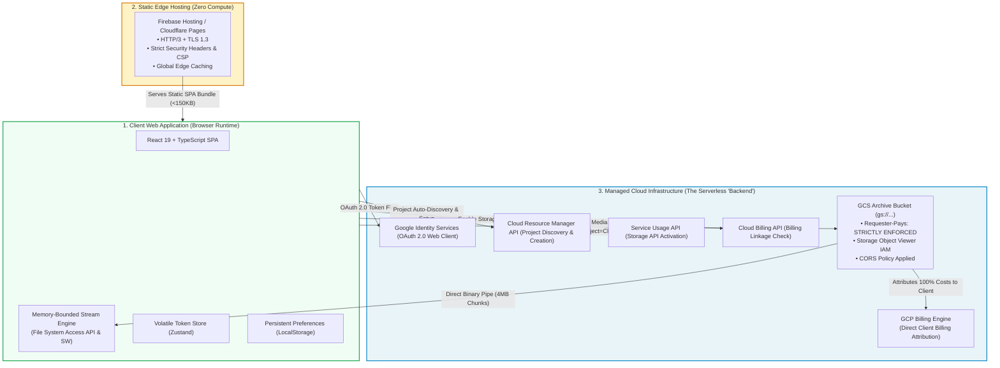
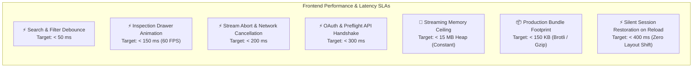
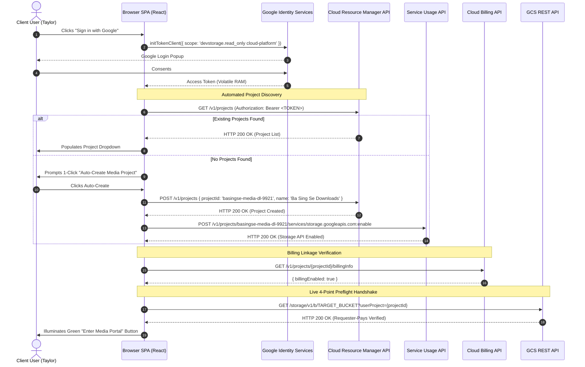
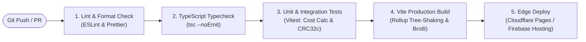

# Web Application & Backend/Infrastructure Requirements Specification
## Project: Files of Ba Sing Se — GCS Requester-Pays Media Distribution Portal

---

### Executive Summary & The "Zero-Backend" Architectural Paradigm

**Files of Ba Sing Se** is architected under a strict **Zero-Host-Liability / Zero-Backend** engineering paradigm. 

A traditional web architecture with a dedicated application server (e.g. Node.js, Python FastAPI, Go, or Java backend) is **intentionally prohibited** for this system. Introducing an application backend introduces two fatal risks:
1. **Host Bandwidth Egress Liability**: If a backend server acts as a proxy for media streams, all 50GB+ egress charges are billed to the host organization's infrastructure rather than the client's GCP billing account.
2. **Operational & Security Overhead**: A backend requires continuous compute maintenance, auto-scaling infrastructure, secret key management, and becomes a central failure and vulnerability point.

Instead, the **web browser itself acts as the client runtime environment**, communicating directly and securely with **Google Identity Services (OAuth 2.0)**, **Google Cloud Resource Manager API**, and **Google Cloud Storage JSON/XML REST APIs**. The "backend" consists entirely of managed Google Cloud platform services and static edge CDN hosting.



---

## 1. Web Application Technical Requirements (Frontend)

### 1.1 Technology Stack & Runtime Dependencies

| Layer | Selected Technology | Version / Spec | Justification |
| :--- | :--- | :--- | :--- |
| **Core Framework** | React | `^19.0.0` | Latest declarative rendering engine with concurrent rendering and zero-cost transitions. |
| **Language** | TypeScript | `^5.7.0` | Strict type safety for GCS API JSON schemas, streaming events, and CRC32c byte buffers. |
| **Build & Tooling** | Vite | `^6.0.0` | Sub-second Hot Module Replacement (HMR) and optimized Rollup production bundling (<150KB initial gzip). |
| **Styling & Design System** | Tailwind CSS + Radix UI | `v4.0` / `@radix-ui/*` | High-density dark-mode styling, accessible keyboard primitives (dialogs, dropdowns, tooltips, checkboxes). |
| **Icons** | Lucide React | `^0.460.0` | Lightweight, scalable SVG icon set for media formats, actions, and status badges. |
| **Global State** | Zustand | `^5.0.0` | Micro-state manager with zero boilerplate, volatile in-memory token isolation, and local storage synchronization. |
| **Checksum / Hash Engine**| `@polycademy/crc32c` (or native WASM) | `Castagnoli 0x1EDC6F41` | High-throughput hardware-accelerated CRC32c calculation on streaming `Uint8Array` chunks. |
| **Storage Persistence** | LocalStorage + `idb` | Modern Web Storage | LocalStorage for string preferences; IndexedDB for resumable byte-range download checkpoints. |

---

### 1.2 Target Runtime & Browser Capability Matrix

| Browser Engine | Operating Systems | Primary Capabilities & API Utilization | Memory SLA | Max File Size | Support Status |
| :--- | :--- | :--- | :--- | :--- | :--- |
| **Chromium 86+** (Chrome, Edge, Brave, Arc) | macOS, Windows, Linux, ChromeOS | **Tier 1 File System Access API**: `window.showSaveFilePicker()` $\rightarrow$ `FileSystemWritableFileStream` $\rightarrow$ 4MB micro-chunk direct pipe. | **Constant < 15 MB RAM** | **Unlimited (100GB+)** | **Tier 1 (Primary)** |
| **WebKit (Safari 15.4+)** | macOS, iPadOS | **Tier 2 Service Worker Stream Interceptor**: Service worker intercepts synthetic download fetch, pipes `ReadableStream` into `Content-Disposition: attachment`. | **Constant < 20 MB RAM** | **Unlimited (Disk Cap)** | **Tier 2 (Hybrid)** |
| **Gecko (Mozilla Firefox)** | macOS, Windows, Linux | **Tier 4 Companion CLI**: Detects Gecko stream limitations, renders informative notice, and routes user to pre-populated 1-click `gcloud storage cp --billing-project` modal. | **Zero Browser RAM** | **Unlimited** | **Graceful Degradation** |
| **Universal (<200MB files)**| All HTML5 Browsers | **Tier 3 Memory Blob**: `response.blob()` $\rightarrow$ `URL.createObjectURL(blob)` $\rightarrow$ `<a download>`. | Equal to file size | < 200 MB | **Lightweight Utility** |

---

### 1.3 Non-Functional Requirements & Performance SLAs (NFRs)



1. **Memory Ceiling SLA**:
   - The frontend **MUST NOT** exceed **25 MB of JavaScript heap memory** during active multi-gigabyte transfers (e.g. 25GB–50GB video archives).
   - In-memory accumulation via `response.blob()` or `arrayBuffer()` is **strictly prohibited for files > 200 MB**.
2. **Virtualized Rendering SLA**:
   - The asset explorer grid **MUST** maintain smooth 60 FPS scrolling when rendering directories containing up to **10,000 objects**.
   - DOM nodes are capped at visible rows plus 5 row overscan buffer.
3. **Response & Reaction Times**:
   - Search/filter input response: **< 50 ms**.
   - Stream cancellation execution (`AbortController.abort()`): **< 200 ms**.
   - Inspection drawer slide-in animation: **< 150 ms** at 60 FPS.
   - Silent session restoration on boot/reload: **< 400 ms**.
4. **Initial Bundle Size**:
   - Production JS bundle size **MUST** be **< 150 KB (gzipped / Brotli)** for fast initial loading over cellular or remote production sets.

---

### 1.4 Client-Side State Management & Security Rules

```
+----------------------------------------------------------------------------------------------------+
|  STORAGE & SECURITY BOUNDARY CLASSIFICATION                                                        |
+----------------------------------------------------------------------------------------------------+
|                                                                                                    |
|  [ VOLATILE MEMORY ONLY ] (Zustand Store - Never Written to Disk)                                  |
|  • Google OAuth 2.0 Access Bearer Token                                                            |
|  • Token Expiration Timestamp & Silent Renewal Timer Handles                                       |
|  • Active Stream Downloader Handles & AbortControllers                                             |
|  • Real-time Transfer Speed & CRC32c Intermediate Hash States                                      |
|  • Session Restoration Live State (isRestoringSession, restorationStatus)                          |
|                                                                                                    |
|  [ PERSISTENT LOCALSTORAGE ] (Non-Sensitive User Preferences & Session Hints Only)                 |
|  • Client GCP Project ID String (e.g., "client-prod-media-2026")                                   |
|  • Target GCS Bucket URI (e.g., "gs://partner-raw-master-archives-2026")                           |
|  • Recent Bucket History Array (Last 5 visited buckets)                                            |
|  • Onboarding Completion Flag (hasCompletedOnboarding: boolean)                                    |
|  • Last Authenticated User Email Hint (lastAuthUserEmail: string)                                  |
|  • UI Theme ("dark" | "light")                                                                     |
|  • Custom Pricing Rate Card Overrides (if customized by client)                                    |
|                                                                                                    |
|  [ INDEXEDDB (via idb) ] (Transfer Checkpoints & Resumption)                                       |
|  • Resumable Download State Records: { objectName, totalBytes, downloadedBytes, etag, crc32cState } |
|                                                                                                    |
|  [ PROHIBITED STORAGE ] (CRITICAL SECURITY VIOLATIONS)                                             |
|  X Google Service Account Private Key JSONs (Never accepted or stored)                             |
|  X Long-lived Google Refresh Tokens or User Passwords                                              |
|  X OAuth Access Bearer Tokens (Strictly volatile in-memory)                                         |
|                                                                                                    |
+----------------------------------------------------------------------------------------------------+
```

---

### 1.5 Client-Side Content Security Policy (CSP) Requirements

To prevent cross-site scripting (XSS) and token exfiltration, the web application must enforce the following strict CSP header:

```http
Content-Security-Policy: 
  default-src 'self';
  script-src 'self' https://accounts.google.com https://apis.google.com;
  connect-src 'self' https://accounts.google.com https://cloudresourcemanager.googleapis.com https://serviceusage.googleapis.com https://cloudbilling.googleapis.com https://storage.googleapis.com;
  img-src 'self' data: https://lh3.googleusercontent.com;
  style-src 'self' 'unsafe-inline';
  frame-src https://accounts.google.com;
  object-src 'none';
  base-uri 'self';
  form-action 'self';
```

---

### 1.6 Client-Side Routing & Browser History API Architecture

Because the portal operates under a zero-backend model without dynamic application server rewrites, the client routing subsystem (*Module 11*, `MOD-11-BROWSER-HISTORY-ROUTING`) adheres to the following infrastructure rules:

1. **Hash-Based Canonical URL Architecture**:
   - URL routes utilize hash-based patterns (`#/browse/{bucketName}/{encodedPrefix}`) to guarantee that all deep links resolve directly on static edge CDNs (Firebase Hosting, Cloudflare Pages, S3, GitHub Pages) without requiring server-side fallback rewrite rules or returning HTTP 404s.
2. **Bidirectional History Stack Synchronization**:
   - Every breadcrumb click and folder navigation triggers `window.history.pushState()`, creating discrete browser history entries.
   - Global `popstate` event listeners intercept Back and Forward button navigation, re-synchronizing active folder views in $< 16\text{ ms}$ (single frame) with zero page reload.
3. **In-Flight Request Cancellation Guard**:
   - Fast successive Back/Forward traversal cancels obsolete GCS network requests via `AbortController` to eliminate race conditions.
4. **Zero-Credential History Guarantee**:
   - `window.history.state` and URL parameters are strictly restricted to public bucket names and folder path strings, guaranteeing zero credential retention.

---

## 2. Backend & Host Infrastructure Requirements (The "Zero-Backend" Service Mesh)

Because there is no custom server software, the "backend" requirements consist of **Google Cloud Platform IAM & Bucket configurations**, **Google Cloud API services**, and **Static Edge CDN hosting**.

---

### 2.1 Comparative Architecture Evaluation: Why Custom Backend is N/A

| Architectural Model | Host Egress Cost Liability | Host Server Compute Cost | Maintenance / Scaling Ops | Direct Client Billing | Verdict |
| :--- | :--- | :--- | :--- | :--- | :--- |
| **Model A: Custom Proxy Backend** (Node/Python/Go) | **HIGH RISK**: Host pays 100% egress ($0.12/GB) for all streamed bytes proxying through server. | $50–$500+/mo (CPU/RAM scaling for 50GB streams). | High (Requires Docker, Kubernetes, SSL, patching). | Complex (Requires building custom credit card billing engine). | **REJECTED (Anti-Pattern)** |
| **Model B: Pre-Signed URL Backend** (Serverless Function) | **HIGH RISK**: GCS Pre-signed URLs bypass Requester Pays and charge the bucket owner by default. | Low ($5/mo serverless compute). | Low-Medium | Not supported cleanly without client service account keys. | **REJECTED (Egress Risk)** |
| **Model C: Direct Client-Side SPA (Selected)** | **ZERO LIABILITY**: 100% of retrieval and egress billed to client via `userProject`. | **$0.00 / month** (Static Edge CDN free tier). | **Zero Server Ops** (Fully managed by Google Cloud). | **Native GCP Billing**: Direct attribution to client project. | **SELECTED (Best of Breed)** |

---

### 2.2 Client Onboarding & Provisioning Protocol Sequence



---

### 2.3 Host Google Cloud Storage (GCS) Bucket Requirements

The host organization's GCS bucket must satisfy the following configuration specifications:

#### Requirement 1: Requester Pays Enforcement
The bucket **MUST** have Requester Pays enabled. When enabled, all anonymous requests or requests lacking a valid `userProject` are immediately rejected with `HTTP 400 UserProjectMissing`.
```bash
gcloud storage buckets update gs://YOUR_BUCKET_NAME --requester-pays
```

#### Requirement 2: Cross-Origin Resource Sharing (CORS) Policy
The bucket **MUST** have a CORS configuration that allows preflight requests from the application's origin, permits `GET`, `HEAD`, `OPTIONS`, and exposes critical response headers for progress tracking, byte-range slicing, and checksum validation.

**`cors.json` Specification**:
```json
[
  {
    "origin": [
      "https://media-portal.yourcompany.com",
      "http://localhost:5173",
      "http://localhost:4173"
    ],
    "method": ["GET", "HEAD", "OPTIONS"],
    "responseHeader": [
      "Content-Type",
      "Content-Length",
      "Content-Range",
      "Accept-Ranges",
      "ETag",
      "x-goog-hash",
      "x-goog-generation",
      "x-goog-metageneration",
      "x-goog-storage-class",
      "x-goog-date"
    ],
    "maxAgeSeconds": 3600
  }
]
```
Apply to bucket:
```bash
gcloud storage buckets update gs://YOUR_BUCKET_NAME --cors-file=cors.json
```

#### Requirement 3: Client IAM Read Access Protocol
External client users (or client Google Groups) must be granted `roles/storage.objectViewer` on the bucket or specific folder paths.
```bash
gcloud storage buckets add-iam-policy-binding gs://YOUR_BUCKET_NAME \
  --member="user:client-user@example.com" \
  --role="roles/storage.objectViewer"
```

---

### 2.4 Static Edge CDN & Edge Hosting Specification

The application bundle must be hosted on a globally distributed static edge CDN (e.g. Firebase Hosting or Cloudflare Pages):

```
+----------------------------------------------------------------------------------------------------+
|  STATIC EDGE HOSTING & CACHING ARCHITECTURE                                                        |
+----------------------------------------------------------------------------------------------------+
|                                                                                                    |
|  Route: /index.html                                                                                |
|  • Cache-Control: no-cache, no-store, must-revalidate (Always fetches latest HTML & CSP)           |
|  • Protocols: HTTP/3, HTTP/2, TLS 1.3                                                              |
|                                                                                                    |
|  Route: /assets/*.(js|css|woff2|svg|png)                                                           |
|  • Cache-Control: public, max-age=31536000, immutable (Cache forever with Vite content hashing)   |
|  • Compression: Brotli (br) and Gzip (gz) pre-compressed                                           |
|                                                                                                    |
|  Route: /sw.js (Service Worker)                                                                    |
|  • Cache-Control: no-cache, max-age=0, must-revalidate                                             |
|                                                                                                    |
+----------------------------------------------------------------------------------------------------+
```

---

### 2.5 CI/CD & Build Automation Pipeline Requirements

The automated build pipeline (GitHub Actions / GitLab CI) must execute the following gates:



1. **Step 1: Code Quality**: `npm run lint` ensures code conforms to standard conventions.
2. **Step 2: Type Safety**: `npm run typecheck` (`tsc --noEmit`) validates complete TypeScript coverage with zero `any` leaks.
3. **Step 3: Test Verification**: `npm run test` executes automated Vitest suites for:
   - Cost calculation engine accuracy across all storage classes.
   - CRC32c running checksum computation against reference test vectors.
   - Project ID and bucket name sanitization regex.
4. **Step 4: Production Build**: `npm run build` compiles Vite assets into `dist/`.
5. **Step 5: Automated Edge Deployment**: Deploys static build to Firebase Hosting / Cloudflare Pages upon merging to `main`.
